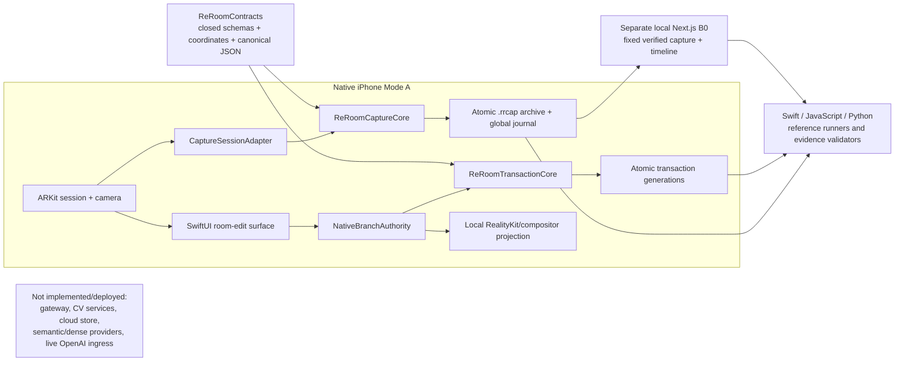

# ReRoom Team Decision Checkpoint

**Snapshot date:** 2026-07-18 (Europe/Vienna)

**Audience:** ReRoom teammates and GPT-5.6 Max

**Repository:** `openai-build-week`

**Branch / snapshot HEAD:** `main` / `a2fc773`

**Delivery classification:** **Demo candidate — not a fully gated P0 release**

**Planning state:** 46/46 implementation plans executed; milestone verification remains open
**Canonical release state:** not P0-complete; shipping blocked; submission pending

> This is a decision checkpoint and synthesis, not a new source of product
> authority. If it conflicts with the human locks, Accepted ADRs, frozen
> contracts, Master Technical Specification, PRD, risk gates, or glossary,
> those sources win in the order defined by
> [`docs/canonical/README.md`](../../../docs/canonical/README.md).

## 1. Executive decision snapshot

The accelerated sprint succeeded as an **implementation and automated-evidence
sprint**. It did not complete the canonical P0 release program.

The repository now contains all 46 planned implementation slices across eight
phases, deterministic Swift capture/replay and transaction cores, a native
SwiftUI/ARKit demo surface, bounded replacement, a deliberately DEBUG-only
removal fixture, a fixed-golden local Next.js B0 replay surface, and a
source-bound evidence pipeline. The retained Phase 8 hardening and evidence
validators pass at this checkpoint.

The product should currently be described as:

> **A ReRoom demo candidate whose retained automated integration evidence
> passes, with canonical physical, visual, browser, resilience, licensing,
> golden-run, and submission work still pending.**

It should **not** be described as P0-complete, production-ready, generally
shippable, fully licensed, or proven across all formal gates.

The highest-value next move is to freeze feature work and convert the existing
implementation into a reproducible, honestly evidenced submission:

1. prove a clean iOS checkout can resolve and build the local Swift package;
2. decide the root license and proxy redistribution status;
3. record one privacy-safe signed-device smoke and one real-browser B0 smoke;
4. capture the demo video with the DEBUG removal limitation visibly disclosed;
5. complete the human-owned submission checklist;
6. resume the canonical P0 gates only after the demo is safe.

Normal signed-device `remove` is the biggest product gap. The present
four-operation demonstration uses an explicit DEBUG fixture and cannot support
a claim that normal removal or `GATE-006` has passed.

## 2. How much has passed?

There is no honest single completion percentage because the repository tracks
implementation, verifier truths, requirements, formal gates, and evidence
objects with different denominators. The following numbers are all correct,
but answer different questions.

| Lens | Current result | Percentage | What it actually means |
|---|---:|---:|---|
| Implementation plans | **46/46 executed** | **100%** | Every approved plan has a matching summary and implementation/evidence artifact. |
| Phase verifier must-haves | **220/231 verified** | **95.2%** | Code-observable and sprint-plan truths verified; 11 truths still depend on broader physical/canonical work. |
| Formal phase verdicts | **1/8 `passed`** | **12.5%** | Phase 1 alone has a fully passed phase verdict; Phases 2–8 are `human_needed`. |
| Canonical P0 requirements | **3/24 checked** | **12.5%** | Only coordinate correctness, contract interoperability, and device/build readiness are checked complete. |
| Formal gate reports | **2/14 `GREEN`** | **14.3%** | `GATE-002` and `GATE-013` retain green reports. |
| Other formal gate states | **1/14 `RUNNING`; 11/14 `NO_REPORT`** | 7.1%; 78.6% | `GATE-001` has a running report; the others are pending, fallback-active, or blocked—not passed. |
| Phase 8 evidence-index entries | **11/16 `VERIFIED`** | **68.8%** | Eight automated artifacts and three pre-existing human-observation reports verify; this is not 11 green gates. |
| Remaining evidence-index entries | **4 `PENDING`; 1 `BLOCKED`** | 31.2% | Browser, device, golden, and submission evidence are pending; license evidence is blocked. |
| Latest composite mutation/regression run | **50/50 passed** | **100%** | The latest Phase 5–8 automated mutation suite passed; this does not replace human gates. |
| Shipping status | **`BLOCKED`** | — | The exact BOM is blocked by two explicit license decisions. |
| Submission status | **`PENDING`** | — | No automation is authorized to publish or submit. |

### Why these numbers differ

- A completed plan means its scoped implementation work was performed. It does
  not mean the associated physical or human evidence exists.
- A verified must-have can be a code property, fixture result, or deliberately
  honest pending-state behavior. It is not automatically a canonical
  requirement completion.
- A requirement checkbox represents the full canonical behavior and its
  acceptance evidence, not merely that supporting code exists.
- A formal gate becomes green only through its prescribed report. Automated
  checks, fallbacks, demos, and operator recollections cannot promote it.
- An evidence-index entry marked `VERIFIED` means that exact artifact and its
  provenance validate. For example, the `GATE-001` report is verified as an
  authentic `RUNNING` report—not as a green gate.

**Conclusion:** implementation completeness is high; canonical release
completeness is low. The project is much closer to a credible demo than to a
fully gated P0 release.

## 3. The critical 36-hour sprint change

The human project owner approved
[`SPRINT-CUT-36H.md`](SPRINT-CUT-36H.md) on 2026-07-18. The sprint overlay is
already tracked in Git by commit `5045ded`; this checkpoint records its effects
and consequences for the next planning decision.

### What changed

The original roadmap targeted a fully evidenced P0: all required physical,
visual, browser, resilience, license, latency, golden-run, and submission proof
would be closed before completion.

The sprint cut changed the execution goal to the smallest honest vertical demo:

- automated record-first capture and exact replay;
- one deterministic native hero path exposing exactly `place`, `replace`,
  `remove`, and `restore`;
- manual/tap target selection and bounded supported views;
- a minimal provider-independent local B0 replay/inspection surface;
- retained deterministic transaction, consent, identity, revision, replay, and
  fail-closed safety properties;
- an explicit pending-gate report instead of pretending deferred proof passed.

### What did not change

The sprint cut did **not** delete, weaken, redefine, or mark green any:

- canonical requirement;
- human-locked decision;
- ADR or provisional ADR kill gate;
- JSON contract or compatibility rule;
- formal gate, threshold, measurement, or test definition;
- terminology or stable ID family;
- full-P0 release obligation.

This is a sequencing and sprint-acceptance overlay, not a product-authority
rewrite.

### Activated fallbacks and boundaries

| Area | Sprint behavior | What remains unproven |
|---|---|---|
| `GATE-004` semantic target | Manual tap/reseed; no semantic-provider dependency | Provider quality, identity, and tracking benchmark |
| `GATE-005` fast geometry/support | Conservative proxy/manual supported-view behavior | Measured mask volume, OBB, support, and view-envelope quality |
| `GATE-007` dense geometry | ARKit plane/fast proxy; no learned dense-depth dependency | Dense provider bake-off, quality, and runtime evidence |
| `GATE-012` runtime tier | Local/demo runtime only; no cloud/provider tier | Selected tier latency, VRAM, queues, soak, and reconnect evidence |
| `GATE-014` Mode B1 | B1 remains excluded and isolated | Any post-P0 B1 work requires a later explicit decision |
| Voice | Typed/tap path remains complete; voice stays out | Optional voice is post-P0 and may never become a dependency |

`GATE-002` and `GATE-013` retain their existing green evidence. Automated
typed/tap and injection safety remained sprint-critical, but `GATE-010` still
has no formal report. `GATE-006` did not receive a product fallback: the DEBUG
reveal fixture is demonstration scaffolding, not normal removal acceptance.

### Work deliberately left behind

The sprint deferred the following proof while preserving exact resume paths:

- the full `GATE-001` consent plus 10-run termination/pressure/recovery matrix;
- the `GATE-003` eight-pose compositor vote and base-device
  FPS/memory/thermal campaign;
- `GATE-004` provider benchmarking if the manual fallback is ever replaced;
- `GATE-005` mask/OBB/support/view-envelope measurements;
- `GATE-006` exact multi-surface reveal thresholds and blinded votes;
- `GATE-007` dense-geometry benchmarking if promoted;
- `GATE-008` full B0 golden replay and degradation/fault evidence;
- `GATE-009` disconnect/reconnect/worker-restart resilience campaign;
- `GATE-010` formal typed/agent/credential safety campaign;
- `GATE-011` licensing and asset parity closure;
- `GATE-012` runtime-tier measurements if a service tier is selected;
- `OPS-GOLDEN-001` five consecutive complete signed-device journeys;
- canonical latency distributions, public submission, and release audit.

### Post-sprint resume order already approved

1. Complete the full `GATE-001` physical capture/recovery matrix.
2. Run formal `GATE-003`, `GATE-006`, `GATE-008`, `GATE-009`, and
   `GATE-011` evidence for the implemented hero path.
3. Benchmark `GATE-004`, `GATE-007`, and `GATE-012` only if replacing their
   accepted fallbacks.
4. Finish Phase 8 hardening, `OPS-GOLDEN-001`, milestone audit, and release
   evidence before making a P0-complete claim.

## 4. Canonical product and architecture boundaries

These are the load-bearing constraints the next plan must preserve.

### Product shape

- Mode A is a native SwiftUI iPhone experience.
- ARKit is the healthy-session pose and world authority.
- The base iPhone 17 path cannot require rear LiDAR.
- The live camera is the photoreal background; the app renders only edit,
  reveal, occlusion, shadow, debug/readiness, and UI overlays.
- The controlled hero target is exactly one freestanding chair or small table
  with visible floor.
- P0 has exactly four operations: `place`, `replace`, `remove`, and `restore`.
  Undo invokes `restore`; it is not a fifth operation.
- A separate Next.js client owns guaranteed Mode B0 replay/inspection/fallback.
- B1, XR, and voice are not P0 dependencies.

### Deterministic authority

- Models may propose typed semantic/design intent only.
- The application owns target authorization, spatial checks, stable identity,
  revisions, idempotency, persistence, confirmation, commit, reconciliation,
  replay, and restore.
- Preview does not increment revision.
- One native branch authority performs explicit CAS commit and increments once.
- Idempotency binds a key and exact request fingerprint.
- Divergence is preserved and quarantined; it never auto-merges.
- Restore is a new compensating transaction over a verified captured-exact
  inverse; committed history remains immutable.
- Typed/tap operation must remain complete without a model or network.

### Realtime and data boundaries

- The 60 Hz native camera/render path never waits for a network, model, worker,
  service, or web client.
- High-rate image buffers do not cross a scripting bridge.
- Capability readiness is independent: target selection, mask volume, surface
  mesh, OBB, occluder, reveal, and operation readiness are not interchangeable.
- Record-first capture advances through the exact lifecycle
  `selected -> image_and_metadata_durable -> journaled -> network_eligible -> server_acknowledged`.
- The global journal is the sole authoritative replay order.
- Capture publication is atomic; interrupted work recovers as a verified prefix
  without mutating the original archive.
- RR-COORD-1, RR-FLOAT-1, and RR-JCS-SHA256-1 remain exact cross-runtime rules.

### Frozen contracts

The closed version-1.0 contract family under [`docs/contracts/`](../../../docs/contracts/)
owns wire shape and lifecycle fields:

| Contract | Purpose |
|---|---|
| `CON-001` | FramePacket image/metadata unit |
| `CON-002` | `.rrcap` manifest and capture inventory |
| `CON-003` | canonical scene state |
| `CON-004` | edit/reveal/occlusion artifacts |
| `CON-005` | revisioned transaction and compensating restore |

Unknown fields, unknown versions, malformed framing, unsafe archive paths,
invalid digests, and identity mismatches must reject before mutation. Any
contract change must synchronize schemas, contract docs, Master Spec, PRD,
glossary, fixtures, compatibility policy, tests, and affected ADRs.

### ADR status

Accepted ADRs: `ADR-001`, `ADR-002`, `ADR-003`, `ADR-004`, `ADR-006`,
`ADR-008`, `ADR-010`, `ADR-011`, `ADR-012`, `ADR-013`, and `ADR-014`.

Provisional ADRs still behind evidence and kill gates:

- `ADR-005` — RealityKit-first compositor;
- `ADR-007` — segmentation and depth providers;
- `ADR-009` — multi-surface reveal and supported-view envelope.

Implementation presence cannot silently promote a provisional ADR.

## 5. Implemented system structure

### Runtime topology implemented today



The `FUTURE` box is intentionally disconnected: the current demo does not
require or deploy the canonical future service topology.

### Repository map

| Surface | Role | Important contents |
|---|---|---|
| [`docs/canonical/`](../../../docs/canonical/) | Product authority | README authority order, Master Technical Specification, PRD, delivery strategy, risk/kill gates, glossary, research ledger |
| [`docs/adr/`](../../../docs/adr/) | Architecture decisions | 11 Accepted and 3 Provisional ADRs |
| [`docs/contracts/`](../../../docs/contracts/) | Frozen wire authority | CON-001–CON-005 schemas and contract documentation |
| [`.planning/`](../..) | GSD project state | project, roadmap, requirements, state, sprint cut, phase plans/summaries/verifications |
| [`ios/Packages/ReRoomContracts/`](../../../ios/Packages/ReRoomContracts/) | Shared Swift package | contract, capture, replay, transaction cores; runners and tests |
| [`ios/ReRoomDeviceProof/`](../../../ios/ReRoomDeviceProof/) | Native app | SwiftUI UI, ARKit session, device proof, capture adapter, deterministic edit UI, resources, Xcode project |
| [`web/`](../../../web/) | Separate Mode B0 app | pinned Next.js fixed-golden replay/inspection surface and tests |
| [`tools/javascript/`](../../../tools/javascript/) | JavaScript reference runtime | independent contract, canonicalization, coordinate, replay, and transaction references |
| [`tools/verify/`](../../../tools/verify/) | Independent validation | Python comparators, mutation suites, evidence and phase validators |
| [`scripts/`](../../../scripts/) | Stable verification entrypoints | `verify-phase-01-*` through `verify-phase-08-*` |
| [`evidence/`](../../../evidence/) | Retained, classified proof | phase-specific automated evidence, formal gate reports, Phase 8 index/BOM/status |
| [`docs/demo/`](../../../docs/demo/) | Human handoff | demo runbook and Build Week submission checklist |

### Swift package boundaries

`ios/Packages/ReRoomContracts/Package.swift` declares three libraries and three
executables:

- `ReRoomContracts`
  - closed schema validation;
  - canonical JSON and RR-JCS hashing support;
  - RR-COORD-1 coordinate math;
  - archive-path and wire-frame safety.
- `ReRoomCaptureCore`
  - bounded newest-useful admission and queues;
  - record-first `CaptureSession`;
  - atomic archive store and typed filesystem faults;
  - recovery-prefix validation;
  - authoritative `ReplayCore` and reports.
- `ReRoomTransactionCore`
  - exact operation and transaction models;
  - typed/untrusted intent boundary;
  - pure place/replace/remove/restore reducers;
  - request fingerprinting and idempotency;
  - sole `TransactionAuthority` and atomic generation store;
  - contract/filesystem adapters and projection logic.
- `ReRoomContractRunner`, `ReRoomReplayRunner`, and
  `ReRoomTransactionTraceExporter` provide independent executable evidence
  producers.

The package is Swift 6.1 and pins `swift-json-schema` 0.13.1. Its resolved graph
also includes `swift-collections` 1.6.0 and `swift-syntax` 603.0.2.

### Native app boundaries

The native app is intentionally thin over deterministic cores:

- `ARSessionController`, `DeviceProofModel`, `OrientationGate`, and
  `WorldEpochController` own AR session and coordinate readiness.
- `FramePacketBuilder`, `CaptureAttemptMachine`, and `CaptureSessionAdapter`
  bind one AR frame's image, intrinsics, projection, pose, and capture state.
- `RoomEditModel` and `RoomEditView` present the four-operation vocabulary but
  do not own canonical mutation authority.
- `DiagnosticJournal`, `DiagnosticChecklistView`, and `EvidenceExporter`
  support classified operator/evidence workflows.
- `Phase3Proxy` contains the single local demo chair and provenance record.
- `Phase6Reveal` contains the clearly labeled DEBUG reveal fixture.

The compositor order remains camera, reveal, real occluders, virtual asset,
debug/readiness overlays, then SwiftUI. Unsupported readiness fails closed.

### Mode B0 web boundaries

The web surface is deliberately narrow and local:

- Next.js `16.2.9`, React `19.2.7`, TypeScript `6.0.2`;
- exact Node `22.22.3` and npm `10.9.8` declared;
- a server loader reads the fixed verified golden capture;
- a projection layer derives a safe view;
- a timeline layer supports deterministic scrub/inspection;
- the React replay explorer presents that bounded result;
- Node tests cover golden replay and timeline behavior;
- typecheck, production build, and local loopback HTTP checks pass in retained
  evidence.

It is **not yet** a general `.rrcap` uploader, arbitrary session browser,
ordinary-video pipeline, authenticated sharing service, TTL/deletion system,
cloud deployment, or general typed-proposal client.

### Evidence architecture

Evidence is treated as a product boundary, not a screenshot folder:

- source-bound automated reports name implementation revisions and input
  digests;
- independent Swift, JavaScript, and Python producers compare against pinned
  fixtures rather than each other as mutable oracles;
- evidence JSON is canonicalized, self-digested, classified, and privacy
  constrained;
- mutation suites prove validators reject altered state, stale bindings, unsafe
  paths, changed claims, and forged completion;
- Phase 8 consolidates an index, exact BOM, automated preflight, and formal
  gate-state projection without promoting pending work.

## 6. End-to-end data flows

### Capture and replay

1. Explicit consent and frame-selection policy admit an upright AR frame.
2. One callback binds image, metadata, intrinsics, projection, pose, world
   epoch, and encoding profile.
3. The frame packet and image become durable atomically.
4. The global journal records the lifecycle transition and becomes the sole
   replay order.
5. Only journaled content becomes network-eligible; network acknowledgement is
   a later independent state.
6. On interruption, recovery accepts only the longest physically present,
   digest-valid contiguous journal prefix.
7. Replay validates the frozen manifest, frames, events, revisions, and digests
   without relying on providers, filenames, or network availability.

### Edit, commit, and idempotency

1. Typed/tap input is parsed as untrusted semantic operation plus allowlisted
   arguments/constraints.
2. Trusted native context attaches identity, branch, revision, target, world,
   and readiness state.
3. A pure reducer computes preview and inverse without changing revision.
4. Explicit confirmation reaches the sole native branch authority.
5. Authority checks base revision, exact fingerprint/idempotency semantics, and
   local artifact readiness.
6. A complete transaction generation is durably published before its active
   pointer changes atomically.
7. The branch advances exactly once; exact retries return the prior durable
   result, changed fingerprints conflict, and divergence quarantines.

### Restore

1. Restore selects an eligible committed transaction.
2. It verifies the source ordered operations and captured-exact inverse.
3. It rebases only the touched projection IDs against current state.
4. It requires local artifacts for the restored result and its fresh inverse.
5. It commits a new compensating transaction; old history is never rewritten.

### B0 replay

1. A verified `.rrcap`/golden fixture is loaded server-side.
2. Closed manifest and replay data are projected into safe web view types.
3. Timeline ordering follows authoritative journal/event order.
4. The browser scrubs and inspects without learned reconstruction or live
   provider dependency.
5. Current implementation is fixed-fixture/local; general session ingestion and
   sharing remain pending.

## 7. Phase-by-phase state

| Phase | Plans | Verifier result | What exists | What prevents formal completion |
|---|---:|---:|---|---|
| 1. Contract and Device Proof | 15/15 | **53/53 — `passed`** | Frozen cross-runtime contracts/coordinates, dependency audit, signed base-device proof, green `GATE-002`/`GATE-013` | No remaining phase gap |
| 2. Atomic Capture and Exact Replay | 7/7 | **48/48 — `human_needed`** | Atomic record-first capture, bounded queues, fault injection, recovery prefixes, authoritative replay, three-runtime evidence | Full new-revision physical `GATE-001` matrix and attestation; report remains `RUNNING` |
| 3. Typed Place, Commit, and Offline Restore | 7/7 | **37/37 — `human_needed`** | Closed transaction ingress, pure reducers, CAS/idempotency authority, atomic store, place/restore UI, cross-runtime traces | Formal resilience/safety/license campaigns and representative physical journey |
| 4. Target Grounding and Compositor Gate | 4/4 | **15/18 — `human_needed`** | Manual targeting/reseed, stable identity, AR raycast fallback, local RealityKit graph, explicit readiness | Three broader physical/provider/runtime truths: compositor/performance, geometry quality, provider/tier evidence |
| 5. Curated Replacement Vertical | 4/4 | **16/19 — `human_needed`** | Bounded replacement reducer/authority/UI, local proxy asset, fail-closed supported view, 22-model checks and mutations | Physical visual quality, supported-view measurement, catalog/license evidence |
| 6. Controlled Multi-Surface Removal | 4/4 | **20/21 — `human_needed`** | Remove reducer/authority/crash/replay/restore behavior and an explicit bounded two-surface DEBUG fixture | Real reveal artifacts, coverage/order thresholds, five blinded votes, and green `GATE-006` |
| 7. Separate Mode B0 Web Fallback | 3/3 | **10/14 — `human_needed`** | Fixed-golden local Next.js replay, timeline, inspection, test/typecheck/build/loopback checks | General input/session/share/retention behavior, real-browser smoke, full B0 degradation campaign |
| 8. P0 Hardening and Evidence | 2/2 | **21/21 sprint must-haves — `human_needed`** | Upstream readiness validation, mutation hardening, 79-member BOM, evidence index, honest gate report, demo/submission runbooks | License decisions, device/browser/golden proof, formal gates, human submission |

All 46 plan files have 46 matching summaries. That is an excellent execution
checkpoint, but only Phase 1 can be marked complete under the current formal
phase-verdict rules.

## 8. Formal gate matrix

Source of current machine-readable states:
[`evidence/hardening/phase-08/pending-gates.json`](../../../evidence/hardening/phase-08/pending-gates.json).

| Gate | Canonical subject | Formal state | Sprint disposition | Honest interpretation / next proof |
|---|---|---|---|---|
| `GATE-001` | Capture durability and replay determinism | `RUNNING` | running | Retained report is authentic but incomplete. Run full consent/termination/pressure/recovery matrix and human attestation. |
| `GATE-002` | RR-COORD-1, projection, orientation, intrinsics | **`GREEN`** | retained green | Existing signed report remains authoritative. |
| `GATE-003` | Native compositor and device viability | `NO_REPORT` | deferred pending | Run eight-pose visual vote plus four-minute base-device FPS/memory/thermal campaign. |
| `GATE-004` | Semantic provider and target tracking | `NO_REPORT` | fallback active | Manual target selection is active. Benchmark only if promoting a semantic provider. |
| `GATE-005` | Fast mask volume, OBB, support, view envelope | `NO_REPORT` | fallback active | Conservative proxy/manual supported view is used; prescribed measurements remain pending. |
| `GATE-006` | Multi-surface reveal and empty removal | `NO_REPORT` | deferred pending | DEBUG fixture is not acceptance. Meet exact coverage/component/order thresholds and at least 4/5 blinded votes. |
| `GATE-007` | Learned depth and dense geometry | `NO_REPORT` | fallback active | No-dense ARKit plane/proxy fallback is active. Benchmark only if promoting dense geometry. |
| `GATE-008` | Guaranteed Mode B0 and web fallback | `NO_REPORT` | deferred pending | Fixed local slice exists; run formal two-run golden replay, fault/degradation, and real-browser evidence. |
| `GATE-009` | Transactions, idempotency, offline restore, reconnect | `NO_REPORT` | deferred pending | Deterministic tests pass; run disconnect/reconnect/worker-restart campaign. |
| `GATE-010` | Typed/agent safety and optional voice boundary | `NO_REPORT` | deferred pending | Automated typed/injection/credential evidence exists; formal campaign remains pending. |
| `GATE-011` | Asset contract, parity, licensing | `NO_REPORT` | **blocked** | Resolve root license and proxy use/redistribution, then complete the formal audit. |
| `GATE-012` | Runtime tier, service latency, queues | `NO_REPORT` | fallback active | Local-only mode is active; select and measure a tier only if adding cloud/provider runtime. |
| `GATE-013` | Signing and base-iPhone preflight | **`GREEN`** | retained green | Existing signed report remains authoritative. Current clean-checkout reproducibility still needs a smoke check after local Xcode edits. |
| `GATE-014` | Mode B1 isolation | `NO_REPORT` | fallback active | B1 remains excluded. Preserve isolation; no B1 dependency should enter P0. |

Formal summary: **2 green, 1 running, 11 with no formal report**. A fallback is
an allowed bounded implementation choice, not a green report.

## 9. Requirements state

The canonical checklist in [`REQUIREMENTS.md`](../../REQUIREMENTS.md) contains 24 P0
requirements:

| Requirement family | Checked | Total |
|---|---:|---:|
| Functional (`FR-*`) | 0 | 10 |
| Non-functional (`NFR-*`) | 2 | 6 |
| Security (`SEC-*`) | 0 | 4 |
| Operations (`OPS-*`) | 1 | 4 |
| **Total** | **3** | **24** |

Checked requirements:

- `NFR-COORD-001` — coordinate correctness;
- `NFR-CONTRACT-001` — versioned interoperability;
- `OPS-DEVICE-001` — device/build readiness.

The traceability table in the same file labels Phase 2–4 mappings as
`Complete` while their top-level requirement checkboxes remain unchecked. The
most charitable interpretation is **implementation mapping complete, canonical
acceptance evidence incomplete**. This vocabulary mismatch is documentation
debt and should be fixed before anyone generates an overall completion report.
Until then, the top-level checkboxes and formal gate reports are the safer
release indicators.

Phase 8's exact trace state is:

| Requirement | Trace state | Remaining closure |
|---|---|---|
| `NFR-LATENCY-001` | pending | synchronized p50/p95/max stage distributions |
| `NFR-RESILIENCE-001` | partial | full `GATE-001` and `GATE-009` fault campaigns |
| `OPS-GOLDEN-001` | pending | five consecutive signed-device journeys plus matching B0 replay |
| `OPS-LICENSE-001` | blocked | root product license and proxy redistribution decision |
| `OPS-SUBMISSION-001` | pending | human rules check, media approval, Session ID selection, and submission |
| `SEC-AGENT-001` | evidence present | retain automated proof and complete formal `GATE-010` campaign |
| `SEC-CREDENTIAL-001` | evidence present | retain scans and complete formal `GATE-010` campaign |

## 10. What demonstrably works now

### Retained automated behavior

- Swift, JavaScript, and Python agree on closed coordinate, canonical JSON,
  digest, wire, capture/replay, and transaction fixtures.
- Malformed contracts, unknown fields/versions, unsafe paths, wrong digests,
  stale revisions, changed idempotency fingerprints, and divergent states fail
  closed in the covered cases.
- Record-first capture has atomic publication, bounded pressure behavior,
  explicit lifecycle events, fault injection, recovered-prefix validation, and
  authoritative replay.
- Place and compensating restore execute through the deterministic native
  transaction authority and survive offline/replay-oriented tests.
- Replacement executes against the one curated local proxy only inside its
  supported view and fails closed outside it.
- Remove transaction semantics, crash recovery, replay, and restore are tested
  against an explicitly labeled two-surface DEBUG reveal fixture.
- The fixed golden B0 capture loads, projects, scrubs, and inspects in the local
  Next.js app with providers disabled.
- Source/bundle credential scans, typed intent containment, BOM generation,
  evidence validation, and mutation resistance pass in retained automation.

### Operator-observed confidence, not retained proof

During the working session, the operator reported that the phone flow worked,
showed **“Verified Reply”**, and produced an accepted verdict. A concrete
`.rrcap` session filename was also reported in conversation; it is intentionally
omitted here because no privacy-safe retained evidence record exists for it.

No repository copy, digest, evidence record, or indexed location for that
session was found at this checkpoint. The Phase 8 evidence index therefore
correctly keeps device smoke `PENDING`. The observation should guide the next
smoke run, but must not be converted into formal evidence retroactively.

## 11. What is not complete or does not exist

### Native product gaps

- Normal signed-device removal is intentionally unavailable.
- The only four-operation `remove` path is enabled by
  `--room-edit-demo-reveal` in DEBUG and must show
  `DEMO REVEAL FIXTURE - GATE-006 PENDING`.
- Multi-surface reveal has no retained real-room threshold or blinded-vote
  evidence.
- Compositor FPS, memory, thermal, and eight-pose visual measurements are not
  retained for the current implementation.
- There is no promoted semantic segmentation, learned depth, or dense geometry
  provider.
- There is no general production asset catalog or completed parity/license
  audit.
- Five consecutive signed-device hero journeys have not been recorded.

### Web/product-service gaps

- B0 is fixed-golden and local, not a general import/session product.
- No arbitrary `.rrcap` upload flow is implemented.
- No ordinary-video replay pipeline is implemented.
- No authenticated sessions, sharing, access states, retention, TTL, or delete
  lifecycle is implemented.
- No real-browser smoke is retained in the evidence index.
- No cloud deployment, gateway, object store, CV worker, provider runtime,
  scoped client credentials, or operational service tier exists.
- No live OpenAI model integration is required or currently deployed in the
  runtime path; typed/tap remains deterministic and local.

### Release and submission gaps

- Shipping is blocked by licensing.
- The public/private repository-access decision is human-owned.
- Public media has not been approved or uploaded.
- A representative `/feedback` Session ID has not been selected and approved
  for disclosure.
- Devpost submission is pending.
- The handoff recorded an observed deadline of **July 21, 2026 at 5:00 PM
  Pacific Time**, but the human submitter must recheck the live official pages
  immediately before submission.

## 12. Evidence and verification inventory

### Evidence-index composition

The Phase 8 index has 16 entries:

- **8 verified automated checks:** Phase 2 through Phase 7 preflights, Phase 8
  hardening, and the exact sprint BOM artifact;
- **3 verified human-observation reports:** `GATE-001` as `RUNNING`, plus
  `GATE-002` and `GATE-013` as `GREEN`;
- **4 pending entries:** browser smoke, device smoke, golden human observation,
  and external submission;
- **1 blocked entry:** shipping license decision.

The exact 79-member sprint BOM contains:

- 65 npm members;
- 6 Python packages;
- 3 SwiftPM packages;
- 5 repository-owned resources.

Its `shipping_status` is `BLOCKED` by exactly:

- `ROOT_LICENSE_MISSING`;
- `PROXY_USE_REDISTRIBUTION_DECISION_MISSING`.

### Fresh checkpoint validation

The following retained-evidence checks were rerun successfully while preparing
this checkpoint:

```text
scripts/verify-phase-08-hardening --verify-evidence
-> PASS; bom_shipping_status=BLOCKED

scripts/verify-phase-08-evidence --verify-evidence
-> PASS; shipping=BLOCKED; submission=PENDING

python3 -m unittest \
  tools.verify.tests.test_phase_05_replacement \
  tools.verify.tests.test_phase_06_removal \
  tools.verify.tests.test_phase_07_b0_gate \
  tools.verify.tests.test_phase_08_hardening \
  tools.verify.tests.test_phase_08_evidence
-> 50 tests passed
```

The results mean the evidence is internally honest and untampered. They do not
mean shipping or submission passed. No expensive Xcode rebuild, physical-device
campaign, or real-browser campaign was performed while writing this document.

### Primary evidence files

- [`evidence/hardening/phase-08/automated-preflight.json`](../../../evidence/hardening/phase-08/automated-preflight.json)
- [`evidence/hardening/phase-08/evidence-index.json`](../../../evidence/hardening/phase-08/evidence-index.json)
- [`evidence/hardening/phase-08/pending-gates.json`](../../../evidence/hardening/phase-08/pending-gates.json)
- [`evidence/hardening/phase-08/sprint-bom.json`](../../../evidence/hardening/phase-08/sprint-bom.json)
- [`docs/demo/PHASE_08_DEMO_RUNBOOK.md`](../../../docs/demo/PHASE_08_DEMO_RUNBOOK.md)
- [`docs/demo/BUILD_WEEK_SUBMISSION_HANDOFF.md`](../../../docs/demo/BUILD_WEEK_SUBMISSION_HANDOFF.md)

## 13. Current Git and Xcode state

### Branch and snapshot

- Branch: `main`
- HEAD while preparing this checkpoint: `a2fc773`
- The checkpoint itself is intended to be staged without committing or staging
  any pre-existing local changes.

### Pre-existing modified/untracked files

The working tree was already dirty before this checkpoint:

```text
 M .planning/config.json
 M ios/ReRoomDeviceProof/ReRoomDeviceProof.xcodeproj/project.pbxproj
 M ios/ReRoomDeviceProof/ReRoomDeviceProof.xcodeproj/xcshareddata/xcschemes/ReRoomDeviceProof.xcscheme
?? ios/Packages/ReRoomContracts/.swiftpm/
?? ios/ReRoomDeviceProof/ReRoomDeviceProof.xcodeproj/project.xcworkspace/
?? ios/ReRoomDeviceProof/ReRoomDeviceProof.xcodeproj/xcuserdata/
```

These local files are not included in this checkpoint's staged scope.

### What the local changes mean

- `.planning/config.json` locally disables several expensive GSD workflow
  controls: Nyquist validation, UI phase/safety gate, code review, pattern
  mapping, post-planning gap analysis, and security enforcement. It also records
  `_auto_chain_active: false`.
- This is evidence of the approved sprint-speed posture, but it does not weaken
  canonical requirements or formal gates. Leaving security enforcement and
  code review disabled after the sprint would be risky.
- `project.pbxproj` locally adds a personal development-team identifier to
  app/test build configurations and rewrites some schema-resource
  references/comments.
- The shared scheme change is mostly Xcode XML reformatting and testable
  attribute normalization.
- The untracked workspace contains generated SwiftPM resolution and personal
  Xcode workspace state; `xcuserdata` must remain machine-local.

### Earlier “Missing package product” failure

The earlier Xcode failure named missing products `ReRoomContracts` and
`ReRoomCaptureCore`. At this checkpoint:

- the **committed** Xcode project already contains one local package reference
  to `../Packages/ReRoomContracts`;
- it already binds products `ReRoomContracts`, `ReRoomCaptureCore`, and
  `ReRoomTransactionCore` to the app target;
- the committed `Package.swift` declares all three products;
- `ios/Packages/ReRoomContracts/Package.resolved` is tracked;
- the operator subsequently rebuilt in Xcode and ran the phone flow.

Therefore the current uncommitted PBX diff is not itself the missing-product
linkage fix. The original failure may have involved Xcode package resolution,
workspace state, stale DerivedData, signing/resource changes, or an earlier
checkout state. A clean-clone/clean-derived-data build has not yet reproduced
the successful phone result.

**Immediate risk:** a teammate may still see the original missing-product error
on a clean checkout. The next plan should validate this before changing package
references or committing generated/personal Xcode state.

### Disk pressure

The data volume currently reports roughly 12 GiB free but 98% usage. The
repository itself is about 400 MiB, of which the local web tree is about
350 MiB. Xcode DerivedData, archives, SwiftPM caches, and Next build output can
consume the remaining margin quickly. Disk pressure is an operational risk for
archives and video capture even though it is not currently a formal blocker.

## 14. Principal risks and blockers

| Priority | Risk | Consequence | Best immediate response |
|---:|---|---|---|
| 0 | Claim inflation | A 100% plan metric could be mistaken for P0 completion | Use the multi-lens dashboard and permitted-claims wording in this checkpoint |
| 0 | Normal removal absent | Four-operation product claim can become misleading | Keep DEBUG banner and verbal disclosure; decide whether demo-only removal is acceptable |
| 0 | Shipping license blocked | Public repository/media or redistribution may be unsafe | Record root license and explicit proxy redistribution decision before public release |
| 1 | Clean iOS build not reproduced | Teammates/judges may hit missing Swift package products | Run one clean-checkout package resolve/build and document exact steps |
| 1 | Device/browser evidence not retained | Successful operator experience cannot support claims | Record privacy-safe evidence with revision, procedure, digest, and classification |
| 1 | Submission is human-owned and time-sensitive | A working demo may still miss entry requirements | Recheck rules, lock video script, choose Session ID, and submit with buffer |
| 1 | Working tree on `main` is dirty | Signing/generated state can be lost or accidentally committed | Review each local diff; never bulk-stage Xcode user/workspace files |
| 1 | GSD quality controls locally disabled | Fast sprint mode could persist into release work | Re-enable code review, security, UI safety, and gap checks for post-sprint planning |
| 2 | B0 is fixed-golden only | “General web fallback” claim would overstate behavior | Say fixed-golden local replay; add general import only if the demo actually needs it |
| 2 | No formal performance distributions | “Realtime,” thermal, or latency claims are unsupported | Avoid metrics claims until the exact canonical campaigns run |
| 2 | Near-full disk | Xcode archive/build or media recording may fail late | Free safe generated caches after confirming exact paths; maintain a disk preflight |
| 2 | Status vocabulary mismatch | Planning reports can disagree about “complete” | Generate one dashboard from requirement/gate/evidence JSON with explicit status types |
| 3 | Future service topology is unimplemented | Team may plan cloud/provider work that cannot finish in the demo window | Keep local fallbacks; defer cloud/provider integration unless it is submission-critical |

## 15. Improvement suggestions

### A. Freeze a demo baseline before more feature work

Create a reviewed demo branch/tag from a clean, reproducible commit after the
current Xcode diff is resolved. Do not use the dirty working tree as the only
known-good state. The baseline should name exact Xcode/Swift/Node/npm versions,
package resolution, launch arguments, fixture digests, and supported claims.

### B. Make Xcode resolution reproducible without personal state

Test the committed local package reference in a fresh clone or clean worktree
with DerivedData outside the repository. Determine whether a shared workspace
`Package.resolved` is genuinely required before tracking it. Keep `xcuserdata`
out of Git. Consider a documented local signing override or `.xcconfig` so a
personal development-team ID does not become the repository's universal build
assumption.

### C. Turn the evidence JSON into the only status dashboard

Generate a short human Markdown dashboard from:

- requirement checkboxes/trace state;
- phase verification frontmatter;
- formal gate reports;
- the Phase 8 evidence index;
- the BOM and submission state.

The generator should output separate fields for `implemented`,
`automated_verified`, `human_needed`, `formal_gate_state`, and
`release_complete`. This would eliminate the current ambiguity where a
traceability row says `Complete` while its canonical checkbox is unchecked.

### D. Name two milestones instead of overloading “P0”

Use a non-canonical delivery label such as **Build Week demo candidate** for the
current slice and reserve **P0 release** for the existing canonical acceptance
bar. This does not alter any requirement; it makes planning and communication
honest.

### E. Capture evidence at the moment of successful operation

The operator already saw a working phone result, but it disappeared from the
evidence trail. Add a lightweight, privacy-safe smoke procedure that immediately
records:

- commit/revision and dirty-state declaration;
- device/toolchain class without personal identifiers;
- exact procedure and launch arguments;
- accepted session/archive digest, not raw private imagery;
- pass/fail observations and limitations;
- evidence classification (`device_smoke`, not formal gate unless prescribed);
- operator attestation.

Apply the same pattern to the real-browser B0 smoke.

### F. Decide the removal strategy explicitly

There are only two honest choices:

1. **Demo choice:** keep DEBUG bounded removal, show the warning banner, disclose
   `GATE-006 PENDING`, and do not spend the remaining submission window on
   general reveal quality.
2. **P0 choice:** prioritize real multi-surface reveal artifacts, thresholds,
   supported-view measurements, physical runs, and blinded votes. This is a
   materially larger and less predictable effort.

Avoid a middle state that hides the DEBUG flag or claims the fixture is normal
product behavior.

### G. Resolve licensing before polishing public distribution

Choose and record the root project license, then explicitly approve or reject
use and redistribution of the repository-owned proxy/reveal resources. Re-run
the BOM and `GATE-011` process afterward. If a decision cannot be made in time,
keep the repository/private artifact path aligned with the live challenge rules
and do not claim shipping readiness.

### H. Restore lightweight quality gates after the sprint

The sprint disabled several workflow checks to gain speed. For the next
milestone, restore at least:

- code review;
- security enforcement and credential scanning;
- UI safety review where UI changes occur;
- post-planning gap analysis;
- Nyquist/validation checks for behavior-bearing changes.

Keep a fast `quick` lane for iteration and a source-bound `full` lane before
handoff. This preserves speed without erasing release discipline.

### I. Do not generalize B0 unless the demo requires it

The fixed-golden B0 is enough to demonstrate deterministic replay. A general
upload/session/share system introduces parsing, privacy, retention, auth,
storage, and deployment scope. Add only the smallest general import slice if a
judge-facing demo cannot work with the current fixture.

### J. Defer providers and cloud runtime

Semantic providers, learned depth, dense reconstruction, a gateway, cloud
storage, and live service tiers are not on the shortest path to an honest demo.
They also activate provisional ADR and runtime/license/security gates. Preserve
manual/no-dense/local fallbacks until the submission is safe.

## 16. Decision options for the team

### Option A — Demo-first freeze and submission (recommended)

**Objective:** submit the strongest honest demo from the implementation that
already exists.

**Do now:** clean-build reproduction, local-diff review, license/access decision,
one signed-device smoke, one real-browser smoke, video capture, evidence index
update, and human submission.

**Accept:** normal removal remains a visible DEBUG fixture; broader gates remain
pending; claims stay demo-candidate-only.

**Why recommended:** it protects the working vertical, minimizes new failure
modes, and directly addresses the remaining Build Week deliverables.

### Option B — Selective P0-risk closure before submission

**Objective:** improve one or two canonical claims before video/submission.

**Likely focus:** clean build plus `GATE-006` removal or `GATE-008` general B0.

**Tradeoff:** either focus can consume the remaining window and still require
human evidence. It risks losing the already working demo without completing the
gate. Choose this only if the current DEBUG/fixed-golden limitations make the
submission unacceptable to the team.

### Option C — Resume full canonical P0

**Objective:** follow the approved post-sprint gate order and make the product
fully release-claimable.

**Tradeoff:** this includes physical matrices, performance and visual campaigns,
licensing, resilience, general web/session/privacy work, and 5/5 golden runs.
It is the correct post-demo roadmap but not a credible short submission sprint.

## 17. Recommended next-plan sequence

This is a proposed planning sequence, not authorization to publish or make
human decisions.

### Plan 0 — Team decision lock

Record answers to:

- Are we shipping a **demo candidate** or attempting a **P0 release**?
- Is visibly labeled DEBUG removal acceptable in the submitted video?
- What root license and proxy redistribution decision applies?
- Will the repository be public or private with judge access?
- Which supported claim sentence will every teammate use?

**Exit:** one written decision record; no ambiguous “almost production” language.

### Plan 1 — Reproducible demo baseline

- review—not bulk-stage—the current PBX, scheme, config, and generated Xcode
  state;
- reproduce package resolution and app build from a clean checkout/worktree;
- verify `ReRoomContracts`, `ReRoomCaptureCore`, and `ReRoomTransactionCore`
  resolve without personal workspace files;
- document signing as a local prerequisite;
- rerun the smallest authoritative automated suite;
- create the reviewed baseline commit/tag.

**Exit:** another teammate can build the same demo from repository instructions.

### Plan 2 — Representative human smoke evidence

- perform the normal signed app flow for place, replace, and restore;
- optionally perform the separately classified DEBUG four-operation fixture;
- retain the warning banner in any removal evidence;
- record a privacy-safe device-smoke artifact;
- run local B0 in a real browser and record a browser-smoke artifact;
- update the evidence index without promoting any formal gate.

**Exit:** device and browser entries move from `PENDING` only if their exact
artifacts validate.

### Plan 3 — Submission package

- recheck live challenge/rules pages;
- approve category, project description, claims, and repository access;
- capture a public video under three minutes with audible Codex/GPT-5.6
  explanation;
- disclose the DEBUG removal and deferred P0 gates;
- choose and approve one representative `/feedback` Session ID;
- run final retained-evidence checks;
- human submits and records the resulting external-submission evidence.

**Exit:** `OPS-SUBMISSION-001` has a real human-owned submission record; no
automated tool claims to have submitted.

### Plan 4 — Post-demo canonical P0 closure

Resume in the accepted order: `GATE-001`; formal `GATE-003`, `GATE-006`,
`GATE-008`, `GATE-009`, `GATE-011`; conditional provider/tier benchmarks;
latency/resilience/security closure; `OPS-GOLDEN-001` 5/5; milestone audit and
release evidence.

## 18. Decisions GPT-5.6 Max and the team should challenge

1. Is a four-operation video with explicitly DEBUG-only removal stronger than a
   three-operation normal-mode video with no removal claim?
2. Does the challenge judging benefit enough from general `.rrcap` import to
   justify expanding B0 beyond its fixed golden fixture?
3. Can the proxy chair and reveal fixture be redistributed under the intended
   repository visibility and root license?
4. Which exact uncommitted Xcode changes are necessary for a clean successful
   device build, and which are merely personal/generated state?
5. What is the minimum privacy-safe evidence needed to convert the successful
   operator observation into a durable `device_smoke` record?
6. Should the current GSD workflow controls be restored immediately after the
   demo baseline is frozen?
7. Which canonical gap is truly on the critical path after submission:
   `GATE-006` removal, `GATE-008` general B0, or `GATE-001` durability proof?
8. Is every planned public statement supported by a linked evidence artifact,
   rather than by plan completion or memory?

## 19. Definitions of done

### Build Week demo candidate done

- clean repository instructions reproduce the native build;
- one approved signed-device smoke exists and is indexed;
- the DEBUG removal fixture, if shown, is visibly and verbally disclosed;
- one approved real-browser fixed-golden B0 smoke exists and is indexed;
- retained automation still passes against the frozen baseline;
- license/repository-access choice is explicit and consistent with the live
  rules;
- video, description, category, repository access, and Session ID are approved;
- a human performs and records submission;
- all claims say demo candidate and preserve pending formal gates.

### Canonical P0 release done

- every P0 requirement has its prescribed acceptance evidence and checked
  canonical status;
- every blocking gate has an authoritative acceptable report or documented
  canonical fallback/kill decision;
- normal place, replace, remove, and restore are supported without a DEBUG-only
  reveal fixture;
- capture/recovery, compositor, visual quality, B0, transaction resilience,
  safety, licensing, latency, and runtime evidence meet their exact thresholds;
- `OPS-GOLDEN-001` passes 5/5 on the declared device/tier;
- shipping BOM is not blocked;
- milestone audit and release evidence support the P0-complete claim.

## 20. Permitted and prohibited claim language

### Supported now

- “All 46 approved implementation plans were executed.”
- “Retained automated integration and mutation checks pass.”
- “The demo contains deterministic record-first capture/replay, place/restore,
  bounded replacement, a clearly labeled DEBUG removal fixture, and fixed-golden
  local B0 replay.”
- “Two formal gates retain green reports; other physical/human/license gates
  remain pending or blocked.”
- “This is a demo candidate, not a fully gated P0 release.”

### Not supported now

- “P0 is complete.”
- “All gates passed.”
- “Production-ready” or “shippable.”
- “Normal remove works on device.”
- “General B0 sessions, sharing, retention, or arbitrary upload work.”
- “Realtime/thermal/latency targets passed.”
- “Assets and repository are cleared for redistribution.”
- “Device/browser smoke is verified” until exact new artifacts are retained and
  indexed.
- Any model/provider quality, cloud runtime, or dense reconstruction claim.

## 21. Operational handoff commands

### Retained evidence validation

```bash
scripts/verify-phase-08-hardening --verify-evidence
scripts/verify-phase-08-evidence --verify-evidence
python3 tools/verify/verify_phase_08_evidence.py \
  --docs docs/demo/PHASE_08_DEMO_RUNBOOK.md \
         docs/demo/BUILD_WEEK_SUBMISSION_HANDOFF.md \
  --index evidence/hardening/phase-08/evidence-index.json \
  --gates evidence/hardening/phase-08/pending-gates.json
```

Any failure stops the evidence handoff. A `PASS` may still correctly report
`shipping=BLOCKED` and `submission=PENDING`.

### Native demo procedure

Follow [`docs/demo/PHASE_08_DEMO_RUNBOOK.md`](../../../docs/demo/PHASE_08_DEMO_RUNBOOK.md).
Do not infer current Xcode signing/package state from this checkpoint alone.
Never label the DEBUG reveal fixture as normal product removal or `GATE-006`
evidence.

### Submission procedure

Follow
[`docs/demo/BUILD_WEEK_SUBMISSION_HANDOFF.md`](../../../docs/demo/BUILD_WEEK_SUBMISSION_HANDOFF.md).
It prepares a human handoff only and does not authorize publication, repository
visibility changes, disclosure of a Session ID, rules acceptance, or final
submission.

## 22. Key commits and durable artifacts

| Commit | Meaning |
|---|---|
| `5045ded` | recorded the human-approved 36-hour demo sprint cut |
| `44ea727` | reconciled sprint execution state in GSD planning |
| `8c136ba` | fixed honest degraded Remove runbook/evidence binding |
| `6c99d4d` | independently verified sprint evidence |
| `5ef0aaa` | separated/finalized historical successor-source binding behavior |
| `93815b8` | refreshed successor-bound hardening evidence |
| `63b390c` | recorded successor binding closure |
| `a2fc773` | bound the final hardening evidence producer; checkpoint base HEAD |

The source of truth for detailed implementation decisions remains the 46 phase
summaries and eight phase verification reports under [`.planning/phases/`](../../phases/).

## 23. Final recommendation

Choose **Option A: demo-first freeze and submission** unless the team explicitly
decides that a visibly labeled DEBUG removal fixture makes the entry
unacceptable. The codebase has already crossed the point where adding broad new
features is likely to improve the submission more than reproducibility,
evidence, licensing, and a clear story will.

The next checkpoint should not ask “how much code is left?” It should ask:

> **Can a teammate reproduce the build, can a judge understand the bounded
> demo, can every public claim be followed to retained evidence, and can the
> human submitter safely publish it before the deadline?**

If the answer becomes yes, submit the honest demo. Then resume the full P0 gate
program in its already approved order.
