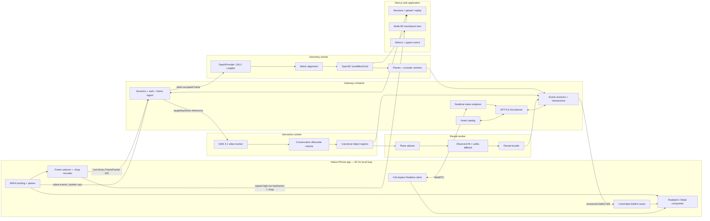

# Reframe Master Technical Prompt

This document is the product and architecture authority for Reframe. Implement
the system described here as production software: preserve its deterministic
boundaries, keep external dependencies behind typed ports, and update this file
whenever a product-level contract intentionally changes.

---

## 0. Product definition

Reframe is a live diminished- and augmented-reality room editor. The primary experience runs in a native iPhone application: the real camera feed remains the photoreal background, ARKit keeps the world stable, and Reframe draws only the virtual content needed to make an edit believable—background reveal surfaces, occlusion geometry, replacement furniture, shadows, and UI. Cloud services continuously improve spatial understanding but never enter the 60 Hz rendering loop.

The final architecture has three product modes:

- **Mode A — Live AR:** native SwiftUI + ARKit + RealityKit/Metal on iPhone. Place, replace, remove, and restore while looking through the live camera.
- **Mode B0 — Scan, process, and continue:** every capture is recorded in `.rfcap`; the same session can be processed or replayed later and edited from the Next.js application. Ordinary uploaded video is also supported.
- **Mode B1 — Photoreal twin:** an immutable capture snapshot may be globally consolidated and optimized into a Gaussian-splat scene for the web after the live and replay paths meet their requirements.

### 0.1 Parallel geometry tracks

Mode A no longer waits for dense TSDF reconstruction before an object can be edited. It has two parallel geometry tracks:

1. **Fast interaction track — critical path:** ARKit metric poses and planes + a reticle/tap-seeded SAM 3.1 video track + a conservative multi-view silhouette volume. This produces an object identity, approximate volume, OBB, support relation, and reveal footprint quickly enough for replace/remove decisions.
2. **Dense understanding track — enhancement path:** learned depth + robust metric alignment + Open3D VoxelBlockGrid TSDF. This improves dimensions, collisions, occlusion meshes, fallback-web geometry, and research metrics, but it may not block a valid fast-path edit.

Do not make the first edit depend on this serial chain:

```text
learned depth → scale fit → TSDF → semantic lift → shell → compositor → first edit
```

Use these parallel paths:

```text
ARKit pose/planes + SAM track → conservative object volume → reveal bundle → first edit
                                 └──────────── dense TSDF improves it in parallel
```

### 0.2 Permanent architecture rules

- **No camera-pixel “punching” in the primary compositor.** The camera background is untouched. Reframe overlays true-3D floor/wall reveal proxies and virtual assets. A Metal stencil compositor is the fallback when RealityKit cannot meet quality.
- **A reveal may contain several surfaces.** A chair can expose floor, wall, and skirting board; the data model no longer assumes one plane.
- **Readiness is capability-specific.** `replace_ready` and `remove_ready` are separate. Replacement can become available before empty removal.
- **The editing volume and collision surface are separate artifacts.** A conservative closed mask volume is used for diminished reality; a denser surface mesh is used for dimensions and collision.
- **Tap selection is first class.** Voice + reticle is the primary interaction, but tap uses the same resolver and remains available without AI.
- **The GPU stack is separated into Docker services immediately.** LingBot/geometry and SAM 3.1 have incompatible recommended Python/PyTorch environments.
- **The depth model is isolated behind a provider interface.** DA3Metric and LingBot serve different input modes and must not leak provider state into scene identity.
- **Mode B0 is guaranteed.** Mode B1 never consumes live-path compute or blocks core product behavior.

---

## 1. Product boundary and non-negotiable scope

### 1.1 Core user-visible operations

Reframe exposes exactly four editing operations:

1. **Place:** place one catalog asset on a detected floor at the reticle/tap location.
2. **Replace:** replace the staged freestanding armchair or small side table with a normalized asset that physically fits and visually covers the old object.
3. **Remove:** hide the staged object and reveal a precomputed multi-surface background bundle.
4. **Restore / undo:** restore the real object or undo the most recent committed transaction, locally and immediately.

The primary operation is **replace**. Empty removal is enabled only when its reveal-quality requirements pass.

### 1.2 Initial operating envelope

- One controlled, well-lit room.
- One freestanding primary object with clear floor around it.
- Prefer a plain or slowly varying wall behind the object.
- Capture duration of approximately 30–120 seconds.
- Base iPhone 17, without relying on rear LiDAR.
- A broad indexed furniture catalog plus a small synchronized set of injection-ready assets with validated USDZ and GLB derivatives.
- One active room session per warm GPU worker set until measured capacity supports greater concurrency.

### 1.3 Explicitly out of scope

- General-purpose removal of every object or non-planar background.
- Whole-room automatic semantic discovery.
- Recoloring a real object while preserving shading.
- Multi-room mapping.
- Cross-launch AR relocalization.
- Robust submap alignment after an ARKit world reset.
- On-device neural reconstruction or segmentation.
- Dynamic people/pets as editable objects.
- Photoreal Mode B1 on the critical path.
- Android, visionOS, Quest, or OpenXR clients in the current architecture.

---

## 2. Architecture overview



### 2.1 Local loop

The local loop is independent of the network and targets 60 FPS:

1. ARKit updates camera pose, plane anchors, tracking quality, light estimate, and raycasts.
2. RealityKit or Metal draws the camera background.
3. The compositor draws retained-scene occlusion meshes.
4. For removed/replaced objects, it draws the active reveal layers.
5. It draws replacement/placed USDZ entities, contact shadows, and status UI.
6. Committed EditKit artifacts are stored locally and continue rendering if the network fails.

No per-frame neural model runs on the phone in core release.

### 2.2 Cloud fast interaction loop

The fast interaction loop is event-driven:

1. Reticle dwell or tap captures `frame_id`, pixel, world ray, and ARKit hit.
2. SAM 3.1 starts or refines one video track.
3. Tracked masks and ARKit camera matrices form a conservative closed object volume.
4. ARKit planes establish floor/wall support and the approximate reveal surfaces.
5. Plane atlases and a reveal bundle are generated.
6. Capability states transition independently: `tracked`, `geometry_ready`, `replace_ready`, `remove_ready`.
7. The phone receives only changed, revisioned artifacts.

### 2.3 Cloud dense understanding loop

Accepted frames are processed asynchronously:

1. DepthProvider predicts metric depth or reconstructs depth/pose.
2. Native ARKit sessions use ARKit as the pose authority.
3. Depth is converted into the project’s depth convention and aligned to ARKit validated input.
4. High-confidence measurements are integrated into a sparse CUDA TSDF.
5. The TSDF produces a retained-scene occluder mesh, object surface meshes, dimensions, and Mode B0 geometry.
6. Dense results may upgrade artifacts but never invalidate committed object UUIDs or transactions.

### 2.4 Voice/agent loop

1. The iPhone obtains a short-lived Realtime credential from the gateway.
2. Full-duplex audio travels directly over WebRTC.
3. Realtime emits a minimal `submit_user_turn` function call—or asks a clarifying question—and the gateway schema-validates it.
4. The gateway invokes GPT-5.6 Sol through the Responses API with strict tool schemas for load-bearing intent and candidate selection.
5. Deterministic tools resolve spatial targets and validate physical constraints.
6. A preview is issued; commit creates a new scene revision and EditKit delta.

Realtime is not treated as the source of canonical structured state: the current Realtime model supports function calling but not Structured Outputs. Strictness and retries therefore live in the gateway/Sol planning boundary, not in the audio model.

---

## 3. Product modes

### 3.1 Mode A — Live AR

**Client:** native SwiftUI iOS application.  
**Tracking:** ARKit is authoritative.  
**Visual skin:** live camera feed.  
**Rendered additions:** reveal geometry, occluders, USDZ assets, shadows, coaching and readiness UI.  
**Required operations:** place, replace, remove, undo.  
**Network behavior:** new understanding pauses when disconnected; committed edits remain visible.

Mode A is the product’s primary mode.

### 3.2 Mode B0 — Scan, process, and continue

Mode B0 is a guaranteed core release product, not merely a developer utility.

Inputs:

- `.rfcap` recorded by the iOS application;
- ordinary uploaded MP4/MOV video;
- browser capture using `getUserMedia` as a low-priority convenience path.

Outputs:

- persistent session and scene graph;
- TSDF mesh or point cloud in a Next.js/Three.js viewer;
- object selection and typed/voice edit commands;
- catalog asset placement;
- replay timeline, metrics, and artifact inspection.

For `.rfcap`, ARKit poses are reused. For ordinary video, LingBot owns the camera trajectory and geometry. Mode B0 shares scene, transaction, catalog, semantics, and reveal services with Mode A.

### 3.3 Mode B1 — Photoreal polish

B1 remains disabled until all live and replay requirements pass.

Pipeline:

```text
immutable session snapshot
→ select 80–160 sharp, diverse keyframes
→ MapAnything Apache model for global metric consolidation
→ gsplat optimization
→ compressed/versioned Gaussian skin
→ Spark viewer in Next.js
```

B1 may only replace a render skin. It cannot rewrite canonical object IDs, support relations, transactions, or undo history.

---

## 4. Capability and lifecycle model

A single `editable` flag is insufficient. Each object exposes independent capability readiness:

```text
candidate
  └─ observed once
tracked
  └─ stable 2D video identity
geometry_ready
  └─ conservative 3D volume + OBB + support relation
replace_ready
  └─ geometry_ready + validated asset candidate + sufficient visual cover
remove_ready
  └─ geometry_ready + reveal bundle passing coverage and quality requirements
retired / uncertain
  └─ contradictory, lost, dynamic, or unsupported
```

### 4.1 Readiness rules

User-facing readiness is the intersection of server validated input and client activation. A server artifact is not ‘ready’ until the phone has downloaded it, verified its hash, created the render entity, and acknowledged the artifact revision.

| Capability | Minimum validated input |
|---|---|
| `place_ready` | stable ARKit floor plane and valid raycast |
| `tracked` | stable SAM identity; one view may establish the track |
| `geometry_ready` | at least two calibrated masks with adequate baseline, closed conservative volume, OBB, and support surface |
| `replace_ready` | geometry ready, asset fits, and asset-only or asset+reveal composite coverage passes |
| `remove_ready` | reveal bundle covers the projected target across sampled views and passes texture/seam checks |

### 4.2 User-facing states

- **Looking:** no target selected.
- **Understanding:** target selected; track/volume being built.
- **Replace ready:** replacement is safe even if empty removal is not.
- **Remove ready:** reveal bundle meets quality thresholds.
- **Healing:** reveal generation is still running; the system must not pretend removal is instant.
- **Tracking paused:** ARKit tracking is limited; new edits are disabled but committed edits remain.

---

## 5. Technical decisions

| ID | Decision | Required choice | Reason |
|---|---|---|---|
| RF-D1 | Native client | SwiftUI, ARKit, RealityKit/Metal | Direct spatial, audio, capture, and rendering control |
| RF-D2 | Universal client | Separate Next.js application | Cross-device upload, replay, typed control, and Mode B viewing |
| RF-D3 | Metric pose | ARKit VIO on healthy native sessions | Low-latency, metric, gravity-aligned tracking |
| RF-D4 | Live dependency | Fast semantic/plane path does not wait for TSDF | Keeps learned dense geometry off the interaction critical path |
| RF-D5 | Dense geometry | DA3Metric-Large behind `DepthProvider`; Open3D CUDA TSDF | Replaceable inference with deterministic metric alignment and fusion |
| RF-D6 | RGB-only mapping | LingBot-Map | Streaming trajectory and geometry for ordinary video |
| RF-D7 | Semantics | SAM 3.1 point/box-seeded tracking | Persistent target identity without whole-room discovery |
| RF-D8 | Diminished reality | Multi-surface reveal proxies | Keeps the real camera background intact |
| RF-D9 | Rendering | RealityKit first; ARKit + Metal fallback | Native anchoring with an explicit compositor escape hatch |
| RF-D10 | Agent | Realtime WebRTC + gateway validation + GPT-5.6 Sol | Conversational input with schema-constrained planning |
| RF-D11 | Catalog | Authorized acquisition + content-addressed assets + Qdrant | Scalable retrieval without placing large binaries in Git |
| RF-D12 | Persistence | SQLite WAL + filesystem/shared volumes | Durable single-authority state without unnecessary infrastructure |
| RF-D13 | Contracts | JSON Schema with Swift, TypeScript, and Python adapters | One wire definition across runtimes |
| RF-D14 | Confirmation | Preview, then spoken or tapped confirmation | The model cannot directly mutate canonical scene state |

---

# Part II — External contracts

## 6. Coordinate, image, and time conventions

These conventions are invariants, not implementation suggestions.

### 6.1 World and camera coordinates

- World is right-handed, metres, gravity aligned, **+Y up**.
- ARKit camera local axes are +X right, +Y up, and the camera looks along −Z.
- Server/OpenCV camera axes are +X right, +Y down, +Z forward.
- Mathematics uses column vectors; serialization is row-major only. The numeric axis-flip matrix is self-inverse, but its direction is named explicitly:

```text
C_arkit_from_opencv = diag(1, -1, -1, 1)
T_world_from_camera_cv = T_world_from_camera_arkit × C_arkit_from_opencv
T_camera_cv_from_world = inverse(T_world_from_camera_cv)
```

- `world_from_camera_arkit` is serialized by logical rows; never memcpy a column-major `simd_float4x4` into the wire buffer.
- Open3D integration receives the explicitly documented `T_camera_cv_from_world` extrinsic.
- Every matrix field carries a convention/version in the session manifest.

### 6.2 Image transforms and intrinsics

The encoded image is always orientation `up` and normalized to sRGB. Native bi-planar YCbCr conversion, crop, rotation, and resize are defined as one pixel transform `A`. If the native sensor image is transformed:

```text
K_encoded = A × K_sensor
```

The same transform must be applied to masks, point prompts, and returned pixels. A known-ray projection test is mandatory in CI.

### 6.3 Depth convention

`DepthObservation.depth_m` is optical-axis/projective **Z depth in metres in the encoded OpenCV camera frame**, not Euclidean ray range. Providers must convert before returning. Confidence is normalized to `[0, 1]` and provider-specific raw diagnostics are kept separately.

### 6.4 Time

- `timestamp_ns` uses the iOS monotonic uptime clock derived from the AR frame timestamp.
- `clock_domain` is explicit.
- Network and server timings use monotonic clocks.
- Gateway performs periodic ping exchanges and records a clock-offset estimate; latency metrics never subtract unrelated wall clocks.

---

## 7. FramePacket contract

### 7.1 Binary frame

All integers are little-endian. The fixed 24-byte header is:

| Offset | Size | Field |
|---:|---:|---|
| 0 | 4 | ASCII magic `RFFP` |
| 4 | 2 | `protocol_version` (`uint16`) |
| 6 | 2 | flags (`uint16`) |
| 8 | 4 | JSON metadata length (`uint32`) |
| 12 | 4 | image payload length (`uint32`) |
| 16 | 8 | `frame_id` (`uint64`) |

Header is followed by UTF-8 JSON metadata and then the image payload. core release payload is JPEG. Unknown flags are ignored only when the protocol major version matches.

### 7.2 Metadata schema example

```json
{
  "protocol_version": 1,
  "session_id": "room_2026_07_13_01",
  "submap_id": 0,
  "frame_id": 842,
  "timestamp_ns": 1783918472391823,
  "clock_domain": "ios_monotonic_uptime",
  "image": {
    "codec": "jpeg",
    "width": 640,
    "height": 480,
    "orientation": "up",
    "color_space": "sRGB",
    "payload_bytes": 48372
  },
  "intrinsics_encoded": [514.4, 0.0, 319.8, 0.0, 513.9, 239.6, 0.0, 0.0, 1.0],
  "world_from_camera_arkit": [
    0.99, 0.00, -0.04, 1.42,
    0.01, 1.00, 0.02, 1.53,
    0.04, -0.02, 0.99, -2.18,
    0.00, 0.00, 0.00, 1.00
  ],
  "tracking": {
    "state": "normal",
    "reason": "none",
    "world_frame_version": 1
  },
  "capture_quality": {
    "blur_score": 0.08,
    "angular_velocity_rad_s": 0.19,
    "translation_since_last_m": 0.034,
    "rotation_since_last_deg": 3.2,
    "exposure_s": 0.0083,
    "iso": 142
  }
}
```

### 7.3 Header flags

```text
bit 0: selected_keyframe
bit 1: replay_packet
bit 2: final_packet
bit 3: high_priority_target_view
bit 4: optional_depth_payload_present (reserved; not used on base iPhone 17 core release)
```

### 7.4 Acceptance and backpressure

- Native selection threshold, initial values: translation ≥ 0.03 m, rotation ≥ 3°, coverage gain, high-priority target view, or 250 ms since last accepted frame.
- Reject when ARKit tracking is not normal, blur/angular velocity is excessive, exposure is transitioning, or the socket has an unacknowledged frame and the queue is full.
- Native queue capacity: 2.
- Worker queue capacity: 1–2.
- When overloaded, keep the newest useful frame; never accumulate latency.

---

## 8. Plane and pointer event contracts

Plane anchors and user pointing are control events, not duplicated into every frame. ARKit plane IDs are ephemeral observations; the gateway/geometry worker associates them with versioned canonical surfaces such as `floor_01`. A removed or merged ARKit anchor never silently changes an object’s canonical support surface.

```json
{
  "type": "plane_upsert",
  "session_id": "room_2026_07_13_01",
  "plane_id": "arkit_plane_07",
  "revision": 4,
  "classification": "floor",
  "world_from_plane": ["16 float32 row-major"],
  "extent_m": [3.82, 4.10],
  "boundary_vertices_local_xz_m": [[-1.9,-2.0],[1.9,-2.0],[1.9,2.1],[-1.9,2.1]],
  "confidence": 0.88
}
```

```json
{
  "type": "target_seed",
  "session_id": "room_2026_07_13_01",
  "frame_id": 842,
  "pixel_encoded": [318.0, 251.0],
  "ray_world": {
    "origin": [1.42, 1.53, -2.18],
    "direction": [0.11, -0.18, -0.98]
  },
  "arkit_hit": {
    "surface_id": "arkit_plane_07",
    "position_world": [1.66, 0.01, -4.31]
  },
  "source": "reticle_dwell"
}
```

`source` is one of `reticle_dwell`, `tap`, `voice_capture`, or `debug_web`. `plane_remove` carries the same session/plane ID and final revision; `plane_upsert` revisions are monotonic per observed anchor.

---

## 9. `.rfcap` contract

While recording, `.rfcap` is a directory. On clean finish it may be zipped without changing its internal paths.

```text
session.rfcap/
  manifest.json
  frames/
    000000000001.jpg
    000000000002.jpg
  keyframes/
    000000000842.jpg
  frames.jsonl
  keyframes.jsonl
  events.jsonl
  checksums.json
```

### 9.1 Durability

- Every accepted packet is enqueued to the local writer before it is offered to the network sender.
- Frame image is written to a temporary name and atomically renamed.
- `frames.jsonl` is append-only; batching flushes is allowed.
- `checksums.json` is finalized at session end.
- A crash may lose the last buffered frame, but must not corrupt prior records.
- Replay emits the same logical FramePacket sequence, preserving IDs, timestamps, poses, intrinsics, and event ordering.
- `keyframes/` contains sparse high-resolution stills (target long edge ≤1440 px initially) keyed to the same AR frame IDs; they are encoded off the render thread and uploaded over signed HTTP, never through the live FramePacket socket.
- `keyframes.jsonl` records the high-resolution image size, exact encoded-image intrinsics, crop/orientation transform, source frame ID, sharpness, and selection reason.

### 9.2 Manifest minimum

```json
{
  "format": "rrcap",
  "version": 1,
  "session_id": "room_2026_07_13_01",
  "created_at": "2026-07-13T17:30:00Z",
  "device": {"model": "iPhone 17", "os": "iOS 26"},
  "world": {"units": "metres", "handedness": "right", "up_axis": "+Y"},
  "image_orientation": "up",
  "matrix_layout": "row_major",
  "camera_convention": "arkit",
  "tsdf_parameters": null,
  "consent": {"upload": true, "retain_raw_until": "2026-07-14T17:30:00Z"}
}
```

---

## 10. DepthProvider contract

```python
class DepthProvider(Protocol):
    def start_session(self, calibration: SessionCalibration) -> None: ...
    def infer(self, packet: FramePacket) -> DepthObservation: ...
    def finish_session(self) -> ProviderSummary: ...
```

```json
{
  "frame_id": 842,
  "provider": "da3metric-large",
  "depth_convention": "opencv_z_m",
  "depth_shape": [480, 640],
  "depth_ref": "depth/000000000842.f16.zst",
  "confidence_ref": "confidence/000000000842.u8.zst",
  "pose_source": "arkit",
  "world_from_camera_cv": ["16 float32"],
  "alignment": {
    "scale": 1.027,
    "bias_m": 0.0,
    "inliers": 87,
    "median_abs_residual_m": 0.041,
    "accepted": true
  },
  "timing_ms": {"decode": 4.9, "infer": 31.4, "align": 1.7}
}
```

Provider implementations:

- `DA3MetricProvider`: ARKit pose + DA3Metric-Large monocular metric depth.
- `DA3PoseConditionedProvider`: short, pose-conditioned DA3-Small/Base window; scaled into ARKit world.
- `LingBotProvider`: RGB-only mode; owns pose and geometry when ARKit metadata is absent.

A stable ARKit session never mixes LingBot poses into its world unless an explicit, measured alignment decision is recorded in this prompt.

---

## 11. EditKit artifact contracts

Every external artifact reference carries `mime_type`, `byte_length`, and `sha256` in the normative JSON Schema, even when an abbreviated example below shows only the signed URL. Clients verify length and hash before atomic activation; a failed artifact never advances the scene revision locally.
The client sends `artifact_activated {artifact_id, revision, sha256}` after GPU/resource creation succeeds; capability chips use this acknowledgement rather than server generation status alone.

### 11.1 Object artifacts

```json
{
  "object_id": "chair_04",
  "artifact_revision": 3,
  "mask_volume": {
    "type": "voxel_rle",
    "world_from_volume": ["16 float32"],
    "voxel_size_m": 0.025,
    "dimensions": [48, 39, 41],
    "payload_url": "signed://objects/chair_04/mask-volume-v3.bin",
    "conservative_dilation_m": 0.035
  },
  "mask_mesh": {
    "status": "available",
    "payload_url": "signed://objects/chair_04/mask-mesh-v3.bin",
    "triangle_count": 1860,
    "source": "mask_volume_isosurface"
  },
  "surface_mesh": {
    "status": "available",
    "payload_url": "signed://objects/chair_04/surface-v2.bin",
    "triangle_count": 3820,
    "source": "tsdf_semantic_subset"
  },
  "obb": {
    "center_world": [1.42, 0.48, -2.18],
    "extent_m": [0.82, 0.96, 0.78],
    "yaw_rad": 1.43
  }
}
```

`mask_volume` is conservative and closed. It is not assumed to be an accurate visible surface. `mask_mesh` is the renderable isosurface used by the Metal stencil fallback; the RealityKit plane-proxy path may not need it. `surface_mesh` is the less conservative geometry used for collision and dimensions, and may be absent when the fast path first reaches `geometry_ready`.

### 11.2 Reveal bundle

`layers[].geometry.type` is a tagged union. core release implements `plane_polygon`; `textured_mesh` is permitted for a skirting board or other thin non-coplanar reveal without changing the bundle contract. The main product should still prefer floor/wall-backed targets.

```json
{
  "reveal_bundle_id": "reveal_chair_04_v5",
  "object_id": "chair_04",
  "revision": 5,
  "layers": [
    {
      "layer_id": "floor_layer",
      "surface_id": "floor_01",
      "geometry": {
        "type": "plane_polygon",
        "world_vertices": [[1.0,0.0,-2.8],[2.0,0.0,-2.8],[2.0,0.0,-1.5],[1.0,0.0,-1.5]],
        "uv": [[0,0],[1,0],[1,1],[0,1]]
      },
      "texture_url": "signed://reveals/chair_04/floor-v5.png",
      "alpha_url": "signed://reveals/chair_04/floor-v5-alpha.png",
      "reference_color_space": "linear_srgb",
      "photometric_reference_frame_ids": [711, 734, 790],
      "source_map_url": "signed://reveals/chair_04/floor-v5-provenance.bin",
      "feather_px_at_1080p": 8,
      "quality": 0.91
    },
    {
      "layer_id": "wall_layer",
      "surface_id": "wall_02",
      "geometry": {"type": "plane_polygon", "world_vertices": [], "uv": []},
      "texture_url": "signed://reveals/chair_04/wall-v5.png",
      "alpha_url": "signed://reveals/chair_04/wall-v5-alpha.png",
      "source_map_url": "signed://reveals/chair_04/wall-v5-provenance.bin",
      "feather_px_at_1080p": 8,
      "quality": 0.86
    }
  ],
  "coverage": {
    "sampled_views": 8,
    "p10_target_coverage": 0.968,
    "median_target_coverage": 0.991
  },
  "state": "ready"
}
```

### 11.3 Occluder chunks

```json
{
  "chunk_id": "room_occ_012",
  "revision": 7,
  "world_from_chunk": ["16 float32"],
  "mesh_url": "signed://occluders/room_occ_012_v7.bin",
  "triangle_count": 6120,
  "excluded_object_ids": ["chair_04"]
}
```

### 11.4 Asset manifest

```json
{
  "asset_id": "chair_red_02",
  "category": "armchair",
  "style": ["modern", "warm"],
  "color": "red",
  "dimensions_m": [0.79, 0.91, 0.82],
  "origin": "floor_contact_center",
  "forward_axis": "-Z",
  "delivery": "bundled_p0",
  "local_bundle_key": "chair_red_02.usdz",
  "usdz_url": "signed://assets/chair_red_02.usdz",
  "glb_url": "signed://assets/chair_red_02.glb",
  "collision_hull_url": "signed://assets/chair_red_02_hull.bin",
  "mobile_download_bytes": 8241312,
  "license": {"spdx": "CC-BY-4.0", "source_url": "...", "attribution": "..."}
}
```

### 11.5 Edit delta

```json
{
  "type": "edit_delta",
  "scene_revision": 48,
  "base_scene_revision": 47,
  "transaction_id": "txn_081",
  "idempotency_key": "b02735d7-9204-4f22-8ef8-943f46793f11",
  "ops": [
    {"op": "set_object_visibility", "object_id": "chair_04", "value": "hidden"},
    {"op": "set_reveal_visibility", "reveal_bundle_id": "reveal_chair_04_v5", "value": true},
    {
      "op": "place_asset",
      "asset_id": "chair_red_02",
      "instance_id": "placed_017",
      "world_from_asset": ["16 float32"]
    }
  ],
  "inverse_ops": [
    {"op": "remove_asset_instance", "instance_id": "placed_017"},
    {"op": "set_reveal_visibility", "reveal_bundle_id": "reveal_chair_04_v5", "value": false},
    {"op": "set_object_visibility", "object_id": "chair_04", "value": "visible"}
  ],
  "local_undo": {
    "token": "undo_txn_081",
    "valid_for_committed_revision": 48
  }
}
```

All deltas are idempotent. The phone acknowledges `scene_revision` and each artifact revision. During the active AR session the phone may apply `inverse_ops` immediately without the network, mark the undo `pending_sync`, and submit the undo token when connectivity returns; the gateway then creates the next canonical scene revision. core release assumes one editor, so no concurrent merge is attempted.

---

## 12. Canonical scene graph

```json
{
  "schema_version": 2,
  "scene_revision": 48,
  "session_id": "room_2026_07_13_01",
  "world_frame": {
    "id": "world_01",
    "version": 1,
    "metric": true,
    "handedness": "right",
    "up_axis": "+Y",
    "pose_source": "arkit_vio",
    "scale_confidence": 0.96
  },
  "surfaces": [
    {
      "id": "floor_01",
      "type": "plane",
      "plane_world": [0.0, 1.0, 0.0, -0.01],
      "atlas_ref": "atlases/floor_01/v8",
      "confidence": 0.95
    },
    {
      "id": "wall_02",
      "type": "plane",
      "plane_world": [0.04, 0.0, 0.999, 3.18],
      "atlas_ref": "atlases/wall_02/v6",
      "confidence": 0.90
    }
  ],
  "objects": [
    {
      "id": "chair_04",
      "track_revision": 12,
      "capabilities": {
        "tracked": true,
        "geometry_ready": true,
        "replace_ready": true,
        "remove_ready": true
      },
      "label": {
        "category": "armchair",
        "attributes": {"color": "gray", "material": "fabric"},
        "confidence": 0.93,
        "source": "gpt-5.6-sol"
      },
      "spatial_region_ref": "regions/chair_04/v12",
      "mask_volume_ref": "objects/chair_04/mask-volume-v3",
      "surface_mesh_ref": "objects/chair_04/surface-v2",
      "obb": {
        "center_world": [1.42, 0.48, -2.18],
        "extent_m": [0.82, 0.96, 0.78],
        "yaw_rad": 1.43
      },
      "support_surface_ids": ["floor_01"],
      "reveal_bundle_ref": "reveal_chair_04_v5",
      "state": {
        "visibility": "hidden",
        "replacement_instance_id": "placed_017"
      }
    }
  ],
  "placed_assets": [
    {
      "instance_id": "placed_017",
      "asset_id": "chair_red_02",
      "world_from_asset": ["16 float32"],
      "state": "visible"
    }
  ]
}
```

The scene graph never contains RealityKit entity IDs, Three.js object indices, Gaussian IDs, or Open3D buffer indices.

Optional `navigation_constraints` may contain named 2D polygons on the floor (for example `main_walkway`). When absent, validation reports only minimum geometric gap and must not claim full route connectivity.

---

## 13. Transaction and tool contracts

### 13.1 Transaction state machine

```text
observe
→ resolve target
→ interpret constraints
→ retrieve candidates
→ propose transaction
→ deterministic validation
→ preview
→ commit
→ undo/restore
```

A transaction includes `base_scene_revision`, `idempotency_key`, target-resolution confidence, constraints, validation results, and status. Mutating tools never run in parallel.

### 13.2 Realtime intent ingress

Realtime may invoke only this narrow, non-mutating ingress function:

```json
{
  "name": "submit_user_turn",
  "arguments": {
    "client_turn_id": "turn_019",
    "utterance": "Replace this chair with something warmer and red, but keep the walkway clear.",
    "intent_hint": "replace",
    "pointer_context_id": "ptr_842_01",
    "client_scene_revision": 48,
    "pending_proposal_id": null
  }
}
```

The gateway validates, rate-limits, deduplicates, and attaches authoritative scene/pointer context. Realtime cannot call mutating scene tools directly.

### 13.3 Public GPT tools

Use strict JSON schemas with `additionalProperties: false`.

```text
get_scene_context(region?, detail_level?)
resolve_target(pointer_context_id?, language_reference?)
search_catalog(category?, style?, color?, material?, max_dimensions_m?, budget?)
validate_candidate(target_id, asset_id, constraints?)
prepare_edit_preview(intent, target_id?, asset_id?, constraints?)
```

Commit, restore, hide-object, show-reveal, set-transform, and change-visibility are internal transaction-service functions, not agent-facing primitives.

### 13.4 Deterministic validation

Validation owns:

- target capability readiness;
- support surface;
- asset dimensions and scale;
- bundled/cache availability for core release candidates;
- collision hull;
- room boundary;
- wall intersection;
- 2D minimum floor gap or an explicitly defined walkway-corridor clearance;
- scene revision freshness;
- dependent supported objects;
- reveal readiness;
- replacement visual `cover_score`.

The agent may react to a rejection but cannot override geometry.

### 13.5 Replacement cover score

For sampled captured viewpoints around the target, rasterize the **opaque** replacement geometry rather than its convex hull:

```text
asset_cover_score(view) = area(old_target_projection ∩ opaque_asset_silhouette)
                          / area(old_target_projection)

composite_cover_score(view) = area(old_target_projection ∩
                                    (opaque_asset_silhouette ∪ reveal_projection))
                              / area(old_target_projection)
```

core release defaults:

- asset-only median `cover_score` ≥ 0.98 and tenth-percentile ≥ 0.95; **or**
- combined opaque asset silhouette plus active reveal layers has median coverage ≥ 0.995, tenth-percentile ≥ 0.98, and no uncovered connected component larger than 1% of the original target projection.

An asset-only score below these thresholds may still be used only when the required reveal layers are ready and the combined score passes. This deliberately favors similarly sized or slightly larger replacement assets and prevents small fragments of the real object leaking around legs or armrests.

---

# Part III — Subsystem specifications

## 14. Native iOS capture application


### 14.1 Technology

- SwiftUI application shell.
- `ARSession` with `ARWorldTrackingConfiguration`.
- RealityKit view for the primary compositor; Metal fallback owned by P3.
- Native `URLSessionWebSocketTask` or Network framework WebSocket.
- No Capacitor, Flutter, Unity, or WebView in the hot path.

### 14.2 AR session configuration

- Gravity-aligned world tracking.
- Horizontal and vertical plane detection.
- Autofocus enabled.
- Choose a camera format that sustains stable tracking and at least 30 captured frames/s; the app renders at display cadence.
- Do not enable expensive frame semantics unless a measured core release need exists.
- Monitor `ARCamera.TrackingState` and reason.

### 14.3 Frame selection

The phone emits two image products from the same `ARFrame`:

- low-resolution live packets (initially 640×480 JPEG) over the bounded WebSocket;
- sparse high-resolution keyframes (target long edge ≤1440 px, typically 8–20 around the primary target) written to `.rfcap` and uploaded asynchronously over signed HTTP for reveal textures, naming crops, B0, and optional B1.

Encoding and disk I/O run off the render thread. The high-resolution keyframe keeps its own transformed intrinsics; low- and high-resolution images must never share an intrinsic matrix implicitly.

Initial thresholds are configuration, not constants scattered through Swift:

```yaml
min_translation_m: 0.03
min_rotation_deg: 3.0
max_interval_ms: 250
max_pending_packets: 2
max_blur_score: 0.35
max_angular_velocity_rad_s: 1.2
```

A target-seed event temporarily promotes useful new viewpoints around that object.

### 14.4 Tracking loss

core release behavior:

- `limited`: pause frame acceptance, keep local AR rendering, show coaching.
- recovered in same world frame: resume.
- world reset or discontinuity: stop live cloud integration, preserve `.rfcap`, offer restart or B0 processing.
- Do not implement automatic server-side submap alignment this week.

### 14.5 Local persistence

At commit time, cache:

- reveal bundle textures/geometry;
- target object state;
- USDZ asset and transform;
- occluder chunks required by the edit;
- latest committed scene revision.

Offline persistence is guaranteed for the active AR session. Cross-launch relocalization is not promised.

---

## 15. On-phone compositor


### 15.1 Primary RealityKit render model

1. AR camera background.
2. Retained scene occluder entities using occlusion-only material.
3. Reveal layer entities with unlit textures, alpha feather, and small depth bias.
4. Replacement and placed USDZ entities.
5. Contact-shadow blob, ambient tint/light estimate, readiness UI, reticle, and coaching.

Until the dense retained-scene occluder arrives, core release uses ARKit planes and the staged room avoids foreground blockers across the primary walk path. The product must not imply general real-object occlusion before the proxy mesh is available.

The target object’s occluder contribution is disabled when it is hidden. Other room geometry continues to occlude reveal surfaces and virtual furniture.

### 15.2 Why no primary screen-space punch-out

The camera feed is immutable. A reveal layer is actual virtual background geometry at the floor/wall location, so the same content reprojects correctly as the camera moves. Large observed-texture areas may extend beyond the old silhouette; because they represent the same physical plane, this is preferable to unstable per-frame mask cutting. Boundaries are feathered and selected in low-gradient areas.

### 15.3 Metal fallback requirement

Timebox RealityKit verification to half a day. Switch to ARKit + Metal when any of the following cannot be demonstrated on canned data:

- deterministic layer ordering;
- reveal geometry overlays camera content correctly;
- retained-scene occlusion works;
- USDZ/mesh asset occlusion is coherent;
- stable 45+ FPS on the iPhone 17;
- no severe alpha/depth artifacts at reveal boundaries.

The Metal fallback may render a projected mask volume into stencil and composite reveal textures explicitly. Do not spend more than the requirement window trying to force an unsuitable RealityKit path.

### 15.4 Revision behavior

- Artifact revisions are downloaded before activation.
- Crossfade reveal texture revisions over 150–250 ms.
- At 3–5 Hz, estimate a smoothed per-channel gain and small luma offset from a visible ring of the same plane around the reveal; apply it in the reveal material so the cached atlas follows current exposure/white balance. Fall back to ARKit light estimate when the ring is insufficient.
- Freeze reveal and mask-volume revisions after commit unless improvement exceeds a logged quality threshold.
- A new occluder revision is swapped atomically.

---

## 16. Fast interaction geometry


### 16.1 Target acquisition

core release supports:

- center-reticle dwell of approximately 400 ms;
- explicit tap;
- utterance-time reticle snapshot.

All routes generate the same `target_seed` contract. Tap is not a different editing system.

### 16.2 Conservative multi-view silhouette volume

The fast path builds a closed volume without learned depth:

1. Seed a SAM video track on the selected frame.
2. Collect two to four views with normal tracking and at least one useful baseline: ≥0.15 m translation or ≥12° view change; prefer 20–60° rather than nearly duplicate or opposite views. A target seed enables a bounded 1.5-second 10–12 FPS upload burst while stale frames are still dropped.
3. Establish a candidate 3D ROI using support-plane intersection, mask ray bundle, category-agnostic furniture height limits, and room bounds.
4. Discretize at 2–3 cm.
5. Project each voxel center into each valid mask.
6. Accumulate confidence from signed mask distance, view angle, track score, and image quality.
7. Keep voxels supported by at least two views and a weighted occupancy threshold; avoid strict all-view intersection.
8. Fill enclosed cavities, perform one-voxel closing, and dilate by approximately 3–4 cm.
9. Extract OBB and optional low-triangle boundary mesh.

This artifact is intentionally conservative: slight overcoverage is safer than leaving real-object fragments visible.

### 16.3 Support and dependency

- Floor support is inferred from the lowest occupied voxels and the stable ARKit floor plane.
- Tabletop or shelf support is P1 unless the dense geometry path already exposes a reliable support plane.
- Removing an object with dependents is blocked. core release may offer a confirmed cascade only when all dependent objects are themselves virtual or have valid reveal coverage.

---

## 17. Depth providers and metric alignment


### 17.1 Provider candidates

#### A. DA3Metric-Large — initial enhanced-path implementation

- Input: single encoded frame and focal length.
- Output: monocular metric depth; repository formula is applied exactly.
- Pose: ARKit.
- Strength: simple, metric, and decoupled from trajectory estimation.
- Risk: per-view temporal scale/shape variation.

#### B. DA3-Small/Base pose-conditioned short window — bake-off candidate

- Input: a short view window plus known ARKit camera poses.
- Output: more temporally consistent multi-view geometry, then metric scaling/alignment.
- Strength: provider explicitly uses known poses; smaller model sizes.
- Risk: window-management and latency complexity.

#### C. LingBot-Map — universal fallback

- Input: RGB stream or video.
- Output: streaming pose and geometry.
- Used when ARKit metadata is absent or corrupt.
- It is not the default trajectory provider inside a healthy ARKit session.

### 17.2 D1/D2 replay bake-off

Run the same `.rfcap` through A and B, and a video-only derivative through C. Record:

- median/p95 inference time;
- peak VRAM;
- floor-plane RMSE;
- three taped-distance errors;
- wall thickness in TSDF;
- edge quality around the primary object;
- temporal depth flicker;
- loop-return drift;
- rejected-frame rate;
- qualitative side-by-side mesh.

Choose one ARKit depth provider in a a bounded provider decision. Do not build a general benchmark platform.

### 17.3 Robust alignment

For ARKit sessions:

1. Convert provider output to OpenCV optical-axis Z depth.
2. Project ARKit raw feature points and stable plane intersections into the encoded frame.
3. Sample predicted depths only at spatially distributed, valid correspondences.
4. Fit robust scale-only correction first.
5. Permit bounded affine bias only if it improves held-out residuals and has sufficient spatial support.
6. Temporally smooth accepted parameters.
7. Reject the frame if support or residual quality is insufficient.
8. Once stable, add TSDF raycast correspondences as validated input.

Initial tunable limits:

```text
minimum inliers:             20
scale clamp:                 [0.85, 1.15]
absolute bias clamp:         0.15 m
minimum image quadrants:     3
EMA alpha:                   0.10
```

A plausible-looking but weakly aligned frame is worse than a dropped frame.

---

## 18. Dense geometry and TSDF


### 18.1 Integration

Use Open3D tensor `VoxelBlockGrid` on CUDA. Integrate continuously, but extract/decimate meshes at a bounded cadence (initially 1 Hz) or on interaction demand; do not run full-scene marching cubes per input frame. Limit active blocks to the observed room envelope and record evictions/reloads.

Initial configuration:

```yaml
voxel_size_m: 0.02
sdf_trunc_m: 0.08
depth_min_m: 0.25
depth_max_m: 6.0
max_voxel_weight: 32
```

Before integration:

- derive confidence from provider output when available, otherwise from temporal agreement, alignment residuals, and edge proximity;
- remove low-confidence pixels;
- erode depth discontinuities;
- reject gross disagreement with a stable raycast;
- exclude target/object masks where dynamic motion is suspected;
- require normal ARKit tracking and accepted depth alignment.

### 18.2 Canonical addressing

External references use:

```text
(submap_id, block_coordinate_xyz, local_voxel_mask, region_revision)
```

Never persist Open3D active-block buffer positions. Rebuild mappings after extraction or compaction.

### 18.3 Outputs

- decimated retained-scene occluder chunks;
- object surface meshes for stable semantic regions;
- plane refinements;
- dimensions and collision proxies;
- Mode B0 mesh/point representation;
- raycasting for alignment and validation.

Dense outputs upgrade existing objects; they do not create new object UUIDs without semantic confirmation.

---

## 19. Semantics and identity


### 19.1 Model

- SAM 3.1 current code and checkpoint.
- Point or box prompt from `target_seed`.
- One primary track is core release; background concept discovery is out of scope.
- SAM worker is a separate Python 3.12+ container.

### 19.2 Video tracking

- Maintain a per-session tracker state.
- Prioritize target-request jobs over every background task.
- Keep frame IDs and encoded pixel coordinates exact.
- Store masks as compressed RLE and scores.
- Request additional views when track confidence or baseline is insufficient.

### 19.3 Association with dense geometry

When depth/TSDF is available:

1. Project canonical surfaces into tracked keyframes.
2. Verify expected visibility using observed depth.
3. Accumulate object probability, down-weighting mask borders, grazing views, low confidence, and inconsistent depth.
4. Use connected components and support-plane priors.
5. Persist a canonical region reference.

### 19.4 Naming

After track stabilization, send one structured GPT-5.6 Sol request containing:

- two to four crops;
- approximate dimensions;
- support relation;
- candidate category list;
- object UUID.

Naming is advisory. A label change never changes identity.

---

## 20. Plane atlases and reveal generation


### 20.1 Plane atlas

Each stable plane defines:

- world origin;
- orthonormal U/V basis;
- metric atlas bounds;
- color atlas;
- observed-weight map;
- source-frame/origin map;
- synthesized mask.

For every useful frame:

1. Ray-intersect candidate pixels with the plane and require the intersection to lie within the current plane boundary.
2. Exclude target masks and known foreground object masks.
3. When dense depth or a stable TSDF raycast exists, reject pixels whose observed depth is in front of the plane; before that exists, require multi-frame photometric consistency and restrict core release atlases to the staged primary floor/wall.
4. Weight contributions by view angle, blur, distance, exposure consistency, and tracking quality.
5. Blend in linear color space with robust outlier rejection.
6. Prefer observed texels over synthesized texels permanently.

An ARKit plane anchor is a geometric prior, not proof that every pixel sees that plane; foreground rejection is therefore mandatory.

### 20.2 Reveal extent

Generate one or more layers for the surfaces behind/under the target. Layer polygons are expanded enough to cover the target’s projection across the captured primary view cone. Because they represent the same wall/floor, modest overdraw is acceptable and safer than incomplete coverage.

### 20.3 Fill hierarchy

core release order:

1. real observed atlas samples;
2. deterministic local texture copying/inpainting for simple low-gradient regions;
3. LaMa fallback in its isolated worker.

No diffusion inpainting during the initial release.

### 20.4 Readiness quality requirement

Sample at least eight camera poses from the captured trajectory around the target. Project the conservative target volume and active reveal layers. `remove_ready` requires:

- p10 target coverage ≥0.95;
- median target coverage ≥0.98;
- no uncovered connected component larger than 1% of target projection;
- atlas observed fraction outside the synthesized hole ≥0.80;

If the requirement fails, replacement may still be ready and empty removal stays disabled.

Runtime readiness is fully automatic and contains no fixture, evidence-record, or human-vote
fields. A physical half-circle visual review remains a release acceptance test for the compositor
and reveal pipeline; it is not repeated for each user session. When the camera leaves a reveal's
validated view envelope, the phone disables that reveal and its replacement together, shows the
untouched camera feed, and asks the user to return to the captured area. This local safety behavior
does not change canonical scene state.

### 20.5 Revision policy

- Every texel is `observed(weight, frame_id)` or `synthesized(method, revision)`.
- Observed data may replace synthesized data; synthesized data never replaces observed data.
- Updates are discrete and crossfaded.
- After commit, freeze unless objective seam/coverage score improves materially.

---

## 21. Assets, placement, and replacement


### 21.1 Catalog acquisition and preparation

The catalog pipeline discovers the authorized US-English IKEA product frontier,
observes product-model requests in a controlled browser, and downloads every
discoverable GLB with bounded concurrency, retry/backoff, checkpointing, ETag
support, SHA-256 deduplication, and resumable state. Raw and derived binaries
live in a content-addressed persistent volume, never in Git.

For every asset:

- retain canonical product URL, market, locale, source metadata, and authorization status;
- validate the GLB before processing;
- normalize units to metres, floor-contact-center origin, and a fixed forward axis;
- record explicit dimensions and a low-poly collision proxy;
- produce a compressed web GLB and compliant mobile USDZ derivative;
- produce bounded textures, mobile LODs, and a canonical turntable image;
- record immutable hashes for every input and output;
- enrich category, color, style, material, and descriptive labels from product data and GPT-5.6 vision.

Qdrant stores metadata filters and the 1,024-dimensional `semantic_v1` vector
generated from text plus visual descriptors. The schema reserves `visual_v1`
for a later local image encoder. Retrieval applies deterministic eligibility
filters first, vector ranking second, and GPT reranking only to the bounded
eligible set.

The complete corpus remains in persistent catalog and Qdrant volumes. An
explicit `catalog sync --profile primary` operation pre-caches a small set of
injection-ready assets for iOS and web; application builds never download
assets and fail clearly if the requested cache is missing.

### 21.2 Placement

- Local ghost appears immediately using an ARKit raycast.
- Server validation checks support, bounds, collision, wall intersection, orientation, and clearance.
- Core clearance is an honest 2D floor-footprint calculation, not full path planning: project collision hulls/OBBs onto the support plane, compute distance to room-boundary segments and retained obstacle footprints, and report the minimum free gap. A spoken “keep the walkway clear” constraint maps to `minimum_gap_m` unless a named walkway corridor exists.
- A corrected transform is smoothly reconciled; never teleport without indication.
- Add a soft contact-shadow blob and ARKit light-estimate tint.

### 21.3 Replacement

- Resolve the real target.
- Retrieve asset candidates by dimensions and style.
- Validate geometry and `cover_score`.
- Render and score the exact delivered opaque geometry, including material cutouts. Do not use a
  convex hull as a visual-coverage proxy and do not semantically rescale real products after unit
  normalization. Search only bounded translation and yaw around floor-contact-center alignment.
- Preview local reveal + asset.
- Require spoken or tapped confirmation.
- Commit as one compare-and-swap transaction.
- Undo restores target visibility, hides reveal and replacement, and needs no server call.

---

## 22. Gateway, GPT-5.6 Sol, and voice


### 22.1 Gateway responsibilities

- session lifecycle and room-scoped tokens;
- authenticated single-upload FramePacket ingest, a 5-second/64-frame recent-frame ring for target tracking, a separate latest-only compute queue, and internal frame fan-out;
- scene-revision authority;
- transaction state machine;
- strict tool endpoint implementations;
- GPT-5.6 Sol calls;
- Realtime session credential endpoint;
- asset retrieval;
- WebSocket artifact fan-out;
- SQLite WAL metadata and append-only transaction log.

### 22.2 Realtime

- Model: `gpt-realtime-2.1`.
- Primary: iPhone connects directly to OpenAI Realtime over WebRTC.
- Gateway mints an ephemeral credential; standard API key never reaches the phone.
- Conversation is full-duplex and interruptible, with server voice-activity detection and an explicit mute control.
- Realtime exposes one deliberately small function, `submit_user_turn`, carrying the normalized utterance, client turn, utterance-time pointer context, client scene revision, and optional pending proposal identifier.
- The gateway validates that payload against JSON Schema and may request one repair/clarification; it never writes canonical scene state directly from a Realtime call.
- GPT-5.6 Sol (`gpt-5.6-sol`) is called through the Responses API for planning with `strict: true` function schemas.
- Audio fallback: `AVAudioEngine` streams PCM to the gateway, which uses the Realtime server WebSocket; this changes transport only, not tools or transactions.
- Typed commands enter immediately after `submit_user_turn` and invoke the exact same Sol/proposal pipeline.

This split is intentional: Realtime supports function calling, while canonical strict planning and retries belong at the gateway/Sol boundary.

### 22.3 Load-bearing Sol behavior

Replacement requires Sol to:

- interpret category/style/color constraints;
- understand the selected object and its attributes;
- choose among multiple fitting catalog candidates;
- react to a deterministic rejection;
- explain the selected candidate and clearance result.

Example:

> “Replace this chair with something warmer and red, but keep the walkway clear.”

Sol receives the resolved target and deterministic room facts, searches the
eligible catalog, receives fit rejection or acceptance, revises if necessary,
and prepares one typed preview. It never estimates 3D coordinates or confirms
the edit itself. A turn may use at most six tool calls, inspect at most eight
validated candidates, and produce at most one pending proposal.

### 22.4 Failure behavior

- Voice unavailable: typed or tapped interaction drives the same edit pipeline.
- Sol timeout: return a bounded failure and preserve any current preview; never commit automatically.
- Ambiguous target: ask one concise disambiguation, naming candidates.
- Stale revision: revalidate automatically, then ask only if intent materially changes.

---

## 23. Next.js web application and Mode B0


### 23.1 Routes

```text
/                         landing and project explanation
/sessions                 session list/create/upload
/capture                   browser video fallback
/replay/[sessionId]        synchronized image/pose/event replay
/twin/[sessionId]          mesh/point twin and edits
/catalog                   searchable asset catalog and readiness
```

### 23.2 Stack

- Next.js + TypeScript.
- Three.js for TSDF mesh/point rendering.
- Zod-generated contract validators.
- WebSocket for session events and edits.
- Regular HTTP upload for `.rfcap` and video.
- Spark is installed only if Mode B1 starts.

### 23.3 Universal-device promise

The web application works on modern desktop/mobile browsers for upload, replay, viewing, and control. It does **not** promise the enhanced live AR compositor outside the native iPhone application in v1.

---

## 24. Mode B1 polish worker


- Immutable input snapshot.
- Select 80–160 keyframes by sharpness, coverage gain, baseline, loop value, and semantic relevance.
- Use only the MapAnything Apache-compatible model/configuration.
- Initialize gsplat from consolidated geometry.
- Phase 1: fixed poses, SH0.
- Phase 2: bounded pose/exposure correction, SH1–2.
- Phase 3: densify/prune.
- Phase 4: compress/export and map polished primitives back to canonical surfaces.
- Hot-swap only when `source_scene_revision` is compatible.

B1 can be omitted from the product without reducing core release completeness.

---

# Part IV — Infrastructure and execution

## 25. Runtime topology

```text
apps/
  api/                       TypeScript gateway and scene authority
  ios/                       native Xcode project (not containerized)
  vision/                    Python 3.12 live, map, and reveal profiles
  web/                       Next.js Mode B client
packages/
  agent/                     OpenAI adapters and bounded tool loop
  catalog/                   acquisition, processing, Qdrant, delivery
  protocol/                  schemas and cross-runtime behavior
```

### 25.1 Services

| Container | Runtime | Responsibilities |
|---|---|---|
| `web` | Node | Next.js UI and static assets |
| `api` | Bun/TypeScript | auth, sessions, ingest/router, scene revisions, transactions, GPT, tokens, catalog |
| `vision-semantics` | Python 3.12 | SAM 3.1 stateful target tracking and canonical identity |
| `vision-geometry` | Python 3.12 | DA3Metric-Large, alignment, TSDF, planes, and dense meshes |
| `vision-map` | Python 3.12 | LingBot-Map ordinary-video reconstruction |
| `vision-reveal` | Python 3.12 | atlas assembly, deterministic fills, and isolated `RevealFillProvider` |
| `qdrant` | Qdrant | persistent semantic vectors, payload filters, and catalog references |
| `polish-worker` | Python isolated | MapAnything + gsplat, disabled by default |

### 25.2 Persistence

One shared host-mounted volume:

```text
/data/sessions/<session_id>/
/data/models/
/data/assets/
/data/qdrant/
/data/logs/
```

The gateway stores session metadata in SQLite WAL. Qdrant is dedicated to
catalog retrieval and does not become scene or transaction authority. Do not
introduce Redis, PostgreSQL, S3-compatible storage, or Kubernetes without a
measured product need.

### 25.3 GPU scheduling

One physical GPU is sufficient for the core system if work is prioritized:

```text
1. active target semantic request
2. accepted live depth frame
3. TSDF extraction requested by interaction
4. reveal generation for primary target
5. dense background integration
6. naming/contact sheet
7. B0 batch work
8. B1 polish — never during Mode A
```

Only one GPU-heavy job from each lane runs concurrently unless measured otherwise. A second GPU may isolate semantics/reveal later without changing contracts.

The recent-frame ring is retention for semantics and replay, not a compute backlog: only the newest eligible depth frame enters the geometry queue.

The gateway owns a small `GpuLaneCoordinator`: target semantics and requested reveal jobs pause background dense inference after the current kernel boundary; geometry retains only the newest pending frame and resumes immediately afterward. Workers keep models resident but may not launch uncoordinated background GPU work. This is an in-process scheduling component, not a new infrastructure service.

### 25.4 Deployment posture

Deploy the stateful live lane on one warm, long-lived RunPod Pod or equivalent
GPU host. The active session owns in-memory AR frame state, SAM track state,
TSDF blocks, and persistent WebSockets; queue-style `/run` Serverless jobs are
therefore not the primary transport.

The Docker images remain Serverless-compatible. A later RunPod load-balancing deployment is acceptable only with one active worker, one maximum worker per session, direct HTTP/WebSocket ingress, and either explicit session affinity or externalized recoverable state. Cold scale-to-zero is suitable for B0/B1 batch jobs, not for the primary Mode A session.

---

## 26. Transport

### 26.1 Data planes

- Control REST: iOS/web ↔ gateway.
- Frame ingest binary WebSocket: iOS → gateway ingest/router; the gateway forwards only the latest eligible frame to geometry and retains up to five seconds/64 accepted frames for target semantics, so the phone uploads each live frame once without creating a compute backlog.
- Artifact/event WebSocket: gateway → iOS/web.
- Signed HTTP: `.rfcap`, keyframes, textures, meshes, USDZ/GLB.
- Voice: separate iPhone ↔ OpenAI Realtime WebRTC.

### 26.2 Authentication

- Gateway issues short-lived, room-scoped JWTs.
- Claims: session ID, role, allowed paths, expiry, nonce.
- Worker rejects session mismatch and expired tokens.
- Signed artifact URLs are short-lived.

### 26.3 Reconnect

Phone sends:

```json
{
  "session_id": "room_2026_07_13_01",
  "last_acked_frame_id": 842,
  "scene_revision": 48,
  "artifact_revisions": {
    "reveal_chair_04": 5,
    "occluder_room_occ_012": 7
  }
}
```

Server returns a delta when possible, otherwise a full current snapshot. Every event and transaction is idempotent.

---

## 27. Performance and resource budgets

These are acceptance targets to measure, not claims made before profiling.

### 27.1 iPhone

| Metric | Target | Hard fallback threshold |
|---|---:|---:|
| Camera/compositor render | 60 FPS | ≥45 FPS |
| Local placement ghost | <1 rendered frame | <50 ms |
| Active-session memory | <1.2 GB preferred | no jetsam/crash |
| Thermal state during 4 min | nominal/fair | no sustained serious/critical |
| Tracking pause response | <100 ms UI | <250 ms |

### 27.2 Cloud and interaction

| Metric | Target |
|---|---:|
| Accepted frame packets | 6–12/s |
| Queue growth over 2 min | zero |
| Frame → accepted dense-map update p50 | ≤250 ms |
| Frame → accepted dense-map update p95 | ≤450 ms |
| Target seed → tracked p50 | ≤0.8 s |
| Target seed → asset-only or prewarmed `replace_ready` p50/p95 | ≤2.0 / 3.5 s |
| Target seed → progressive composite preview | 3–10 s target; explicit `Healing` through 30 s |
| Warm-up → `remove_ready` | 10–30 s, scene dependent |
| Simple spoken command → visible change p50 | ≤2.5 s |
| Simple spoken command → visible change p95 | ≤4.0 s |
| Placement validation excluding LLM | ≤300 ms |
| Commit delta → local activation | ≤250 ms after artifacts cached |

### 27.3 Artifact budgets

| Artifact | core release budget |
|---|---:|
| Mask volume / object | ≤1 MB compressed |
| Surface mesh / object | ≤1.5 MB |
| Reveal bundle / object | ≤4 MB preferred |
| Initial occluder mesh set | ≤5 MB |
| USDZ asset | ≤15 MB; prefer ≤10 MB; all core release primary candidates bundled/pre-cached |
| Incremental scene delta | ≤100 KB excluding signed artifact downloads |
| High-resolution keyframe | ≤1.5 MB preferred; sparse async upload |

---

## 28. Telemetry and evaluation

### 28.1 Per-frame/job tracing

Log:

- capture timestamp and frame ID;
- encode, write, queue, uplink, decode, provider, alignment, fusion, semantic, reveal, download, activation timings;
- queue depth and dropped-frame reason;
- ARKit tracking state;
- model/checkpoint/container revision;
- active TSDF blocks and extraction size;
- phone FPS, memory, thermal state;
- scene and artifact revisions;
- transaction tool trace and deterministic validation result.

Do not log raw audio transcripts or image content into ordinary application logs.

### 28.2 Product quality metrics

- command-to-visible-change latency by operation;
- target-to-track and target-to-capability latency;
- mask IoU on approximately 20 hand-annotated frames;
- `cover_score` and reveal-view coverage;
- synthesized-texel fraction versus observed viewpoints;
- floor RMSE and taped-distance errors;
- anchor drift over a three-minute fixed-marker test;
- provider bake-off results;
- end-to-end success rate;
- phone FPS/thermal stability.

---

## 29. Privacy, security, and retention

- Obtain explicit camera/upload consent before a session.
- Show active recording and network status.
- Encrypt all transport.
- OpenAI standard API key remains server-side; iPhone receives only short-lived Realtime credentials.
- Worker tokens are room-scoped and short-lived.
- Raw uploaded frames are deleted by default within 24 hours after processing unless the user explicitly retains the session for B1.
- Local `.rfcap` remains under user control and can be deleted from the app.
- No training reuse without separate opt-in consent.
- Consent copy distinguishes self-hosted room-frame processing from OpenAI processing of microphone audio and the small selected object crops/structured scene facts used for naming or planning. Full raw room video is not sent to OpenAI by the product architecture.
- A session deletion removes frames, masks, depth, geometry, reveal textures, logs containing object labels, and DB rows.
- Golden development generated test cases require documented participant consent and are stored separately from user sessions.

---

## 30. License inventory and supply-chain rules

Before a model or asset enters core release, record exact repository, commit/checkpoint hash, license, and download source.

| Component | Rule |
|---|---|
| DA3Metric-Large | Apache-2.0 checkpoint; permitted candidate |
| DA3-Small/Base | Apache-2.0 checkpoints; permitted candidates |
| DA3 Large/Giant/Nested variants | Do not accidentally adopt non-commercial variants without review |
| LingBot-Map | Apache-2.0 repository; pin commit/checkpoint |
| SAM 3.1 | SAM License; team reviews and records acceptance before use |
| Open3D | pin release and license record |
| LaMa | first provider uses pinned official PyTorch implementation/checkpoint on CUDA; isolate, hash, and review exact license; adopt ONNX only after measured parity |
| MapAnything | Apache-compatible model/config only |
| gsplat | pin release/commit and license record |
| Spark | B1-only web dependency; pin release/commit |
| Assets | every USDZ/GLB pair has source, attribution, and license ledger |

Model preparation is explicit and every checkpoint is verified before service startup.

---


## 31. Reference implementation sources

Primary sources to pin in the repository’s model/license ledger:

1. Apple ARKit documentation: `https://developer.apple.com/documentation/arkit/`
2. Apple RealityKit documentation: `https://developer.apple.com/documentation/realitykit/`
3. Apple iPhone 17 technical specifications: `https://www.apple.com/iphone-17/specs/`
4. Depth Anything 3 official repository: `https://github.com/ByteDance-Seed/Depth-Anything-3`
5. LingBot-Map official repository: `https://github.com/robbyant/lingbot-map`
6. SAM 3 official repository: `https://github.com/facebookresearch/sam3`
7. SAM 3.1 release notes: `https://github.com/facebookresearch/sam3/blob/main/RELEASE_SAM3p1.md`
8. Open3D tensor reconstruction integration: `https://www.open3d.org/docs/latest/tutorial/t_reconstruction_system/integration.html`
9. OpenAI GPT-5.6 Sol model documentation: `https://developers.openai.com/api/docs/models/gpt-5.6-sol`
10. OpenAI GPT-Realtime-2.1 model documentation: `https://developers.openai.com/api/docs/models/gpt-realtime-2.1`
11. OpenAI Realtime WebRTC documentation: `https://developers.openai.com/api/docs/guides/realtime-webrtc`
12. OpenAI function-calling documentation: `https://developers.openai.com/api/docs/guides/function-calling`
13. Next.js documentation: `https://nextjs.org/docs`
14. MapAnything official repository: `https://github.com/facebookresearch/map-anything`
15. gsplat official repository: `https://github.com/nerfstudio-project/gsplat`
16. Spark official repository/documentation: `https://github.com/sparkjsdev/spark`
17. RunPod Serverless load-balancing documentation: `https://docs.runpod.io/serverless/load-balancing/overview`
18. RunPod endpoint configuration documentation: `https://docs.runpod.io/serverless/endpoints/endpoint-configurations`

---
