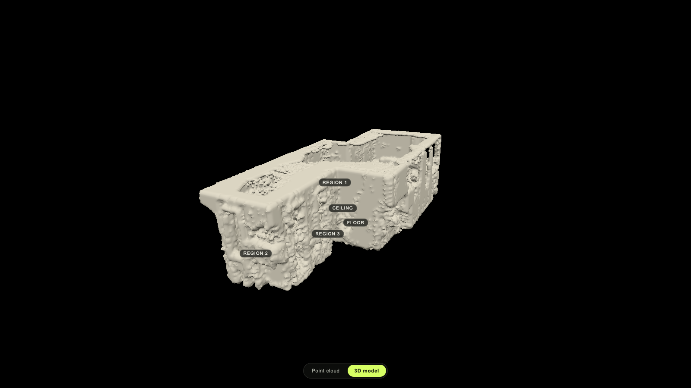
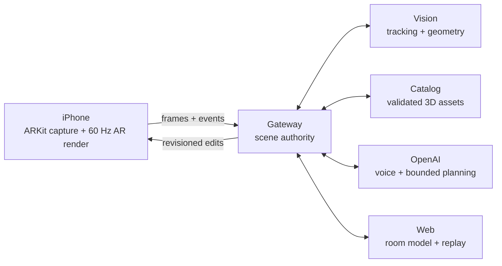

# Reframe

> A live spatial design system for understanding and reshaping real rooms.


[](LICENSE)



Reframe turns room capture into reversible spatial-editing previews. The native
iPhone experience combines ARKit tracking with cloud-assisted understanding,
prepared 3D assets, and an OpenAI design assistant while keeping rendering and
scene authority deterministic.

The product exposes four operations: **place**, **replace**, **remove**, and
**restore**. Every suggested change is a preview until the user confirms it.

## How it works



The iPhone owns the live camera and 60 Hz render loop. The gateway owns room
identity, revisions, transactions, and confirmation, and reaches vision,
catalog, web, and OpenAI services only through typed boundaries. Models can
understand, retrieve, clarify, and propose; they cannot commit scene changes.

## Workspace

| Area | Responsibility |
| --- | --- |
| [iOS](apps/ios/README.md) | Native capture, interaction, and AR rendering |
| [API](apps/api/README.md) | Trusted gateway, sessions, transactions, and service coordination |
| [Vision](apps/vision/README.md) | Private segmentation, depth, geometry, and reveal inference |
| [Web](apps/web/README.md) | Room model, capture handoff, and replay experience |
| [Agent](packages/agent/README.md) | Bounded Responses and Realtime adapters |
| [Catalog](packages/catalog/README.md) | Acquisition, preparation, retrieval, and delivery of 3D assets |
| [Protocol](packages/protocol/README.md) | Canonical schemas, coordinates, and transaction behavior |

The [Master Technical Prompt](MASTER_TECHNICAL_PROMPT.md) is the product and
architecture authority.

## Quickstart

The standalone web room viewer is the fastest way to explore the project. It
requires [Bun 1.3.11](https://bun.sh/) and no service credentials.

```sh
bun install --frozen-lockfile
bun run --cwd apps/web dev
```

Open [localhost:3000](http://localhost:3000) and switch between the source point
cloud and reconstructed 3D model. Full-stack setup is documented by the owning
application or package.

Run the repository checks with:

```sh
bun run check
bun run test:swift
```

## Stack

| Layer | Technology |
| --- | --- |
| Native | Swift 6.1, SwiftUI, ARKit, RealityKit |
| Web | Next.js 16, React 19, Three.js |
| Gateway | Bun, TypeScript, Hono, SQLite |
| Vision | Python 3.12, FastAPI, provider-isolated GPU models |
| AI | OpenAI Responses API and Realtime API |
| Assets | GLB, USDZ, Qdrant semantic retrieval |

## Design principles

- The live renderer never waits for the network or an inference worker.
- ARKit remains the pose authority for healthy native sessions.
- AI tools are bounded, typed, and unable to commit canonical state.
- Prepared assets are activated only after dimensions, provenance, and hashes verify.
- Committed edits remain available locally when cloud services disconnect.

## License

Reframe is available under the [MIT License](LICENSE). Built for OpenAI Build
Week 2026.
