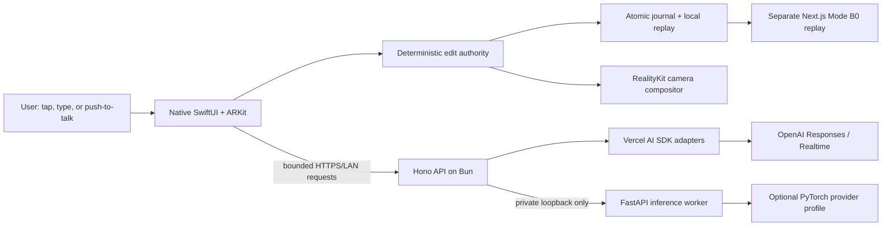

# ReRoom

Status: **working deep-AI hackathon candidate; deterministic software gates pass,
live-provider, physical-device, visual-quality, and human evidence remain pending.**

ReRoom is a camera-grounded room editor for one controlled freestanding chair
or small table. The native iPhone app supports exactly `place`, `replace`,
`remove`, and `restore`. AI can interpret design intent and propose a typed edit;
it can never choose canonical geometry, confirm an edit, increment a revision, or
rewrite history.

## Architecture



There is one public application API: Hono. Python remains a private worker
because PyTorch and computer-vision environments should not share a process with
the Bun gateway. Hono independently validates every worker request and response,
owns authentication, bounds bodies and deadlines, and exposes only safe failure
classes. This gives the product one API without coupling JavaScript and Python
runtime failure domains.

The 60 Hz camera/render path never waits for Hono, OpenAI, Python, PyTorch, or
the web client. ARKit remains healthy-session pose/world authority and the live
camera remains the photoreal background.

## AI pipeline

All semantic input enters one native `submitUserIntent` boundary:

1. Tap/type works locally with no model or network.
2. An optional, explicitly consented JPEG may accompany a vision request.
3. `@reroom/ai` calls OpenAI through Vercel AI SDK—there is no official
   `openai` JavaScript package in the dependency tree.
4. GPT-5.6 Sol must return the closed CON-006 Structured Output shape.
5. Hono attaches trusted context and rejects unknown assets, URLs, transforms,
   confirmation, mutation fields, stale context, and malformed constraints.
6. Native code revalidates the envelope against current session/branch/world/
   object context and may create a revision-neutral preview.
7. Only an explicit user confirmation reaches the deterministic CAS commit
   authority and increments the revision exactly once.

Voice is intentionally transcription-only. A gateway-minted, 600-second
Realtime credential opens a bounded push-to-talk session with no functions or
tools. A completed transcript is sent through the same Sol/CON-006 path as typed
input. Realtime never calls `replace`, `remove`, or any mutation tool directly;
failure returns immediately to the complete typed/tap path.

The private inference route accepts one digest-bound `segment`, `metric_depth`,
or gated `reconstruct` job at a time, with no backlog. Its output is an artifact
candidate, not scene authority. Identity, spatial validity, readiness, preview,
commit, and replay remain deterministic.

### Model status

| Capability | Candidate | Current status | Mandatory fallback |
|---|---|---|---|
| Semantic/design intent | `gpt-5.6-sol` | Vercel AI SDK adapter, strict schema, vision consent, cancellation, and fake-HTTPS transport tests are wired; a live credentialed quality/latency run is pending | Local typed/tap intent and three-item curated catalog |
| Push-to-talk | `gpt-realtime-2.1` + `gpt-4o-mini-transcribe` | Ephemeral-token gateway route and native completed-transcript flow are wired; no tools; live device/network and 4/5 utterance gate pending | Typed input |
| Target segmentation | SAM 2.1 Hiera Small | Canonical initial candidate, not downloaded or selected; requires exact checkpoint/license pin plus GATE-004 benchmark before integration | Explicit target reseeding and frozen validated masks |
| Segmentation upgrade | accessible, license-approved SAM 3.1 | Optional benchmark variant only; access/custom-license gate unresolved | SAM 2.1 Small |
| Dense depth | DA3Metric-Large or Apache-licensed pose-conditioned DA3 Small/Base | Candidate interfaces exist, but no provider is selected or downloaded; GATE-007 pending | ARKit planes/points and no-dense live path |
| Ordinary-video geometry | LingBot-Map | Post-P0 research only; never part of guaranteed B0 | Deterministic media replay and explicit processing state |
| Removal reveal | observed multi-surface reveal bundle | Controlled fixture path exists; normal quality and blinded GATE-006 evidence remain pending | Coach for another view or keep remove unavailable |

PyTorch `2.13.0` is locked as an optional worker extra but is not installed by
the default setup. Installing a runtime is not model selection and does not
silently download weights:

```sh
uv sync --project apps/inference --frozen --extra torch
```

Real profiles are added only after exact code/checkpoint digests, shipping
license evidence, input/output semantics, hardware tier, and their canonical
benchmark gate are recorded. The current explicit `fixture` profile is for
end-to-end protocol testing and labels every result `fixture_only`; it is not
model evidence.

## Repository map

```text
apps/
  api/        Hono/Bun public API, strict ingress, OpenAI and worker routing
  inference/  private FastAPI worker and optional PyTorch provider boundary
  ios/        native SwiftUI/ARKit app and deterministic Swift packages
  web/        separate Next.js Mode B0 replay/inspection client
packages/
  ai/         Vercel AI SDK OpenAI proposal and Realtime token adapters
  contracts/  JavaScript/TypeScript contract, transaction, and replay runtime
docs/         canonical authority, contracts, ADRs, evidence, and history
fixtures/     immutable cross-runtime vectors and controlled demo inputs
tools/        independent Python reference and verification tools
```

Bun `1.3.11` and Turborepo orchestrate the JavaScript/Python workspace. Runtime
dependencies live in the package that imports them. The root contains only
cross-workspace and repository-wide development tooling. `bun.lock`,
`apps/inference/uv.lock`, and the Swift `Package.resolved` are the only lockfiles.

## Install and verify

Requirements: Bun `1.3.11`, CPython `3.13.12`, uv `0.11.16` (the lock-compatible
range is `>=0.9.26,<0.12`), and Xcode 26 for the native app.

```sh
bun install --frozen-lockfile
uv sync --project apps/inference --frozen
bun run check
bun run test:swift
```

`bun run check` runs Biome and Ruff formatting/lint, strict TypeScript and
BasedPyright, all Bun/Python tests, production builds, the tracked-file secret
scan, and lockfile policy. Husky runs fast staged checks locally; the pinned
GitHub workflow repeats the clean frozen-install gate and separately runs Swift
package plus native-app tests on macOS. A local hook is never the only security
boundary.

Open
[ReRoomDeviceProof.xcodeproj](apps/ios/ReRoomDeviceProof/ReRoomDeviceProof.xcodeproj)
for the iPhone app. Simulator compilation/tests cannot prove camera, ARKit,
microphone, thermal, visual quality, signing, or human gates.

## Run locally

The complete no-provider topology can start with:

```sh
bun run dev
```

Without credentials, protected AI routes fail closed while local editing,
capture/replay, the curated catalog, and Mode B0 remain usable.

For the semantic/voice path, export secrets only into the gateway process:

```sh
export REROOM_GATEWAY_HOST=127.0.0.1
export REROOM_GATEWAY_TOKEN=<high-entropy-local-token>
export OPENAI_API_KEY=<server-only-project-key>
bun run --cwd apps/api dev
```

For the private fixture integration test, start the worker and then Hono with a
different internal token:

```sh
export REROOM_INFERENCE_HOST=127.0.0.1
export REROOM_INFERENCE_PROFILE=fixture
export REROOM_INFERENCE_TOKEN=<private-worker-token>
bun run --cwd apps/inference dev
```

```sh
export REROOM_INFERENCE_URL=http://127.0.0.1:8790
export REROOM_INFERENCE_TOKEN=<same-private-worker-token>
export REROOM_GATEWAY_TOKEN=<different-public-gateway-token>
bun run --cwd apps/api dev
```

Never commit those values. `.env.example` files contain names only. Firecrawl
is a read-only research/evidence tool and is not in the production runtime.

### Public HTTP surface

- `GET /health` — unauthenticated process liveness.
- `POST /v1/proposals` — protected strict CON-006 semantic/vision proposal.
- `POST /v1/realtime/client-secret` — protected bounded Realtime credential;
  the session exposes no tools.
- `GET /v1/inference/status` — protected safe private-worker readiness.
- `POST /v1/inference/jobs` — protected typed proxy for one bounded worker job.

See [the API guide](apps/api/README.md) and
[the inference guide](apps/inference/README.md) for exact contracts and limits.

## Authority, GSD, and the next 24 hours

Read [canonical authority](docs/canonical/README.md) before changing product
meaning. The archived Master Technical Plan is a byte-preserved historical
input; [the coverage audit](docs/audit/ARCHIVE_MASTER_PLAN_COVERAGE.md) explains
how it was corrected and mapped into current authority.

GSD Core remains machine-global; only `.planning/` is shared. Its current health
check has zero errors or warnings. Do not reinitialize it. Resume from checked-in
state rather than guessing a phase number:

```text
$gsd-next
```

For this hackathon finish, do not create another speculative phase. Use the
[active implementation handoff](.planning/milestones/v1.0/AUTONOMOUS-FINISH-PLAN-2026-07-20.md)
and [24-hour runbook](.planning/milestones/v1.0/HACKATHON-24H.md), then return to
the Phase 2 verification route recorded in [.planning/STATE.md](.planning/STATE.md).

The shortest honest finish order is:

1. run one credentialed Sol typed request and one explicitly consented frame;
2. keep voice only if the five fixed utterances reach at least 4/5 without an
   authority/security failure;
3. rehearse place/replace/restore and the disclosed removal fixture on the base
   iPhone, then run the required camera/thermal/recovery observations;
4. exercise B0 in a real supported browser;
5. freeze one clean revision, rerun CI-equivalent checks, record the sub-three-
   minute demo, and complete the human submission checklist.

Until those observations exist, do not claim production readiness, real-time
model performance, normal removal quality, or completed physical/human gates.

## Canonical references

- [Master Technical Specification](docs/canonical/MASTER_TECHNICAL_SPEC.md)
- [PRD](docs/canonical/PRD.md)
- [Contracts](docs/contracts/README.md)
- [Architecture decisions](docs/adr/README.md)
- [Risk and kill gates](docs/canonical/RISK_AND_KILL_GATES.md)
- [Research and dependency ledger](docs/canonical/RESEARCH_LEDGER.md)
- [GSD project](.planning/PROJECT.md),
  [roadmap](.planning/ROADMAP.md), and [current state](.planning/STATE.md)
