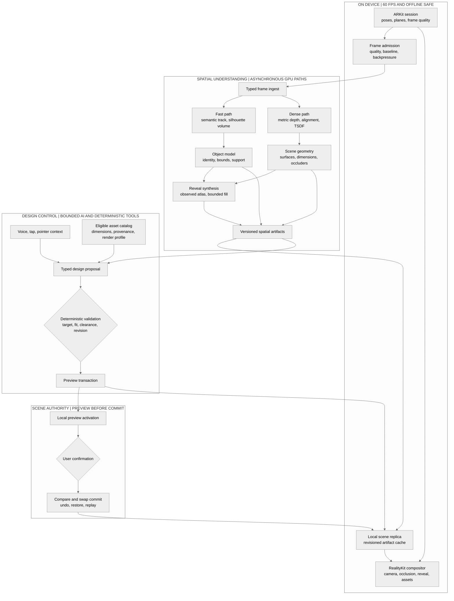

# Reframe

> A live spatial design system for understanding and reshaping real rooms.


[](LICENSE)


Reframe turns a live room capture into reversible spatial edits. The native
iPhone experience combines ARKit tracking, spatial understanding, prepared 3D
assets, and an OpenAI design assistant without giving cloud services control of
the render loop or canonical scene state.

Instead of treating AR as a model viewer, Reframe understands what already
occupies the room, finds an asset that physically fits, and previews the change
against the live camera. The four operations are **place**, **replace**,
**remove**, and **restore**.

## How it works



Reframe separates rendering, inference, planning, and state mutation. ARKit is
the metric pose authority. Accepted frames fan out into a fast semantic path
for target identity and a dense reconstruction path for surfaces, dimensions,
and occlusion. Both paths publish versioned artifacts without entering the 60
FPS render loop.

Voice and tap input carry explicit pointer and scene context. The agent may
interpret intent and retrieve eligible assets, but deterministic tools resolve
the target, validate physical fit, and reject stale revisions. The iPhone
renders the proposal from its local replica. Only user confirmation creates a
new scene revision, and every committed edit remains undoable and restorable.

## Workspace

| Area | Responsibility |
| --- | --- |
| [iOS](apps/ios/README.md) | Native capture, interaction, and AR rendering |
| [API](apps/api/README.md) | Trusted gateway, sessions, transactions, and service coordination |
| [Vision](apps/vision/README.md) | Private segmentation, depth, geometry, and reveal inference |
| [Web](apps/web/README.md) | Room model, capture handoff, and replay experience |
| [Agent](packages/agent/README.md) | Bounded Responses and Realtime adapters |
| [Catalog](packages/catalog/README.md) | Acquisition, preparation, retrieval, and delivery of 3D assets |
| [Protocol](packages/protocol/README.md) | Canonical schemas, coordinates, and transaction behavior |

## Development setup

Reframe is a multi-runtime spatial system, not a one-command application. The
complete experience spans a physical iPhone, a trusted gateway, Qdrant, private
GPU vision workers, the web client, prepared 3D assets, and optional OpenAI
voice and planning.

### Prerequisites

| Requirement | Used for |
| --- | --- |
| macOS, Xcode with the iOS 18 SDK, and a physical iPhone | ARKit capture and the live spatial editor |
| [Bun 1.3.11](https://bun.sh/) | Gateway, web client, and TypeScript packages |
| Python 3.12 and `uv >=0.9.26,<0.12` | Vision service and its verification toolchain |
| Docker with Compose | Local gateway and Qdrant topology |
| CUDA-capable GPU plus prepared DA3 and SAM sources/checkpoints | Live depth, geometry, and target tracking |
| OpenAI API credentials | Realtime voice and bounded design-agent turns |

Install the JavaScript workspace with `bun install --frozen-lockfile`, then
bring up the system capability by capability:

| Order | Component | Required configuration | Runbook |
| ---: | --- | --- | --- |
| 1 | Gateway + Qdrant | Gateway, room-signing, and Qdrant secrets; absolute data directory | [API setup](apps/api/README.md) |
| 2 | Vision workers | Private service token, profile, model sources, checkpoints, revisions, and hashes | [Vision setup](apps/vision/README.md) |
| 3 | Asset catalog | Authorized source frontier, external asset store, processor tools, embeddings, and Qdrant access | [Catalog setup](packages/catalog/README.md) |
| 4 | Web client | Gateway URL and server-side token for connected routes | [Web setup](apps/web/README.md) |
| 5 | iPhone app | Gateway URL, room ID, short-lived room credential, and signing configuration | [iOS setup](apps/ios/README.md) |

The services must agree on gateway and vision URLs, scoped tokens, room/session
identity, and artifact storage. Model repositories and checkpoints are prepared
explicitly; workers do not download them at startup. The landing-page point
cloud viewer can run without those services, but it is a **UI-only preview**,
not a full Reframe deployment.

Run the repository checks with:

```sh
bun run check
bun run test:swift
```

## Stack

| Layer | Technology |
| --- | --- |
| Native | Swift 6.1, SwiftUI, ARKit, RealityKit |
| Web | Next.js 16, React 19, Three.js |
| Gateway | Bun, TypeScript, Hono, SQLite |
| Vision | Python 3.12, FastAPI, provider-isolated GPU models |
| AI | OpenAI Responses API and Realtime API |
| Assets | GLB, USDZ, Qdrant semantic retrieval |

## Design principles

- The live renderer never waits for the network or an inference worker.
- ARKit remains the pose authority for healthy native sessions.
- AI tools are bounded, typed, and unable to commit canonical state.
- Prepared assets are activated only after dimensions, provenance, and hashes verify.
- Committed edits remain available locally when cloud services disconnect.

## License

Reframe is available under the [MIT License](LICENSE). Built for OpenAI Build
Week 2026.
