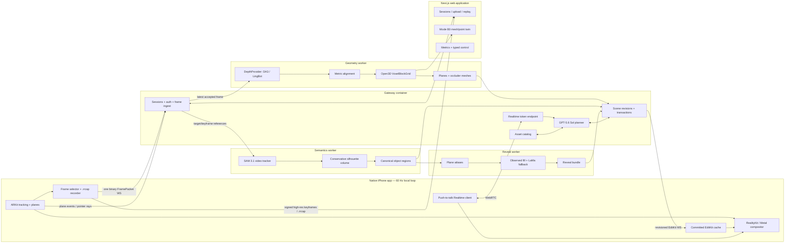

# ReRoom Master Technical Plan v3.2

**Status:** Architecture freeze for OpenAI Build Week  
**Date:** 13 July 2026  
**Owners:** Five-person JKU Linz team  
**Supersedes:** ReRoom v3 Complete Consolidated Specification and all earlier architecture notes  
**Living-document rule:** Changes to a locked decision or external contract require an ADR, updated schemas, and compatibility tests.

---

## 0. Executive decision

ReRoom is a live diminished-/augmented-reality room editor. The hero experience runs in a native iPhone application: the real camera feed remains the photoreal background, ARKit keeps the world stable, and ReRoom draws only the virtual content needed to make an edit believable—background reveal surfaces, occlusion geometry, replacement furniture, shadows, and UI. The cloud continuously improves spatial understanding but is never in the 60 Hz rendering loop.

The final architecture has three product modes:

- **Mode A — Live AR, P0:** native SwiftUI + ARKit + RealityKit/Metal on iPhone. Place, replace, remove, and undo while looking through the live camera.
- **Mode B0 — Scan, process, and continue, P0:** every capture is recorded in `.rrcap`; the same session can be processed or replayed later and edited from a Next.js web application. Ordinary uploaded video is also supported. This is the universal-device and demo-resilience path.
- **Mode B1 — Photoreal twin, stretch:** an immutable capture snapshot is globally consolidated and optimized into a Gaussian-splat scene for the web. It starts only after all P0 gates are green.

### 0.1 The most important change from v3

Mode A no longer waits for dense TSDF reconstruction before an object can be edited. It has two parallel geometry tracks:

1. **Fast interaction track — critical path:** ARKit metric poses and planes + a reticle/tap-seeded SAM 3.1 video track + a conservative multi-view silhouette volume. This produces an object identity, approximate volume, OBB, support relation, and reveal footprint quickly enough for replace/remove decisions.
2. **Dense understanding track — enhancement path:** learned depth + robust metric alignment + Open3D VoxelBlockGrid TSDF. This improves dimensions, collisions, occlusion meshes, fallback-web geometry, and research metrics, but it may not block a valid fast-path edit.

This removes the highest-risk dependency chain in v3:

```text
learned depth → scale fit → TSDF → semantic lift → shell → compositor → first edit
```

and replaces it with:

```text
ARKit pose/planes + SAM track → conservative object volume → reveal bundle → first edit
                                 └──────────── dense TSDF improves it in parallel
```

### 0.2 Additional improvements locked in v3.2

- **No camera-pixel “punching” in the primary compositor.** The camera background is untouched. ReRoom overlays true-3D floor/wall reveal proxies and virtual assets. A Metal stencil compositor is the fallback when RealityKit cannot meet quality.
- **A reveal may contain several surfaces.** A chair can expose floor, wall, and skirting board; the data model no longer assumes one plane.
- **Readiness is capability-specific.** `replace_ready` and `remove_ready` are separate. Replacement can become available before empty removal.
- **The editing volume and collision surface are separate artifacts.** A conservative closed mask volume is used for diminished reality; a denser surface mesh is used for dimensions and collision.
- **Tap selection is P0.** Voice + reticle is the hero interaction, but tap is a first-class reliability and debugging path through the same resolver.
- **The GPU stack is separated into Docker services immediately.** LingBot/geometry and SAM 3.1 have incompatible recommended Python/PyTorch environments.
- **The depth model is isolated behind a provider interface.** Architecture is frozen; DA3Metric, pose-conditioned DA3, and LingBot are selected by replay measurements, not optimism.
- **Mode B0 is guaranteed.** Mode B1 is forbidden from consuming critical-path time.

### 0.3 Provenance markers

- `[TEAM]` — explicit team ruling, including answers 1A/2A and confirmed native readiness/hero scene.
- `[V3]` — retained from the Fable v3 consolidated specification.
- `[SOL]` — introduced or materially corrected in the GPT-5.6 Sol technical audit.
- `[MEASURE]` — deliberately selected by a dated replay/device gate rather than frozen from documentation.

---

## 1. Product boundary and non-negotiable scope

### 1.1 P0 user-visible moments

ReRoom ships exactly four editing moments in the Build Week submission:

1. **Place:** place one catalog asset on a detected floor at the reticle/tap location.
2. **Replace:** replace the staged freestanding armchair or small side table with a normalized asset that physically fits and visually covers the old object.
3. **Remove:** hide the staged object and reveal a precomputed multi-surface background bundle.
4. **Restore / undo:** restore the real object or undo the most recent committed transaction, locally and immediately.

The signature operation is **replace**. Empty removal is shown only when its quality gate passes.

### 1.2 P0 environment assumptions

- One controlled, well-lit room.
- One freestanding hero object with clear floor around it.
- Prefer a plain or slowly varying wall behind the object.
- Capture duration of approximately 30–120 seconds; live demo session no longer than four minutes.
- Base iPhone 17, without relying on rear LiDAR.
- Five to ten curated furniture assets with both USDZ and GLB derivatives and complete license metadata. The P0 iOS candidates are bundled in the app or fully pre-cached before the session; the hero command never waits for a multi-megabyte asset download.
- One active room session and one GPU worker set during the demo.

### 1.3 Explicitly out of scope for P0

- General-purpose removal of every object or non-planar background.
- Whole-room automatic semantic discovery.
- Recoloring a real object while preserving shading.
- Multi-room mapping.
- Cross-launch AR relocalization.
- Robust submap alignment after an ARKit world reset.
- On-device neural reconstruction or segmentation.
- Dynamic people/pets as editable objects.
- Full furniture marketplace integration.
- Photoreal Mode B1 on the critical path.
- Android, visionOS, Quest, or OpenXR clients during Build Week.

---

## 2. Architecture overview



### 2.1 Local loop

The local loop is independent of the network and targets 60 FPS:

1. ARKit updates camera pose, plane anchors, tracking quality, light estimate, and raycasts.
2. RealityKit or Metal draws the camera background.
3. The compositor draws retained-scene occlusion meshes.
4. For removed/replaced objects, it draws the active reveal layers.
5. It draws replacement/placed USDZ entities, contact shadows, and status UI.
6. Committed EditKit artifacts are stored locally and continue rendering if the network fails.

No per-frame neural model runs on the phone in P0.

### 2.2 Cloud fast interaction loop

The fast interaction loop is event-driven:

1. Reticle dwell or tap captures `frame_id`, pixel, world ray, and ARKit hit.
2. SAM 3.1 starts or refines one video track.
3. Tracked masks and ARKit camera matrices form a conservative closed object volume.
4. ARKit planes establish floor/wall support and the approximate reveal surfaces.
5. Plane atlases and a reveal bundle are generated.
6. Capability states transition independently: `tracked`, `geometry_ready`, `replace_ready`, `remove_ready`.
7. The phone receives only changed, revisioned artifacts.

### 2.3 Cloud dense understanding loop

Accepted frames are processed asynchronously:

1. DepthProvider predicts metric depth or reconstructs depth/pose.
2. Native ARKit sessions use ARKit as the pose authority.
3. Depth is converted into the project’s depth convention and aligned to ARKit evidence.
4. High-confidence measurements are integrated into a sparse CUDA TSDF.
5. The TSDF produces a retained-scene occluder mesh, object surface meshes, dimensions, and Mode B0 geometry.
6. Dense results may upgrade artifacts but never invalidate committed object UUIDs or transactions.

### 2.4 Voice/agent loop

1. The iPhone obtains a short-lived Realtime credential from the gateway.
2. Push-to-talk audio travels directly over WebRTC.
3. Realtime emits a minimal `submit_user_intent` function call—or asks a clarifying question—and the gateway schema-validates it.
4. The gateway invokes GPT-5.6 Sol through the Responses API with strict tool schemas for load-bearing intent and candidate selection.
5. Deterministic tools resolve spatial targets and validate physical constraints.
6. A preview is issued; commit creates a new scene revision and EditKit delta.

Realtime is not treated as the source of canonical structured state: the current Realtime model supports function calling but not Structured Outputs. Strictness and retries therefore live in the gateway/Sol planning boundary, not in the audio model.

---

## 3. Product modes

### 3.1 Mode A — Live AR

**Client:** native SwiftUI iOS application.  
**Tracking:** ARKit is authoritative.  
**Visual skin:** live camera feed.  
**Rendered additions:** reveal geometry, occluders, USDZ assets, shadows, coaching and readiness UI.  
**Required operations:** place, replace, remove, undo.  
**Network behavior:** new understanding pauses when disconnected; committed edits remain visible.

Mode A is the submission’s hero mode.

### 3.2 Mode B0 — Scan, process, and continue

Mode B0 is a guaranteed P0 product, not merely a developer utility.

Inputs:

- `.rrcap` recorded by the iOS application;
- ordinary uploaded MP4/MOV video;
- browser capture using `getUserMedia` as a low-priority convenience path.

Outputs:

- persistent session and scene graph;
- TSDF mesh or point cloud in a Next.js/Three.js viewer;
- object selection and typed/voice edit commands;
- catalog asset placement;
- replay timeline, metrics, and artifact inspection.

For `.rrcap`, ARKit poses are reused. For ordinary video, LingBot owns the camera trajectory and geometry. Mode B0 shares scene, transaction, catalog, semantics, and reveal services with Mode A.

### 3.3 Mode B1 — Photoreal polish

B1 is disabled until the D7 P0 acceptance gate passes.

Pipeline:

```text
immutable session snapshot
→ select 80–160 sharp, diverse keyframes
→ MapAnything Apache model for global metric consolidation
→ gsplat optimization
→ compressed/versioned Gaussian skin
→ Spark viewer in Next.js
```

B1 may only replace a render skin. It cannot rewrite canonical object IDs, support relations, transactions, or undo history.

---

## 4. Capability and lifecycle model

A single `editable` flag is insufficient. Each object exposes independent capability readiness:

```text
candidate
  └─ observed once
tracked
  └─ stable 2D video identity
geometry_ready
  └─ conservative 3D volume + OBB + support relation
replace_ready
  └─ geometry_ready + validated asset candidate + sufficient visual cover
remove_ready
  └─ geometry_ready + reveal bundle passing coverage and quality gates
retired / uncertain
  └─ contradictory, lost, dynamic, or unsupported
```

### 4.1 Readiness rules

User-facing readiness is the intersection of server evidence and client activation. A server artifact is not ‘ready’ until the phone has downloaded it, verified its hash, created the render entity, and acknowledged the artifact revision.

| Capability | Minimum evidence |
|---|---|
| `place_ready` | stable ARKit floor plane and valid raycast |
| `tracked` | stable SAM identity; one view may establish the track |
| `geometry_ready` | at least two calibrated masks with adequate baseline, closed conservative volume, OBB, and support surface |
| `replace_ready` | geometry ready, asset fits, and asset-only or asset+reveal composite coverage passes |
| `remove_ready` | reveal bundle covers the projected target across sampled views and passes texture/seam checks |

### 4.2 User-facing states

- **Looking:** no target selected.
- **Understanding:** target selected; track/volume being built.
- **Replace ready:** replacement is safe even if empty removal is not.
- **Remove ready:** reveal bundle meets quality thresholds.
- **Healing:** reveal generation is still running; the system must not pretend removal is instant.
- **Tracking paused:** ARKit tracking is limited; new edits are disabled but committed edits remain.

---

## 5. Locked technical decisions

| ID | Decision | Locked choice | Reason | Source |
|---|---|---|---|---|
| D1 | Hero client | Native SwiftUI app | Direct ARKit, Metal/RealityKit, audio, recording, and predictable performance | `[TEAM]` |
| D2 | Universal client | Separate Next.js app | Cross-device upload, replay, typed control, debugging, and Mode B viewers | `[TEAM]` |
| D3 | Metric pose | ARKit VIO authoritative on iOS | Low-latency, metric, gravity-aligned tracking | `[SOL]` |
| D4 | Live edit dependency | Fast semantic/plane path does not wait for TSDF | Removes the longest failure chain | `[SOL]` |
| D5 | Depth architecture | `DepthProvider` interface; replay bake-off | Model choice remains replaceable and measurable | `[SOL]`+`[MEASURE]` |
| D6 | Initial depth candidate | DA3Metric-Large | Direct monocular metric output with Apache-licensed checkpoint | `[SOL]`+`[MEASURE]` |
| D7 | Temporal depth candidate | DA3-Small/Base with ARKit pose conditioning | Potentially more stable multi-view depth at lower model size | `[SOL]`+`[MEASURE]` |
| D8 | RGB-only fallback | LingBot-Map | Streaming camera trajectory and geometry for ordinary video/browser input | `[V3]`+`[SOL]` |
| D9 | Canonical dense map | Open3D CUDA VoxelBlockGrid TSDF | Sparse metric fusion, raycasting, mesh extraction | `[SOL]` |
| D10 | P0 semantics | SAM 3.1 point/box-seeded video tracking | Persistent target identity; no whole-room discovery required | `[SOL]` |
| D11 | Diminished reality | Multi-surface reveal proxies; camera background remains untouched | Simpler and more physically coherent than arbitrary pixel replacement | `[V3]`+`[SOL]` |
| D12 | Renderer | RealityKit first; ARKit + Metal fallback | Fast asset/anchor path with an explicit quality escape hatch | `[V3]`+`[SOL]`+`[MEASURE]` |
| D13 | Empty removal | Quality-gated; hero replacement remains primary | Prevents a fragile reveal from sinking the demo | `[TEAM]`+`[V3]` |
| D14 | Agent | Realtime WebRTC intent capture + gateway validation + GPT-5.6 Sol strict tools | Keeps audio conversational while canonical planning remains schema-constrained and deterministic | `[SOL]` |
| D15 | Infra | Split Docker services on one warm GPU host | Avoids dependency collisions and enables later GPU isolation | `[SOL]` |
| D16 | P0 storage | SQLite WAL + filesystem/shared volume | Sufficient for one-week, one-session demo; no Redis/Postgres/MinIO | `[V3]` |
| D17 | Mode B0 | Guaranteed | Development backbone and universal fallback | `[TEAM]` |
| D18 | Mode B1 | Stretch only | Cannot consume live-product time | `[TEAM]` |
| D19 | Contract format | JSON Schema mirrored in Swift Codable, TS Zod, Python Pydantic | Fast iteration, readable fixtures, cross-language validation | `[SOL]` |
| D20 | Change control | ADR required for locked contract changes | Prevents five parallel agents from drifting interfaces | `[TEAM]`+`[SOL]` |

---

# Part II — External contracts

## 6. Coordinate, image, and time conventions

These conventions are invariants, not implementation suggestions.

### 6.1 World and camera coordinates

- World is right-handed, metres, gravity aligned, **+Y up**.
- ARKit camera local axes are +X right, +Y up, and the camera looks along −Z.
- Server/OpenCV camera axes are +X right, +Y down, +Z forward.
- Mathematics uses column vectors; serialization is row-major only. The numeric axis-flip matrix is self-inverse, but its direction is named explicitly:

```text
C_arkit_from_opencv = diag(1, -1, -1, 1)
T_world_from_camera_cv = T_world_from_camera_arkit × C_arkit_from_opencv
T_camera_cv_from_world = inverse(T_world_from_camera_cv)
```

- `world_from_camera_arkit` is serialized by logical rows; never memcpy a column-major `simd_float4x4` into the wire buffer.
- Open3D integration receives the explicitly documented `T_camera_cv_from_world` extrinsic.
- Every matrix field carries a convention/version in the session manifest.

### 6.2 Image transforms and intrinsics

The encoded image is always orientation `up` and normalized to sRGB. Native bi-planar YCbCr conversion, crop, rotation, and resize are defined as one pixel transform `A`. If the native sensor image is transformed:

```text
K_encoded = A × K_sensor
```

The same transform must be applied to masks, point prompts, and returned pixels. A known-ray projection test is mandatory in CI.

### 6.3 Depth convention

`DepthObservation.depth_m` is optical-axis/projective **Z depth in metres in the encoded OpenCV camera frame**, not Euclidean ray range. Providers must convert before returning. Confidence is normalized to `[0, 1]` and provider-specific raw diagnostics are kept separately.

### 6.4 Time

- `timestamp_ns` uses the iOS monotonic uptime clock derived from the AR frame timestamp.
- `clock_domain` is explicit.
- Network and server timings use monotonic clocks.
- Gateway performs periodic ping exchanges and records a clock-offset estimate; latency metrics never subtract unrelated wall clocks.

---

## 7. FramePacket contract

### 7.1 Binary frame

All integers are little-endian. The fixed 24-byte header is:

| Offset | Size | Field |
|---:|---:|---|
| 0 | 4 | ASCII magic `RRFP` |
| 4 | 2 | `protocol_version` (`uint16`) |
| 6 | 2 | flags (`uint16`) |
| 8 | 4 | JSON metadata length (`uint32`) |
| 12 | 4 | image payload length (`uint32`) |
| 16 | 8 | `frame_id` (`uint64`) |

Header is followed by UTF-8 JSON metadata and then the image payload. P0 payload is JPEG. Unknown flags are ignored only when the protocol major version matches.

### 7.2 Metadata schema example

```json
{
  "protocol_version": 1,
  "session_id": "room_2026_07_13_01",
  "submap_id": 0,
  "frame_id": 842,
  "timestamp_ns": 1783918472391823,
  "clock_domain": "ios_monotonic_uptime",
  "image": {
    "codec": "jpeg",
    "width": 640,
    "height": 480,
    "orientation": "up",
    "color_space": "sRGB",
    "payload_bytes": 48372
  },
  "intrinsics_encoded": [514.4, 0.0, 319.8, 0.0, 513.9, 239.6, 0.0, 0.0, 1.0],
  "world_from_camera_arkit": [
    0.99, 0.00, -0.04, 1.42,
    0.01, 1.00, 0.02, 1.53,
    0.04, -0.02, 0.99, -2.18,
    0.00, 0.00, 0.00, 1.00
  ],
  "tracking": {
    "state": "normal",
    "reason": "none",
    "world_frame_version": 1
  },
  "capture_quality": {
    "blur_score": 0.08,
    "angular_velocity_rad_s": 0.19,
    "translation_since_last_m": 0.034,
    "rotation_since_last_deg": 3.2,
    "exposure_s": 0.0083,
    "iso": 142
  }
}
```

### 7.3 Header flags

```text
bit 0: selected_keyframe
bit 1: replay_packet
bit 2: final_packet
bit 3: high_priority_target_view
bit 4: optional_depth_payload_present (reserved; not used on base iPhone 17 P0)
```

### 7.4 Acceptance and backpressure

- Native selection threshold, initial values: translation ≥ 0.03 m, rotation ≥ 3°, coverage gain, high-priority target view, or 250 ms since last accepted frame.
- Reject when ARKit tracking is not normal, blur/angular velocity is excessive, exposure is transitioning, or the socket has an unacknowledged frame and the queue is full.
- Native queue capacity: 2.
- Worker queue capacity: 1–2.
- When overloaded, keep the newest useful frame; never accumulate latency.

---

## 8. Plane and pointer event contracts

Plane anchors and user pointing are control events, not duplicated into every frame. ARKit plane IDs are ephemeral observations; the gateway/geometry worker associates them with versioned canonical surfaces such as `floor_01`. A removed or merged ARKit anchor never silently changes an object’s canonical support surface.

```json
{
  "type": "plane_upsert",
  "session_id": "room_2026_07_13_01",
  "plane_id": "arkit_plane_07",
  "revision": 4,
  "classification": "floor",
  "world_from_plane": ["16 float32 row-major"],
  "extent_m": [3.82, 4.10],
  "boundary_vertices_local_xz_m": [[-1.9,-2.0],[1.9,-2.0],[1.9,2.1],[-1.9,2.1]],
  "confidence": 0.88
}
```

```json
{
  "type": "target_seed",
  "session_id": "room_2026_07_13_01",
  "frame_id": 842,
  "pixel_encoded": [318.0, 251.0],
  "ray_world": {
    "origin": [1.42, 1.53, -2.18],
    "direction": [0.11, -0.18, -0.98]
  },
  "arkit_hit": {
    "surface_id": "arkit_plane_07",
    "position_world": [1.66, 0.01, -4.31]
  },
  "source": "reticle_dwell"
}
```

`source` is one of `reticle_dwell`, `tap`, `voice_capture`, or `debug_web`. `plane_remove` carries the same session/plane ID and final revision; `plane_upsert` revisions are monotonic per observed anchor.

---

## 9. `.rrcap` contract

While recording, `.rrcap` is a directory. On clean finish it may be zipped without changing its internal paths.

```text
session.rrcap/
  manifest.json
  frames/
    000000000001.jpg
    000000000002.jpg
  keyframes/
    000000000842.jpg
  frames.jsonl
  keyframes.jsonl
  events.jsonl
  checksums.json
```

### 9.1 Durability

- Every accepted packet is enqueued to the local writer before it is offered to the network sender.
- Frame image is written to a temporary name and atomically renamed.
- `frames.jsonl` is append-only; batching flushes is allowed.
- `checksums.json` is finalized at session end.
- A crash may lose the last buffered frame, but must not corrupt prior records.
- Replay emits the same logical FramePacket sequence, preserving IDs, timestamps, poses, intrinsics, and event ordering.
- `keyframes/` contains sparse high-resolution stills (target long edge ≤1440 px initially) keyed to the same AR frame IDs; they are encoded off the render thread and uploaded over signed HTTP, never through the live FramePacket socket.
- `keyframes.jsonl` records the high-resolution image size, exact encoded-image intrinsics, crop/orientation transform, source frame ID, sharpness, and selection reason.

### 9.2 Manifest minimum

```json
{
  "format": "rrcap",
  "version": 1,
  "session_id": "room_2026_07_13_01",
  "created_at": "2026-07-13T17:30:00Z",
  "device": {"model": "iPhone 17", "os": "iOS 26"},
  "world": {"units": "metres", "handedness": "right", "up_axis": "+Y"},
  "image_orientation": "up",
  "matrix_layout": "row_major",
  "camera_convention": "arkit",
  "tsdf_parameters": null,
  "consent": {"upload": true, "retain_raw_until": "2026-07-14T17:30:00Z"}
}
```

---

## 10. DepthProvider contract

```python
class DepthProvider(Protocol):
    def start_session(self, calibration: SessionCalibration) -> None: ...
    def infer(self, packet: FramePacket) -> DepthObservation: ...
    def finish_session(self) -> ProviderSummary: ...
```

```json
{
  "frame_id": 842,
  "provider": "da3metric-large",
  "depth_convention": "opencv_z_m",
  "depth_shape": [480, 640],
  "depth_ref": "depth/000000000842.f16.zst",
  "confidence_ref": "confidence/000000000842.u8.zst",
  "pose_source": "arkit",
  "world_from_camera_cv": ["16 float32"],
  "alignment": {
    "scale": 1.027,
    "bias_m": 0.0,
    "inliers": 87,
    "median_abs_residual_m": 0.041,
    "accepted": true
  },
  "timing_ms": {"decode": 4.9, "infer": 31.4, "align": 1.7}
}
```

Provider implementations:

- `DA3MetricProvider`: ARKit pose + DA3Metric-Large monocular metric depth.
- `DA3PoseConditionedProvider`: short, pose-conditioned DA3-Small/Base window; scaled into ARKit world.
- `LingBotProvider`: RGB-only mode; owns pose and geometry when ARKit metadata is absent.

A stable ARKit session never mixes LingBot poses into its world unless an explicit, measured alignment ADR is accepted.

---

## 11. EditKit artifact contracts

Every external artifact reference carries `mime_type`, `byte_length`, and `sha256` in the normative JSON Schema, even when an abbreviated example below shows only the signed URL. Clients verify length and hash before atomic activation; a failed artifact never advances the scene revision locally.
The client sends `artifact_activated {artifact_id, revision, sha256}` after GPU/resource creation succeeds; capability chips use this acknowledgement rather than server generation status alone.

### 11.1 Object artifacts

```json
{
  "object_id": "chair_04",
  "artifact_revision": 3,
  "mask_volume": {
    "type": "voxel_rle",
    "world_from_volume": ["16 float32"],
    "voxel_size_m": 0.025,
    "dimensions": [48, 39, 41],
    "payload_url": "signed://objects/chair_04/mask-volume-v3.bin",
    "conservative_dilation_m": 0.035
  },
  "mask_mesh": {
    "status": "available",
    "payload_url": "signed://objects/chair_04/mask-mesh-v3.bin",
    "triangle_count": 1860,
    "source": "mask_volume_isosurface"
  },
  "surface_mesh": {
    "status": "available",
    "payload_url": "signed://objects/chair_04/surface-v2.bin",
    "triangle_count": 3820,
    "source": "tsdf_semantic_subset"
  },
  "obb": {
    "center_world": [1.42, 0.48, -2.18],
    "extent_m": [0.82, 0.96, 0.78],
    "yaw_rad": 1.43
  }
}
```

`mask_volume` is conservative and closed. It is not assumed to be an accurate visible surface. `mask_mesh` is the renderable isosurface used by the Metal stencil fallback; the RealityKit plane-proxy path may not need it. `surface_mesh` is the less conservative geometry used for collision and dimensions, and may be absent when the fast path first reaches `geometry_ready`.

### 11.2 Reveal bundle

`layers[].geometry.type` is a tagged union. P0 implements `plane_polygon`; `textured_mesh` is permitted for a skirting board or other thin non-coplanar reveal without changing the bundle contract. The main demo should still prefer floor/wall-backed targets.

```json
{
  "reveal_bundle_id": "reveal_chair_04_v5",
  "object_id": "chair_04",
  "revision": 5,
  "layers": [
    {
      "layer_id": "floor_layer",
      "surface_id": "floor_01",
      "geometry": {
        "type": "plane_polygon",
        "world_vertices": [[1.0,0.0,-2.8],[2.0,0.0,-2.8],[2.0,0.0,-1.5],[1.0,0.0,-1.5]],
        "uv": [[0,0],[1,0],[1,1],[0,1]]
      },
      "texture_url": "signed://reveals/chair_04/floor-v5.png",
      "alpha_url": "signed://reveals/chair_04/floor-v5-alpha.png",
      "reference_color_space": "linear_srgb",
      "photometric_reference_frame_ids": [711, 734, 790],
      "provenance_url": "signed://reveals/chair_04/floor-v5-provenance.bin",
      "feather_px_at_1080p": 8,
      "quality": 0.91
    },
    {
      "layer_id": "wall_layer",
      "surface_id": "wall_02",
      "geometry": {"type": "plane_polygon", "world_vertices": [], "uv": []},
      "texture_url": "signed://reveals/chair_04/wall-v5.png",
      "alpha_url": "signed://reveals/chair_04/wall-v5-alpha.png",
      "provenance_url": "signed://reveals/chair_04/wall-v5-provenance.bin",
      "feather_px_at_1080p": 8,
      "quality": 0.86
    }
  ],
  "coverage": {
    "sampled_views": 8,
    "p10_target_coverage": 0.968,
    "median_target_coverage": 0.991
  },
  "state": "ready"
}
```

### 11.3 Occluder chunks

```json
{
  "chunk_id": "room_occ_012",
  "revision": 7,
  "world_from_chunk": ["16 float32"],
  "mesh_url": "signed://occluders/room_occ_012_v7.bin",
  "triangle_count": 6120,
  "excluded_object_ids": ["chair_04"]
}
```

### 11.4 Asset manifest

```json
{
  "asset_id": "chair_red_02",
  "category": "armchair",
  "style": ["modern", "warm"],
  "color": "red",
  "dimensions_m": [0.79, 0.91, 0.82],
  "origin": "floor_contact_center",
  "forward_axis": "-Z",
  "delivery": "bundled_p0",
  "local_bundle_key": "chair_red_02.usdz",
  "usdz_url": "signed://assets/chair_red_02.usdz",
  "glb_url": "signed://assets/chair_red_02.glb",
  "collision_hull_url": "signed://assets/chair_red_02_hull.bin",
  "mobile_download_bytes": 8241312,
  "license": {"spdx": "CC-BY-4.0", "source_url": "...", "attribution": "..."}
}
```

### 11.5 Edit delta

```json
{
  "type": "edit_delta",
  "scene_revision": 48,
  "base_scene_revision": 47,
  "transaction_id": "txn_081",
  "idempotency_key": "b02735d7-9204-4f22-8ef8-943f46793f11",
  "ops": [
    {"op": "set_object_visibility", "object_id": "chair_04", "value": "hidden"},
    {"op": "set_reveal_visibility", "reveal_bundle_id": "reveal_chair_04_v5", "value": true},
    {
      "op": "place_asset",
      "asset_id": "chair_red_02",
      "instance_id": "placed_017",
      "world_from_asset": ["16 float32"]
    }
  ],
  "inverse_ops": [
    {"op": "remove_asset_instance", "instance_id": "placed_017"},
    {"op": "set_reveal_visibility", "reveal_bundle_id": "reveal_chair_04_v5", "value": false},
    {"op": "set_object_visibility", "object_id": "chair_04", "value": "visible"}
  ],
  "local_undo": {
    "token": "undo_txn_081",
    "valid_for_committed_revision": 48
  }
}
```

All deltas are idempotent. The phone acknowledges `scene_revision` and each artifact revision. During the active AR session the phone may apply `inverse_ops` immediately without the network, mark the undo `pending_sync`, and submit the undo token when connectivity returns; the gateway then creates the next canonical scene revision. P0 assumes one editor, so no concurrent merge is attempted.

---

## 12. Canonical scene graph

```json
{
  "schema_version": 2,
  "scene_revision": 48,
  "session_id": "room_2026_07_13_01",
  "world_frame": {
    "id": "world_01",
    "version": 1,
    "metric": true,
    "handedness": "right",
    "up_axis": "+Y",
    "pose_source": "arkit_vio",
    "scale_confidence": 0.96
  },
  "surfaces": [
    {
      "id": "floor_01",
      "type": "plane",
      "plane_world": [0.0, 1.0, 0.0, -0.01],
      "atlas_ref": "atlases/floor_01/v8",
      "confidence": 0.95
    },
    {
      "id": "wall_02",
      "type": "plane",
      "plane_world": [0.04, 0.0, 0.999, 3.18],
      "atlas_ref": "atlases/wall_02/v6",
      "confidence": 0.90
    }
  ],
  "objects": [
    {
      "id": "chair_04",
      "track_revision": 12,
      "capabilities": {
        "tracked": true,
        "geometry_ready": true,
        "replace_ready": true,
        "remove_ready": true
      },
      "label": {
        "category": "armchair",
        "attributes": {"color": "gray", "material": "fabric"},
        "confidence": 0.93,
        "source": "gpt-5.6-sol"
      },
      "spatial_region_ref": "regions/chair_04/v12",
      "mask_volume_ref": "objects/chair_04/mask-volume-v3",
      "surface_mesh_ref": "objects/chair_04/surface-v2",
      "obb": {
        "center_world": [1.42, 0.48, -2.18],
        "extent_m": [0.82, 0.96, 0.78],
        "yaw_rad": 1.43
      },
      "support_surface_ids": ["floor_01"],
      "reveal_bundle_ref": "reveal_chair_04_v5",
      "state": {
        "visibility": "hidden",
        "replacement_instance_id": "placed_017"
      }
    }
  ],
  "placed_assets": [
    {
      "instance_id": "placed_017",
      "asset_id": "chair_red_02",
      "world_from_asset": ["16 float32"],
      "state": "visible"
    }
  ]
}
```

The scene graph never contains RealityKit entity IDs, Three.js object indices, Gaussian IDs, or Open3D buffer indices.

Optional `navigation_constraints` may contain named 2D polygons on the floor (for example `main_walkway`). When absent, validation reports only minimum geometric gap and must not claim full route connectivity.

---

## 13. Transaction and tool contracts

### 13.1 Transaction state machine

```text
observe
→ resolve target
→ interpret constraints
→ retrieve candidates
→ propose transaction
→ deterministic validation
→ preview
→ commit
→ undo/restore
```

A transaction includes `base_scene_revision`, `idempotency_key`, target-resolution confidence, constraints, validation results, and status. Mutating tools never run in parallel.

### 13.2 Realtime intent ingress

Realtime may invoke only this narrow, non-mutating ingress function:

```json
{
  "name": "submit_user_intent",
  "arguments": {
    "utterance": "Replace this chair with something warmer and red, but keep the walkway clear.",
    "intent_hint": "replace",
    "pointer_context_id": "ptr_842_01",
    "client_turn_id": "turn_019"
  }
}
```

The gateway validates, rate-limits, deduplicates, and attaches authoritative scene/pointer context. Realtime cannot call mutating scene tools directly.

### 13.3 Public GPT tools

Use strict JSON schemas with `additionalProperties: false`.

```text
get_scene_summary(region?, detail_level?)
resolve_target(frame_id?, pixel?, ray_world?, language_reference?)
search_assets(category?, style?, color?, max_dimensions_m?, budget?)
propose_edit(intent, target_id?, asset_id?, pointer_context?)
validate_transaction(transaction_id)
render_preview(transaction_id, viewpoints?)
commit_transaction(transaction_id)
undo_transaction(transaction_id?)
```

Low-level operations such as hide-object, show-reveal, set-transform, and change-visibility are internal transaction-service functions, not agent-facing primitives.

### 13.4 Deterministic validation

Validation owns:

- target capability readiness;
- support surface;
- asset dimensions and scale;
- bundled/cache availability for P0 candidates;
- collision hull;
- room boundary;
- wall intersection;
- 2D minimum floor gap or an explicitly defined walkway-corridor clearance;
- scene revision freshness;
- dependent supported objects;
- reveal readiness;
- replacement visual `cover_score`.

The agent may react to a rejection but cannot override geometry.

### 13.5 Replacement cover score

For sampled captured viewpoints around the target, rasterize the **opaque** replacement geometry rather than its convex hull:

```text
asset_cover_score(view) = area(old_target_projection ∩ opaque_asset_silhouette)
                          / area(old_target_projection)

composite_cover_score(view) = area(old_target_projection ∩
                                    (opaque_asset_silhouette ∪ reveal_projection))
                              / area(old_target_projection)
```

P0 defaults:

- asset-only median `cover_score` ≥ 0.98 and tenth-percentile ≥ 0.95; **or**
- combined opaque asset silhouette plus active reveal layers has median coverage ≥ 0.995, tenth-percentile ≥ 0.98, and no uncovered connected component larger than 1% of the original target projection.

An asset-only score below these thresholds may still be used only when the required reveal layers are ready and the combined score passes. This deliberately favors similarly sized or slightly larger replacement assets and prevents small fragments of the real object leaking around legs or armrests.

---

# Part III — Subsystem specifications

## 14. Native iOS capture application

**Owner:** P1  
**D2 exit:** deterministic `.rrcap`, coordinate projection test, stable floor plane, frame upload, and replay on the physical iPhone 17.

### 14.1 Technology

- SwiftUI application shell.
- `ARSession` with `ARWorldTrackingConfiguration`.
- RealityKit view for the primary compositor; Metal fallback owned by P3.
- Native `URLSessionWebSocketTask` or Network framework WebSocket.
- No Capacitor, Flutter, Unity, or WebView in the hot path.

### 14.2 AR session configuration

- Gravity-aligned world tracking.
- Horizontal and vertical plane detection.
- Autofocus enabled.
- Choose a camera format that sustains stable tracking and at least 30 captured frames/s; the app renders at display cadence.
- Do not enable expensive frame semantics unless a measured P0 need exists.
- Monitor `ARCamera.TrackingState` and reason.

### 14.3 Frame selection

The phone emits two image products from the same `ARFrame`:

- low-resolution live packets (initially 640×480 JPEG) over the bounded WebSocket;
- sparse high-resolution keyframes (target long edge ≤1440 px, typically 8–20 around the hero target) written to `.rrcap` and uploaded asynchronously over signed HTTP for reveal textures, naming crops, B0, and optional B1.

Encoding and disk I/O run off the render thread. The high-resolution keyframe keeps its own transformed intrinsics; low- and high-resolution images must never share an intrinsic matrix implicitly.

Initial thresholds are configuration, not constants scattered through Swift:

```yaml
min_translation_m: 0.03
min_rotation_deg: 3.0
max_interval_ms: 250
max_pending_packets: 2
max_blur_score: 0.35
max_angular_velocity_rad_s: 1.2
```

A target-seed event temporarily promotes useful new viewpoints around that object.

### 14.4 Tracking loss

P0 behavior:

- `limited`: pause frame acceptance, keep local AR rendering, show coaching.
- recovered in same world frame: resume.
- world reset or discontinuity: stop live cloud integration, preserve `.rrcap`, offer restart or B0 processing.
- Do not implement automatic server-side submap alignment this week.

### 14.5 Local persistence

At commit time, cache:

- reveal bundle textures/geometry;
- target object state;
- USDZ asset and transform;
- occluder chunks required by the edit;
- latest committed scene revision.

Offline persistence is guaranteed for the active AR session. Cross-launch relocalization is not promised.

---

## 15. On-phone compositor

**Owner:** P3  
**D2 exit:** canned multi-surface reveal and USDZ replacement remain anchored while walking around and render at ≥45 FPS; RealityKit/Metal decision recorded.

### 15.1 Primary RealityKit render model

1. AR camera background.
2. Retained scene occluder entities using occlusion-only material.
3. Reveal layer entities with unlit textures, alpha feather, and small depth bias.
4. Replacement and placed USDZ entities.
5. Contact-shadow blob, ambient tint/light estimate, readiness UI, reticle, and coaching.

Until the dense retained-scene occluder arrives, P0 uses ARKit planes and the staged room avoids foreground blockers across the hero walk path. The product must not imply general real-object occlusion before the proxy mesh is available.

The target object’s occluder contribution is disabled when it is hidden. Other room geometry continues to occlude reveal surfaces and virtual furniture.

### 15.2 Why no primary screen-space punch-out

The camera feed is immutable. A reveal layer is actual virtual background geometry at the floor/wall location, so the same content reprojects correctly as the camera moves. Large observed-texture areas may extend beyond the old silhouette; because they represent the same physical plane, this is preferable to unstable per-frame mask cutting. Boundaries are feathered and selected in low-gradient areas.

### 15.3 Metal fallback gate

Timebox RealityKit verification to half a day. Switch to ARKit + Metal when any of the following cannot be demonstrated on canned data:

- deterministic layer ordering;
- reveal geometry overlays camera content correctly;
- retained-scene occlusion works;
- USDZ/mesh asset occlusion is coherent;
- stable 45+ FPS on the iPhone 17;
- no severe alpha/depth artifacts at reveal boundaries.

The Metal fallback may render a projected mask volume into stencil and composite reveal textures explicitly. Do not spend more than the gate window trying to force an unsuitable RealityKit path.

### 15.4 Revision behavior

- Artifact revisions are downloaded before activation.
- Crossfade reveal texture revisions over 150–250 ms.
- At 3–5 Hz, estimate a smoothed per-channel gain and small luma offset from a visible ring of the same plane around the reveal; apply it in the reveal material so the cached atlas follows current exposure/white balance. Fall back to ARKit light estimate when the ring is insufficient.
- Freeze reveal and mask-volume revisions after commit unless improvement exceeds a logged quality threshold.
- A new occluder revision is swapped atomically.

---

## 16. Fast interaction geometry

**Owner:** P4 with P1/P2 support  
**D2 exit:** target seed → SAM track → closed conservative volume + OBB + support relation from two to four views.

### 16.1 Target acquisition

P0 supports:

- center-reticle dwell of approximately 400 ms;
- explicit tap;
- utterance-time reticle snapshot.

All routes generate the same `target_seed` contract. Tap is not a different editing system.

### 16.2 Conservative multi-view silhouette volume

The fast path builds a closed volume without learned depth:

1. Seed a SAM video track on the selected frame.
2. Collect two to four views with normal tracking and at least one useful baseline: ≥0.15 m translation or ≥12° view change; prefer 20–60° rather than nearly duplicate or opposite views. A target seed enables a bounded 1.5-second 10–12 FPS upload burst while stale frames are still dropped.
3. Establish a candidate 3D ROI using support-plane intersection, mask ray bundle, category-agnostic furniture height limits, and room bounds.
4. Discretize at 2–3 cm.
5. Project each voxel center into each valid mask.
6. Accumulate confidence from signed mask distance, view angle, track score, and image quality.
7. Keep voxels supported by at least two views and a weighted occupancy threshold; avoid strict all-view intersection.
8. Fill enclosed cavities, perform one-voxel closing, and dilate by approximately 3–4 cm.
9. Extract OBB and optional low-triangle boundary mesh.

This artifact is intentionally conservative: slight overcoverage is safer than leaving real-object fragments visible.

### 16.3 Support and dependency

- Floor support is inferred from the lowest occupied voxels and the stable ARKit floor plane.
- Tabletop or shelf support is P1 unless the dense geometry path already exposes a reliable support plane.
- Removing an object with dependents is blocked. P0 may offer a confirmed cascade only when all dependent objects are themselves virtual or have valid reveal coverage.

---

## 17. Depth providers and metric alignment

**Owner:** P2  
**D3 exit:** provider ADR based on one shared fixture; dense TSDF meets metric thresholds.

### 17.1 Provider candidates

#### A. DA3Metric-Large — initial enhanced-path implementation

- Input: single encoded frame and focal length.
- Output: monocular metric depth; repository formula is applied exactly.
- Pose: ARKit.
- Strength: simple, metric, and decoupled from trajectory estimation.
- Risk: per-view temporal scale/shape variation.

#### B. DA3-Small/Base pose-conditioned short window — bake-off candidate

- Input: a short view window plus known ARKit camera poses.
- Output: more temporally consistent multi-view geometry, then metric scaling/alignment.
- Strength: provider explicitly uses known poses; smaller model sizes.
- Risk: window-management and latency complexity.

#### C. LingBot-Map — universal fallback

- Input: RGB stream or video.
- Output: streaming pose and geometry.
- Used when ARKit metadata is absent or corrupt.
- It is not the default trajectory provider inside a healthy ARKit session.

### 17.2 D1/D2 replay bake-off

Run the same `.rrcap` through A and B, and a video-only derivative through C. Record:

- median/p95 inference time;
- peak VRAM;
- floor-plane RMSE;
- three taped-distance errors;
- wall thickness in TSDF;
- edge quality around the hero object;
- temporal depth flicker;
- loop-return drift;
- rejected-frame rate;
- qualitative side-by-side mesh.

Choose one ARKit depth provider in a one-page ADR. Do not build a general benchmark platform.

### 17.3 Robust alignment

For ARKit sessions:

1. Convert provider output to OpenCV optical-axis Z depth.
2. Project ARKit raw feature points and stable plane intersections into the encoded frame.
3. Sample predicted depths only at spatially distributed, valid correspondences.
4. Fit robust scale-only correction first.
5. Permit bounded affine bias only if it improves held-out residuals and has sufficient spatial support.
6. Temporally smooth accepted parameters.
7. Reject the frame if support or residual quality is insufficient.
8. Once stable, add TSDF raycast correspondences as evidence.

Initial tunable limits:

```text
minimum inliers:             20
scale clamp:                 [0.85, 1.15]
absolute bias clamp:         0.15 m
minimum image quadrants:     3
EMA alpha:                   0.10
```

A plausible-looking but weakly aligned frame is worse than a dropped frame.

---

## 18. Dense geometry and TSDF

**Owner:** P2  
**D3 exit:** floor RMSE <2.5 cm and three taped distances within ±4% on the hero fixture.

### 18.1 Integration

Use Open3D tensor `VoxelBlockGrid` on CUDA. Integrate continuously, but extract/decimate meshes at a bounded cadence (initially 1 Hz) or on interaction demand; do not run full-scene marching cubes per input frame. Limit active blocks to the observed room envelope and record evictions/reloads.

Initial configuration:

```yaml
voxel_size_m: 0.02
sdf_trunc_m: 0.08
depth_min_m: 0.25
depth_max_m: 6.0
max_voxel_weight: 32
```

Before integration:

- derive confidence from provider output when available, otherwise from temporal agreement, alignment residuals, and edge proximity;
- remove low-confidence pixels;
- erode depth discontinuities;
- reject gross disagreement with a stable raycast;
- exclude target/object masks where dynamic motion is suspected;
- require normal ARKit tracking and accepted depth alignment.

### 18.2 Canonical addressing

External references use:

```text
(submap_id, block_coordinate_xyz, local_voxel_mask, region_revision)
```

Never persist Open3D active-block buffer positions. Rebuild mappings after extraction or compaction.

### 18.3 Outputs

- decimated retained-scene occluder chunks;
- object surface meshes for stable semantic regions;
- plane refinements;
- dimensions and collision proxies;
- Mode B0 mesh/point representation;
- raycasting for alignment and validation.

Dense outputs upgrade existing objects; they do not create new object UUIDs without semantic confirmation.

---

## 19. Semantics and identity

**Owner:** P4  
**D4 exit:** reticle/tap → persistent track → stable object UUID → fast volume and dense-region association.

### 19.1 Model

- SAM 3.1 current code and checkpoint.
- Point or box prompt from `target_seed`.
- One hero track is P0; background concept discovery is out of scope.
- SAM worker is a separate Python 3.12+ container.

### 19.2 Video tracking

- Maintain a per-session tracker state.
- Prioritize target-request jobs over every background task.
- Keep frame IDs and encoded pixel coordinates exact.
- Store masks as compressed RLE and scores.
- Request additional views when track confidence or baseline is insufficient.

### 19.3 Association with dense geometry

When depth/TSDF is available:

1. Project canonical surfaces into tracked keyframes.
2. Verify expected visibility using observed depth.
3. Accumulate object probability, down-weighting mask borders, grazing views, low confidence, and inconsistent depth.
4. Use connected components and support-plane priors.
5. Persist a canonical region reference.

### 19.4 Naming

After track stabilization, send one structured GPT-5.6 Sol request containing:

- two to four crops;
- approximate dimensions;
- support relation;
- candidate category list;
- object UUID.

Naming is advisory. A label change never changes identity.

---

## 20. Plane atlases and reveal generation

**Owner:** P4  
**D5 exit:** hero reveal bundle passes coverage and qualitative seam gate from a half-circle walk.

### 20.1 Plane atlas

Each stable plane defines:

- world origin;
- orthonormal U/V basis;
- metric atlas bounds;
- color atlas;
- observed-weight map;
- source-frame/provenance map;
- synthesized mask.

For every useful frame:

1. Ray-intersect candidate pixels with the plane and require the intersection to lie within the current plane boundary.
2. Exclude target masks and known foreground object masks.
3. When dense depth or a stable TSDF raycast exists, reject pixels whose observed depth is in front of the plane; before that exists, require multi-frame photometric consistency and restrict P0 atlases to the staged hero floor/wall.
4. Weight contributions by view angle, blur, distance, exposure consistency, and tracking quality.
5. Blend in linear color space with robust outlier rejection.
6. Prefer observed texels over synthesized texels permanently.

An ARKit plane anchor is a geometric prior, not proof that every pixel sees that plane; foreground rejection is therefore mandatory.

### 20.2 Reveal extent

Generate one or more layers for the surfaces behind/under the target. Layer polygons are expanded enough to cover the target’s projection across the captured hero view cone. Because they represent the same wall/floor, modest overdraw is acceptable and safer than incomplete coverage.

### 20.3 Fill hierarchy

P0 order:

1. real observed atlas samples;
2. deterministic local texture copying/inpainting for simple low-gradient regions;
3. LaMa fallback in its isolated worker.

No diffusion inpainting during Build Week.

### 20.4 Readiness quality gate

Sample at least eight camera poses from the captured trajectory around the target. Project the conservative target volume and active reveal layers. `remove_ready` requires:

- p10 target coverage ≥0.95;
- median target coverage ≥0.98;
- no uncovered connected component larger than 1% of target projection;
- atlas observed fraction outside the synthesized hole ≥0.80;
- team visual review from a half-circle walk passes at least 4/5.

If the gate fails, replacement may still be ready and empty removal stays disabled.

### 20.5 Revision policy

- Every texel is `observed(weight, frame_id)` or `synthesized(method, revision)`.
- Observed data may replace synthesized data; synthesized data never replaces observed data.
- Updates are discrete and crossfaded.
- After commit, freeze unless objective seam/coverage score improves materially.

---

## 21. Assets, placement, and replacement

**Owners:** P3 for rendering; P5 for catalog; P2 for validation  
**D3 exit:** one USDZ placed, anchored, occluded, and stable during walk-around.

### 21.1 Catalog preparation

For every asset:

- canonical source and license record;
- units in metres;
- floor-contact-center origin;
- fixed forward axis;
- explicit dimensions;
- low-poly collision hull;
- mobile USDZ derivative bundled or pre-cached for every P0 candidate;
- web GLB derivative;
- compressed textures and mobile triangle budget;
- category, color, style, material, and optional price-like metadata.

P0 contains five to ten assets, not dozens. The iOS build verifies their hashes on launch and reports `catalog_ready` before the hero flow begins.

### 21.2 Placement

- Local ghost appears immediately using an ARKit raycast.
- Server validation checks support, bounds, collision, wall intersection, orientation, and clearance.
- P0 clearance is an honest 2D floor-footprint calculation, not full path planning: project collision hulls/OBBs onto the support plane, compute distance to room-boundary segments and retained obstacle footprints, and report the minimum free gap. A spoken “keep the walkway clear” constraint maps to `minimum_gap_m` unless a named walkway corridor exists.
- A corrected transform is smoothly reconciled; never teleport without indication.
- Add a soft contact-shadow blob and ARKit light-estimate tint.

### 21.3 Replacement

- Resolve the real target.
- Retrieve asset candidates by dimensions and style.
- Validate geometry and `cover_score`.
- Preview local reveal + asset.
- Commit as one transaction.
- Undo restores target visibility, hides reveal and replacement, and needs no server call.

---

## 22. Gateway, GPT-5.6 Sol, and voice

**Owner:** P5  
**D6 exit:** push-to-talk hero command → Sol decision → deterministic validation → phone commit; typed path also passes.

### 22.1 Gateway responsibilities

- session lifecycle and room-scoped tokens;
- authenticated single-upload FramePacket ingest, a 5-second/64-frame recent-frame ring for target tracking, a separate latest-only compute queue, and internal frame fan-out;
- scene-revision authority;
- transaction state machine;
- strict tool endpoint implementations;
- GPT-5.6 Sol calls;
- Realtime session credential endpoint;
- asset retrieval;
- WebSocket artifact fan-out;
- SQLite WAL metadata and append-only transaction log.

### 22.2 Realtime

- Model: `gpt-realtime-2.1`.
- Primary: iPhone connects directly to OpenAI Realtime over WebRTC.
- Gateway mints an ephemeral credential; standard API key never reaches the phone.
- P0 uses push-to-talk, not mandatory full duplex.
- Realtime exposes one deliberately small function, `submit_user_intent`, carrying the normalized transcript/intent class plus the utterance-time pointer context identifier.
- The gateway validates that payload against JSON Schema and may request one repair/clarification; it never writes canonical scene state directly from a Realtime call.
- GPT-5.6 Sol (`gpt-5.6-sol`) is called through the Responses API for planning with `strict: true` function schemas.
- Sanctioned audio fallback: `AVAudioEngine` captures one push-to-talk turn and streams PCM to the gateway, which uses the Realtime server WebSocket; this changes transport only, not tools or transactions.
- Typed debug commands enter immediately after `submit_user_intent` and invoke the exact same Sol/transaction pipeline.

This split is intentional: Realtime supports function calling, while canonical strict planning and retries belong at the gateway/Sol boundary.

### 22.3 Load-bearing Sol behavior

The hero replacement must require Sol to:

- interpret category/style/color constraints;
- understand the selected object and its attributes;
- choose among multiple fitting catalog candidates;
- react to a deterministic rejection;
- explain the selected candidate and clearance result.

Example:

> “Replace this chair with something warmer and red, but keep the walkway clear.”

Sol receives the resolved target and deterministic room facts, selects a candidate, receives a fit rejection or pass, revises if necessary, and proposes the transaction. It never estimates 3D coordinates itself.

### 22.4 Failure behavior

- Voice unavailable: typed laptop command drives the same phone edit.
- Sol timeout: deterministic direct tools may perform a previously selected simple place/undo, but the recorded hero take should use Sol.
- Ambiguous target: ask one concise disambiguation, naming candidates.
- Stale revision: revalidate automatically, then ask only if intent materially changes.

---

## 23. Next.js web application and Mode B0

**Owner:** P5  
**D2 exit:** video/`.rrcap` upload, session page, replay timeline, and typed transaction smoke test.

### 23.1 Routes

```text
/                         landing and project explanation
/sessions                 session list/create/upload
/capture                   browser video fallback
/replay/[sessionId]        synchronized image/pose/event replay
/twin/[sessionId]          mesh/point twin and edits
/debug/[sessionId]         timings, artifacts, scene graph, raw tool calls
```

### 23.2 Stack

- Next.js + TypeScript.
- Three.js for P0 TSDF mesh/point rendering.
- Zod-generated contract validators.
- WebSocket for session events and edits.
- Regular HTTP upload for `.rrcap` and video.
- Spark is installed only if B1 starts.

### 23.3 Universal-device promise

The web application works on modern desktop/mobile browsers for upload, replay, viewing, and control. It does **not** promise the enhanced live AR compositor outside the native iPhone application in v1.

---

## 24. Mode B1 polish worker

**Owner:** unassigned until P0 is green; then P2/P5  
**Start gate:** all D7 release criteria pass.

- Immutable input snapshot.
- Select 80–160 keyframes by sharpness, coverage gain, baseline, loop value, and semantic relevance.
- Use only the MapAnything Apache-compatible model/configuration.
- Initialize gsplat from consolidated geometry.
- Phase 1: fixed poses, SH0.
- Phase 2: bounded pose/exposure correction, SH1–2.
- Phase 3: densify/prune.
- Phase 4: compress/export and map polished primitives back to canonical surfaces.
- Hot-swap only when `source_scene_revision` is compatible.

B1 can be omitted from the submission without reducing P0 completeness.

---

# Part IV — Infrastructure and execution

## 25. Docker topology

```text
apps/
  ios/                       native Xcode project (not containerized)
  web/                       Next.js
services/
  gateway/                   TypeScript + Fastify
  geometry-worker/           Python 3.10; DA3/LingBot/Open3D
  semantics-worker/          Python 3.12; SAM 3.1
  reveal-worker/             isolated atlas/LaMa dependencies
  polish-worker/             MapAnything + gsplat; optional profile
packages/
  contracts-jsonschema/
  contracts-ts/
  contracts-swift/
  contracts-python/
  coordinate-tests/
fixtures/
  golden-10s.rrcap/
  hero-60s.pointer.json
  expected/
docs/
  adr/
  devlog/
  runbooks/
infra/
  compose.yaml
  compose.polish.yaml
```

### 25.1 Services

| Container | Runtime | Responsibilities |
|---|---|---|
| `web` | Node | Next.js UI and static assets |
| `gateway` | Node/TS | auth, sessions, single-upload ingest/router, recent-frame ring, scene revisions, transactions, GPT, tokens, catalog |
| `geometry-worker` | Python 3.10 | DA3/LingBot provider, alignment, TSDF, planes, dense meshes |
| `semantics-worker` | Python 3.12 | SAM 3.1 session/tracking and masks |
| `reveal-worker` | Python isolated | atlas assembly, deterministic fills, LaMa |
| `polish-worker` | Python isolated | MapAnything + gsplat, disabled by default |

### 25.2 P0 persistence

One shared host-mounted volume:

```text
/data/sessions/<session_id>/
/data/models/
/data/assets/
/data/logs/
```

Gateway stores metadata in SQLite WAL. Do not introduce Redis, PostgreSQL, S3-compatible storage, or Kubernetes unless an explicit failure demonstrates necessity and an ADR approves it.

### 25.3 GPU scheduling

One physical GPU is sufficient for P0 if work is prioritized:

```text
1. active target semantic request
2. accepted live depth frame
3. TSDF extraction requested by interaction
4. reveal generation for hero target
5. dense background integration
6. naming/contact sheet
7. B0 batch work
8. B1 polish — never during Mode A
```

Only one GPU-heavy job from each lane runs concurrently unless measured otherwise. A second GPU may isolate semantics/reveal later without changing contracts.

The recent-frame ring is retention for semantics and replay, not a compute backlog: only the newest eligible depth frame enters the geometry queue.

The gateway owns a small `GpuLaneCoordinator`: target semantics and requested reveal jobs pause background dense inference after the current kernel boundary; geometry retains only the newest pending frame and resumes immediately afterward. Workers keep models resident but may not launch uncoordinated background GPU work. This is an in-process scheduling component, not a new infrastructure service.

### 25.4 Deployment posture

For Build Week, deploy the stateful live lane on one warm, long-lived RunPod Pod or equivalent GPU host. The active session owns in-memory AR frame state, SAM track state, TSDF blocks, and persistent WebSockets; queue-style `/run` Serverless jobs are therefore not the primary transport.

The Docker images remain Serverless-compatible. A later RunPod load-balancing deployment is acceptable only with one active worker, one maximum worker per session, direct HTTP/WebSocket ingress, and either explicit session affinity or externalized recoverable state. Cold scale-to-zero is suitable for B0/B1 batch jobs, not for the hero Mode A session.

---

## 26. Transport

### 26.1 Data planes

- Control REST: iOS/web ↔ gateway.
- Frame ingest binary WebSocket: iOS → gateway ingest/router; the gateway forwards only the latest eligible frame to geometry and retains up to five seconds/64 accepted frames for target semantics, so the phone uploads each live frame once without creating a compute backlog.
- Artifact/event WebSocket: gateway → iOS/web.
- Signed HTTP: `.rrcap`, keyframes, textures, meshes, USDZ/GLB.
- Voice: separate iPhone ↔ OpenAI Realtime WebRTC.

### 26.2 Authentication

- Gateway issues short-lived, room-scoped JWTs.
- Claims: session ID, role, allowed paths, expiry, nonce.
- Worker rejects session mismatch and expired tokens.
- Signed artifact URLs are short-lived.

### 26.3 Reconnect

Phone sends:

```json
{
  "session_id": "room_2026_07_13_01",
  "last_acked_frame_id": 842,
  "scene_revision": 48,
  "artifact_revisions": {
    "reveal_chair_04": 5,
    "occluder_room_occ_012": 7
  }
}
```

Server returns a delta when possible, otherwise a full current snapshot. Every event and transaction is idempotent.

---

## 27. Performance and resource budgets

These are acceptance targets to measure, not claims made before profiling.

### 27.1 iPhone

| Metric | Target | Hard fallback threshold |
|---|---:|---:|
| Camera/compositor render | 60 FPS | ≥45 FPS |
| Local placement ghost | <1 rendered frame | <50 ms |
| Active-session memory | <1.2 GB preferred | no jetsam/crash |
| Thermal state during 4 min | nominal/fair | no sustained serious/critical |
| Tracking pause response | <100 ms UI | <250 ms |

### 27.2 Cloud and interaction

| Metric | Target |
|---|---:|
| Accepted frame packets | 6–12/s |
| Queue growth over 2 min | zero |
| Frame → accepted dense-map update p50 | ≤250 ms |
| Frame → accepted dense-map update p95 | ≤450 ms |
| Target seed → tracked p50 | ≤0.8 s |
| Target seed → `replace_ready` p50/p95 | ≤2.0 / 3.5 s |
| Warm-up → `remove_ready` | 10–30 s, scene dependent |
| Simple spoken command → visible change p50 | ≤2.5 s |
| Simple spoken command → visible change p95 | ≤4.0 s |
| Placement validation excluding LLM | ≤300 ms |
| Commit delta → local activation | ≤250 ms after artifacts cached |

### 27.3 Artifact budgets

| Artifact | P0 budget |
|---|---:|
| Mask volume / object | ≤1 MB compressed |
| Surface mesh / object | ≤1.5 MB |
| Reveal bundle / object | ≤4 MB preferred |
| Initial occluder mesh set | ≤5 MB |
| USDZ asset | ≤15 MB; prefer ≤10 MB; all P0 hero candidates bundled/pre-cached |
| Incremental scene delta | ≤100 KB excluding signed artifact downloads |
| High-resolution keyframe | ≤1.5 MB preferred; sparse async upload |

---

## 28. Telemetry and evaluation

### 28.1 Per-frame/job tracing

Log:

- capture timestamp and frame ID;
- encode, write, queue, uplink, decode, provider, alignment, fusion, semantic, reveal, download, activation timings;
- queue depth and dropped-frame reason;
- ARKit tracking state;
- model/checkpoint/container revision;
- active TSDF blocks and extraction size;
- phone FPS, memory, thermal state;
- scene and artifact revisions;
- transaction tool trace and deterministic validation result.

Do not log raw audio transcripts or image content into ordinary application logs.

### 28.2 Build Week and paper metrics

- command-to-visible-change latency by operation;
- target-to-track and target-to-capability latency;
- mask IoU on approximately 20 hand-annotated frames;
- `cover_score` and reveal-view coverage;
- synthesized-texel fraction versus observed viewpoints;
- floor RMSE and taped-distance errors;
- anchor drift over a three-minute fixed-marker test;
- provider bake-off results;
- golden-path success rate;
- phone FPS/thermal stability.

---

## 29. Privacy, security, and retention

- Obtain explicit camera/upload consent before a session.
- Show active recording and network status.
- Encrypt all transport.
- OpenAI standard API key remains server-side; iPhone receives only short-lived Realtime credentials.
- Worker tokens are room-scoped and short-lived.
- Raw uploaded frames are deleted by default within 24 hours after processing unless the user explicitly retains the session for B1.
- Local `.rrcap` remains under user control and can be deleted from the app.
- No training reuse without separate opt-in consent.
- Consent copy distinguishes self-hosted room-frame processing from OpenAI processing of microphone audio and the small selected object crops/structured scene facts used for naming or planning. Full raw room video is not sent to OpenAI by the product architecture.
- A session deletion removes frames, masks, depth, geometry, reveal textures, logs containing object labels, and DB rows.
- Golden development fixtures require documented participant consent and are stored separately from user sessions.

---

## 30. License inventory and supply-chain rules

Before a model or asset enters P0, record exact repository, commit/checkpoint hash, license, and download source.

| Component | Rule |
|---|---|
| DA3Metric-Large | Apache-2.0 checkpoint; permitted candidate |
| DA3-Small/Base | Apache-2.0 checkpoints; permitted candidates |
| DA3 Large/Giant/Nested variants | Do not accidentally adopt non-commercial variants without review |
| LingBot-Map | Apache-2.0 repository; pin commit/checkpoint |
| SAM 3.1 | SAM License; team reviews and records acceptance before use |
| Open3D | pin release and license record |
| LaMa | isolate and review exact implementation/checkpoint license |
| MapAnything | Apache-compatible model/config only |
| gsplat | pin release/commit and license record |
| Spark | B1-only web dependency; pin release/commit |
| Assets | every USDZ/GLB pair has source, attribution, and license ledger |

No unreviewed model is pulled into the demo container on the final day.

---

## 31. Team ownership

| Owner | Primary scope | Pairing dependency |
|---|---|---|
| P1 | iOS ARKit capture, FramePacket, `.rrcap`, plane/pointer events, upload, coaching hooks | P3 coordinate/render integration; P2 replay |
| P2 | Depth providers, alignment, TSDF, dense planes/occluders, provider ADR | P1 calibration; P4 region lift |
| P3 | RealityKit/Metal compositor, reveal entities, USDZ, occlusion, shadows, UI | P1 AR session; P4 artifacts |
| P4 | SAM 3.1, target track, silhouette volume, plane atlases, reveal worker | P1 frame IDs; P2 dense upgrade |
| P5 | Gateway, contracts, GPT/Realtime, transactions, assets, Next.js/B0, demo/integration | everyone |

Humans own physical-device debugging, coordinate sanity, visual quality votes, and kill decisions. Codex agents own bounded implementation tasks, tests, documentation, and repetitive integration code.

---

## 32. Calendar and exits

### 13 July — D1: contracts, capture, and spikes

- Freeze JSON schemas and coordinate conventions.
- Install app on physical iPhone.
- Record golden 10-second and hero 60-second `.rrcap` fixtures.
- RealityKit reveal/occlusion spike; decide RealityKit versus Metal by midday.
- Start DA3Metric and pose-conditioned DA3 replay bake-off.
- Run LingBot on video-only derivative.
- Web upload/session shell and typed transaction skeleton.

### 14 July — D2: fast-path proof and native gate

- Deterministic `.rrcap` replay.
- Projection/intrinsics tests.
- Stable floor plane and taped metric check.
- Target seed → SAM track → conservative volume/OBB.
- Canned multi-surface reveal + USDZ replacement on phone.
- Written gate decision.

### 15 July — D3: dense geometry and placement

- Provider ADR.
- Scale-aligned TSDF and metric thresholds.
- Retained-scene occluder extraction.
- Live place operation, anchored and occluded.
- B0 mesh/point viewer from the same capture.

### 16 July — D4: replace path

- Live target track integrated with scene graph.
- Asset retrieval, fit validation, `cover_score`.
- Typed end-to-end replacement transaction.
- Undo locally.

### 17 July — D5: removal quality

- Plane atlases and multi-surface reveal bundle.
- Empty removal quality gate.
- If it fails, formally demote empty removal and polish replacement.

### 18 July — D6: voice and resilience

- Push-to-talk Realtime.
- GPT-5.6 Sol hero decision path.
- Network disconnect/reconnect test.
- Typed fallback drives phone.

### 19 July — D7: release candidate

- Golden path succeeds five consecutive times.
- Hero room and fallback rehearsal.
- Capture primary and over-the-shoulder footage.
- Freeze dependencies and model hashes.

### 20 July — submission assembly

- Video edit, README, Devpost copy, devlog, metrics, repo cleanup.
- B1 may start only if all release criteria remain green.

### 21 July — regression and submission

- Re-run golden fixture and physical-device path.
- Submit with buffer before the official deadline.

---

## 33. Kill gates

### 33.1 D1 compositor gate

Pass RealityKit when all are true on canned data:

1. reveal geometry reliably overlays camera content;
2. retained scene occlusion works;
3. a replacement USDZ has correct depth ordering;
4. walking around preserves anchoring;
5. sustained frame rate is at least 45 FPS;
6. team visual vote is at least 4/5.

Failure after half a day → switch P3 to ARKit + Metal. Do not extend the spike.

### 33.2 D2 native fast-path gate

Pass iff all are demonstrated on the real iPhone 17 and hero room:

1. `.rrcap` replay emits the same logical packet/event sequence and passes checksums;
2. image orientation/intrinsics projection tests pass;
3. floor anchor and one taped metric are within ±4%;
4. reticle/tap seed creates a stable SAM track and closed object volume from two to four views;
5. canned multi-surface reveal and USDZ replacement remain anchored at ≥45 FPS;
6. RealityKit/Metal decision is documented.

Any failure → 30-minute recovery review. If the recovery estimate is more than one day, activate B0 as the primary product while preserving only the native work that already passes.

### 33.3 D3 dense gate

- Provider ADR complete.
- Floor-plane RMSE <2.5 cm.
- Three taped distances each within ±4%.
- No growing frame queue during two-minute replay.

Failure does **not** kill Mode A fast path. Dense geometry falls back to ARKit planes + conservative volumes and Mode B0 uses LingBot/video reconstruction.

### 33.4 D4 semantic/edit gate

- Target track, target resolution, typed replacement transaction, and local undo pass end to end.
- If dense semantic lifting fails, retain mask-volume identity for the hero target.

### 33.5 D5 reveal gate

- Empty removal passes coverage thresholds and 4/5 visual review during a half-circle walk.
- Failure → replacement is the only hero edit; empty removal is labeled experimental or omitted from the main take.

### 33.6 D6 voice gate

- Five push-to-talk attempts produce at least four correct transactions.
- Failure → typed Next.js command drives the phone during the recorded demo. Do not rebuild the voice stack.

### 33.7 D7 release gate

The full golden path succeeds **5/5 consecutively**:

1. start session and warm up;
2. target the hero object by reticle or tap;
3. place one small asset and undo it locally;
4. when the D5 gate passed, remove the hero object and undo so the original real object returns;
5. replace through a Sol-mediated command with deterministic fit evidence;
6. walk a half-circle with stable anchoring and coherent reveal/occlusion;
7. demonstrate network-loss behavior separately;
8. open the same session in Mode B0.

If empty removal did not pass D5, item 4 is omitted from the main take and the five-run release test uses replacement plus restore instead; the product does not fake or relabel the missing capability.

---

## 34. Risk register

| Risk | Level | Prevention | Fallback |
|---|---|---|---|
| Native iOS/compositor scope | High | two owners, half-day gate, canned artifacts | Mode B0 primary; place-only native slice |
| Reveal does not fully erase object | High | multi-surface layers, conservative volume, staged room, objective coverage gate | hero replacement; omit empty removal |
| RealityKit layering limits | Medium | D1 spike | Metal compositor |
| DA3 temporal inconsistency | Medium | provider bake-off, robust alignment, frame rejection | pose-conditioned DA3 or LingBot/B0 |
| TSDF too slow or thick | Medium | bounded frame rate, confidence/edge gating | fast path; coarse mesh; LingBot B0 |
| SAM target drifts | Medium | explicit point/tap seed, short hero session, additional views | freeze best masks; manual debug seed |
| Asset does not cover old object | Medium | `cover_score`, similar-size catalog | choose larger asset; require reveal ready |
| Network instability | Medium | record-first, cached committed edits, B0 | replay recorded session / typed fallback |
| Voice fails | Low–medium | push-to-talk, strict tools, typed path | laptop command |
| Dependency collision | High if combined | separate containers from D1 | sequential scheduling/pinned images |
| Scope creep | Certain | P0 boundary and dated gates | drop workstream after one-day slip |
| B1 temptation | Certain | Compose profile disabled and start gate | no B1 in submission |

---

## 35. Codex development protocol

### 35.1 `AGENTS.md` invariants

Copy these verbatim into the repository root:

1. The canonical world is metric, right-handed, and +Y up.
2. Every rotate/crop/resize applied to an image is applied identically to intrinsics, masks, and pointer pixels.
3. High-rate camera buffers stay in native Swift; they never cross a scripting or WebView bridge.
4. Frame queues are bounded; stale frames are dropped instead of building lag.
5. The scene graph never stores renderer, RealityKit, Three.js, Gaussian, or Open3D buffer indices.
6. The Mode A fast interaction path may not wait for dense TSDF completion.
7. Capability readiness is separate: tracked, geometry-ready, replace-ready, and remove-ready are not interchangeable.
8. Every mutation uses observe/resolve/propose/validate/preview/commit and an idempotency key.
9. GPT interprets intent and choices; deterministic code owns coordinates, collision, clearance, support, and revision validity.
10. Mode B0 is guaranteed; Mode B1 never blocks or rewrites Mode A scene identity.
11. Locked contracts change only through an ADR and synchronized Swift/Zod/Pydantic/schema updates.
12. Learned depth is not fused until its convention and metric alignment have passed acceptance checks.
13. The camera feed remains untouched; diminished reality is rendered using spatial reveal geometry, with a Metal stencil only as the explicit fallback.
14. Committed edit artifacts must render during an active session without the network.
15. No new P0 infrastructure or model dependency enters without a named owner, acceptance test, and kill rule.

### 35.2 Codex issue template

Every task includes:

- objective and owning section of this plan;
- exact files allowed to change;
- input/output contract and schema version;
- golden fixture;
- acceptance test;
- metrics to emit;
- error/fallback behavior;
- definition of done;
- prohibited scope.

### 35.3 Parallel work rules

- Contracts merge before implementation branches depend on them.
- One owner per contract; reviewers from every consuming language.
- Agents may generate adapters from JSON Schema, but generated output is committed and tested.
- No agent silently changes coordinate conventions, units, field names, readiness semantics, or scene-revision rules.
- Keep PRs bounded to one subsystem or contract migration.
- Maintain `docs/devlog/YYYY-MM-DD.md` with prompts/tasks, decisions, benchmark results, and failures.

### 35.4 CI

P0 CI contains at least:

1. coordinate/projection golden tests;
2. `.rrcap` replay and checksum test;
3. Swift/TS/Python contract fixture compatibility;
4. transaction idempotency and stale-revision tests;
5. Docker image build smoke tests;
6. ten-second replay smoke test producing expected artifact manifests.

Only the first three block every PR on D1; add the remainder as their services land.

---

## 36. Demo runbook

### 36.1 Scene

- Freestanding armchair or small side table.
- Clear floor around it.
- Plain/slowly varying wall behind it.
- Stable lighting; avoid windows directly behind the target.
- Replacement asset similar in size or slightly larger.
- Mark camera starting position and half-circle path unobtrusively.

### 36.2 Technical preflight

Before every recorded take:

1. confirm the expected warm GPU host, region, container/model hashes, and health checks;
2. run model warm-up and one 10-second fixture replay;
3. verify gateway RTT, zero queue growth, and Realtime connection;
4. verify `catalog_ready` and all hero USDZ hashes on the phone;
5. start a fresh AR session and confirm normal tracking, correct floor anchor, and artifact WebSocket;
6. keep the previous successful `.rrcap` and screen recording untouched.

### 36.3 Required shots

1. Over-the-shoulder proof showing person, real room, and phone screen.
2. Phone screen recording showing warm-up and readiness chips.
3. Place one small accent asset at the reticle and undo it locally (short proof of placement).
4. When `remove_ready`, remove the real hero object and undo it so the original returns; omit this shot if the D5 gate failed.
5. Say: “Replace this chair with something warmer and red, but keep the walkway clear.”
6. Briefly show the agent trace: target resolved, candidate rejected or accepted, and measured minimum gap.
7. End on a half-circle walk showing the replacement anchored with coherent reveal and occlusion.
8. Show Mode B0 replay/session view as resilience and universal-device proof.
9. Optional B1 flythrough, explicitly labeled as polished mode.

### 36.4 Honesty rules

- Do not label prerecorded replay as live.
- Do not call B0 photoreal unless it is.
- Do not imply the base iPhone has LiDAR.
- Do not claim arbitrary object removal.
- Show measured latency/FPS rather than model-only numbers.

---

## 37. Open items that do not block kickoff

- `OPEN(P2)`: provider ADR after shared replay—DA3Metric versus pose-conditioned DA3.
- `OPEN(P3)`: RealityKit versus Metal, resolved by D1 gate.
- `OPEN(P4)`: exact SAM 3.1 checkpoint access/license record before first container build.
- `OPEN(P5)`: final five-to-ten asset list and license ledger by D3.
- `OPEN(team)`: final product name; “ReRoom” remains the working title.

No other product or architecture question is open.

---

## 38. Reference implementation sources

Primary sources to pin in the repository’s model/license ledger:

1. Apple ARKit documentation: `https://developer.apple.com/documentation/arkit/`
2. Apple RealityKit documentation: `https://developer.apple.com/documentation/realitykit/`
3. Apple iPhone 17 technical specifications: `https://www.apple.com/iphone-17/specs/`
4. Depth Anything 3 official repository: `https://github.com/ByteDance-Seed/Depth-Anything-3`
5. LingBot-Map official repository: `https://github.com/robbyant/lingbot-map`
6. SAM 3 official repository: `https://github.com/facebookresearch/sam3`
7. SAM 3.1 release notes: `https://github.com/facebookresearch/sam3/blob/main/RELEASE_SAM3p1.md`
8. Open3D tensor reconstruction integration: `https://www.open3d.org/docs/latest/tutorial/t_reconstruction_system/integration.html`
9. OpenAI GPT-5.6 Sol model documentation: `https://developers.openai.com/api/docs/models/gpt-5.6-sol`
10. OpenAI GPT-Realtime-2.1 model documentation: `https://developers.openai.com/api/docs/models/gpt-realtime-2.1`
11. OpenAI Realtime WebRTC documentation: `https://developers.openai.com/api/docs/guides/realtime-webrtc`
12. OpenAI function-calling documentation: `https://developers.openai.com/api/docs/guides/function-calling`
13. Next.js documentation: `https://nextjs.org/docs`
14. MapAnything official repository: `https://github.com/facebookresearch/map-anything`
15. gsplat official repository: `https://github.com/nerfstudio-project/gsplat`
16. Spark official repository/documentation: `https://github.com/sparkjsdev/spark`
17. RunPod Serverless load-balancing documentation: `https://docs.runpod.io/serverless/load-balancing/overview`
18. RunPod endpoint configuration documentation: `https://docs.runpod.io/serverless/endpoints/endpoint-configurations`

---

## 39. Changelog

### v3.2 — 13 July 2026

- Adopted team ruling 1A: native SwiftUI hero app plus separate Next.js web app.
- Adopted team ruling 2A: guaranteed Mode B0; photoreal B1 stretch.
- Confirmed Mac/Xcode/device readiness and a stageable freestanding hero target.
- Split fast interaction geometry from dense reconstruction.
- Replaced primary pixel-punch compositor with multi-surface spatial reveal proxies.
- Added conservative mask volume versus dense surface mesh distinction.
- Added capability-specific readiness and objective reveal/cover gates.
- Promoted tap selection to P0 reliability path.
- Split GPU components into dedicated containers.
- Corrected `.rrcap`, binary frame, coordinate, depth, and transaction contracts.
- Added explicit B0 universal-device promise and B1 start gate.
- Separated Realtime intent capture from strict Sol planning because the audio model is not the canonical structured-state authority.
- Added artifact integrity fields, renderable mask meshes, atlas foreground rejection, and an explicit warm-host/serverless deployment posture.
- Clarified the semantically correct demo sequence for place, undo, remove/undo, and final replacement.
- Corrected transform naming/serialization, added sparse high-resolution keyframes, and made live frame upload single-path through the gateway.
- Tightened replacement coverage, added explicit offline inverse operations, runtime reveal photometric matching, and coordinated single-GPU scheduling.
- Added pre-cached P0 assets, client-acknowledged capability readiness, recent-frame semantic retention, and an honest 2D clearance definition.
- Restored explicit decision provenance, clarified non-planar reveal extensibility, OpenAI data boundaries, and the recording preflight.

### Archive note

The July 12 v3 consolidated specification is now read-only provenance. This file and the PRD are the living sources of truth.
