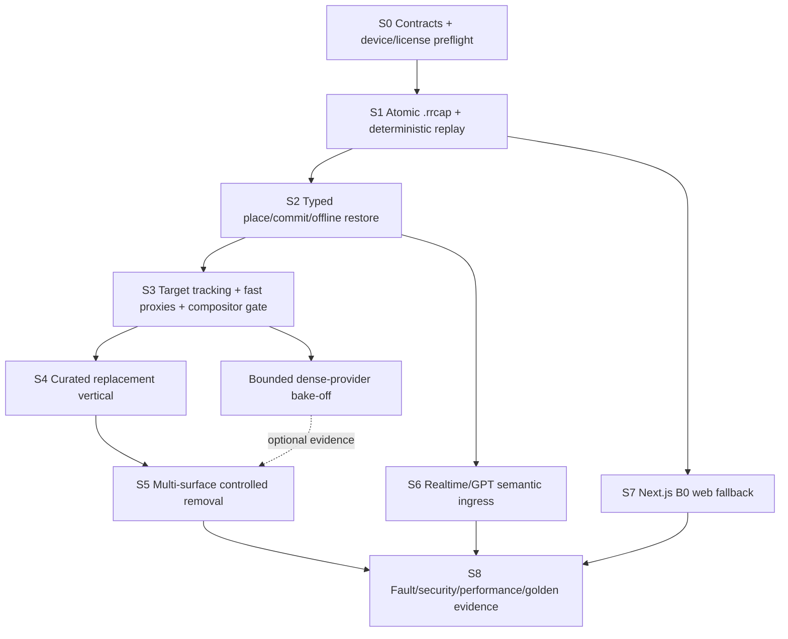

# ReRoom Development Strategy

Status: canonical implementation-sequencing authority
Version: 1.0.0  
Date: 2026-07-13

## 1. Strategy

Build one replayable vertical path at a time. The critical path starts with contracts, physical-device readiness, deterministic capture/replay, and a typed place/restore transaction. It surfaces coordinate, compositor, semantic, and reveal risk before voice or polish. Mode B0 exists before the demo depends on a live service. Mode B1 has no P0 task.

This is a dependency strategy for two developers working with Codex/Sol, not a staffing or named-owner plan. At most two implementation-critical streams should be active, plus a bounded research/fixture task. Parallel work must join through versioned contracts and replay fixtures rather than unreviewed integration branches.

## 2. Non-negotiable sequencing rules

1. Lock CON-001–CON-005 and RR-COORD-1 fixtures before client/service implementations diverge.
2. Make selected frames durable and exactly replayable before live inference.
3. Make typed place → preview → commit → offline restore pass before voice.
4. Run the base-iPhone compositor gate before building a rich rendering stack.
5. Make replacement pass before investing in empty removal.
6. Removal remains P0 and its controlled fixture must pass; an unavailable session capability is not permission to ship without the release gate.
7. Build the provider-independent B0 viewer/timeline before depending on learned video geometry.
8. Keep dense depth/fusion behind a timeboxed experiment and a no-dense fallback.
9. Begin short demo/evidence recordings as soon as each vertical slice passes.
10. Any red P0 gate freezes B1 work and optional dependency expansion.

## 3. Dependency graph

The no-dense fast path from S3 to S5 remains valid. S6 and S7 may proceed after their prerequisites but must not starve S4/S5 physical-device work.

## 4. Slice plan

Each slice should become one or a few GSD phases small enough for a fresh agent context: one vertical behavior, its fixtures, tests, observability, and decision update. Avoid phases that span native, web, service, multiple ML providers, and infrastructure at once.

### S0 — Contract lock and feasibility preflight

**Goal:** prove the project can build on the confirmed device and that all work shares one vocabulary.

**Entry:** canonical docs approved; no product repository exists yet.  
**Work:** translate CON-001–CON-005 into implementation fixtures later; establish RR-COORD-1 synthetic projections; verify current Xcode/signing/install/ARKit world tracking and planes on base iPhone 17; create license/BOM evidence template; choose exact fixture file layout.  
**Exit:** signed device smoke build; schema fixtures validate; coordinate goldens agreed; no unknown license on initial 3–5 assets/providers; GATE device/signing and contract preconditions green.  
**Maximum recovery budget:** one focused setup block. If signing/device capture is not working, stop mobile feature work and repair it; B0 fixture tooling may continue.  
**Evidence:** build/tool versions, device launch video, schema outputs, coordinate fixture digest.

### S1 — Atomic capture, crash recovery, and replay

**Goal:** create the deterministic backbone before any live model coupling.

**Entry:** S0 contracts/coordinate convention locked.  
**Work:** later implement ARFrame selection, upright encoding, transformed intrinsics, RRFP-WIRE-1, exact image-byte hash, five-state lifecycle, atomic image+metadata publication, contiguous global journal/projections, RR-JCS digest vectors, bounded queue, `.rrcap` finalization/recovered prefix, ordinary-video variant, replay reader, gateway echo/acceptance stub, latency spans.  
**Exit:** crash injection at every durability edge yields no partial accepted record; Swift/JavaScript/Python digest/wire vectors agree; two replays have the same journal-derived digest/projections; coordinate projection passes; queue is bounded; a fixture is usable by later native/web/service tests.  
**Fallback:** reduce cadence/codec; preserve local keyframes and journal; do not proceed on coordinate ambiguity.  
**Evidence:** golden `.rrcap`, corruption fixtures, hash/replay report, queue/drop metrics.

### S2 — Typed place, commit, and offline restore

**Goal:** prove the complete deterministic edit lifecycle without voice or learned geometry.

**Entry:** S1 replay and CON-003/CON-005 fixtures pass.  
**Work:** later implement branch/authority-bound SceneState and artifact records, RR-EDIT-PROJECTION-1 inverse/log, ARKit plane tap, curated placeholder asset manifest, exact ordered operation reducer, proposal/operation-specific validation/preview/explicit confirmation, native-authority CAS commit, RR-JCS fingerprinted idempotency, local inverse/artifact durability, compensating restore with fresh monotonic envelopes, journal replication, divergent-branch quarantine/reconciliation.  
**Exit:** place/restore works live and by replay; preview changes no revision; confirmation and reducer traces match; retries/stale bases/wrong authority/conflicting keys match exact traces; committed view and restore work offline and replicate without automatic merge.  
**Fallback:** user-confirmed plane and local-only pending sync; no speculative merge.  
**Evidence:** transaction vectors, expected revision traces, short device video. Start the rolling demo cut here.

### S3 — Target-first semantics, fast geometry, and compositor gate

**Goal:** retire the largest native/vision integration risks early.

**Entry:** typed transaction path and replay fixture exist.  
**Work:** later integrate tap/box seed, provisional SAM provider, lifecycle/readiness, conservative multi-view mask volume, OBB/support proxy, RealityKit-first reveal/occlusion ordering, bounded custom Metal spike only if required, memory/FPS/thermal spans. Run the depth/fusion bake-off in a separate timebox against the same replay.
**Exit:** no silent identity switch; re-seed works; fast proxies are stable enough for replacement; base-device compositor meets the current gate or a viable bounded fallback is selected; dense decision is recorded without blocking S4.  
**Fallback:** manual re-seed, lower mask cadence, no-dense ARKit planes, replacement-first RealityKit path.  
**Evidence:** labeled target sequences, projection overlays, device frame-time/thermal report, provider matrix update.

### S4 — Curated replacement vertical

**Goal:** deliver the signature end-to-end edit before empty removal.

**Entry:** S2 transaction and S3 target/compositor gates pass.  
**Work:** later validate paired USDZ/GLB assets, dimensions/origin/collision/LODs/license, support/collision proxy checks, conservative original masking, lighting/contact shadow, supported-view coaching, local persistence/replay.
**Exit:** FR-REPLACE-001 passes five development runs without wrong target, duplicate revision, severe seam, or lost edit; asset licenses/hashes are complete.  
**Fallback:** place asset in front of original with honest copy; request more views/re-seed. This fallback does not satisfy removal.  
**Evidence:** device/replay recordings, asset manifests, transaction and latency traces.

### S5 — Multi-surface observed reveal and controlled removal

**Goal:** satisfy the locked empty-removal P0 on the controlled fixture.

**Entry:** replacement and compositor baseline pass; hero fixture/camera path is fixed.  
**Work:** later build observed floor/wall/other layer atlases, supported view envelope, foreground occluders, coverage/confidence metrics, deterministic tiny-gap fill, revision pinning, coaching/out-of-envelope behavior. Neural fill is allowed only after license and same-quality gate, within a strict timebox.
**Exit:** FR-REMOVE-001 and the canonical reveal gate pass over prescribed views and human visual review; remove/restore persist and replay; unsupported views never expose unbounded synthesis.  
**Fallback:** keep per-session remove unavailable and coach/replacement usable. A failed controlled hero gate blocks P0 release and requires repair or explicit human scope escalation.  
**Evidence:** view trajectory, coverage maps, artifact revisions, blinded votes, device capture.

### S6 — Optional Realtime/GPT semantic ingress

**Goal:** add nonblocking conversational value without making it an authority, dependency, or critical fallback.

**Entry:** typed proposals for all four operations and transaction security tests pass.  
**Work:** later implement server-only credential/bootstrap, client WebRTC, utterance-time target context, one narrow nonmutating proposal tool, strict Responses schema where applicable, injection corpus, and clean disable/fallback behavior. Confirmation remains an explicit UI event outside model authority.
**Exit:** optional 4/5 scripted utterance target met; no model output can mutate state or bypass revision/readiness/license/confirmation; typed/tap path remains complete under model/network failure.  
**Fallback:** disable model tools and use deterministic typed/tap input.  
**Evidence:** intent confusion table, injection cases, tool audit, credential scan.

### S7 — Separate Next.js Mode B0

**Goal:** make replay/debug/fallback real before live-demo dependence.

**Entry:** S1 golden `.rrcap` and S2 scene/transaction vectors pass.  
**Work:** later create session/upload/replay/timeline/artifact inspector, degraded plane/point/artifact viewer, typed proposals, sharing/retention controls, ordinary-video decode/timeline, browser capability/degradation matrix. The gateway remains WebSocket/session replica and reconciliation authority; it owns mutations only on an explicit B0 replay fork, never an active phone branch.
**Exit:** golden capture opens/replays with matching digest/transactions; camera denial, unsupported codec, quota and network failures degrade honestly; no Mode A parity claim; learned geometry may be absent.  
**Fallback:** upload/timeline/metadata-only viewer.  
**Evidence:** browser matrix, replay report, failure screenshots/video.

### S8 — Hardening, final audit, and evidence

**Goal:** turn individual passes into a repeatable submission-quality system.

**Entry:** four operations, B0, and all blocking subsystem gates are individually green.  
**Work:** later run network/tracking/worker/storage fault matrix, reconnect/reconciliation, schema compatibility, secret/injection/privacy/delete/license audit, latency/FPS/memory/thermal distributions, 5/5 golden run, demo video/audio and rules checklist.  
**Exit:** every P0 acceptance criterion and blocking gate green; no unsupported performance/physical/novelty claim; 5/5 runs; evidence and fallback recording complete.  
**Fallback:** activate the documented subsystem fallback and rerun the whole golden suite; never hide a failed locked capability.  
**Evidence:** consolidated test report, BOM, secret scan, metrics, five run IDs, final demo artifacts.

## 5. One-week critical path and capacity

This is a relative execution budget to guide later GSD planning, not a calendar promise or staffing assignment.

| Window | Critical path | Parallel bounded work | Stop condition |
|---|---|---|---|
| First 10% | S0 device/contracts | fixture/license inventory | device/signing or coordinate authority blocked |
| 10–25% | S1 capture/replay | minimal gateway contract | replay digest/crash recovery not exact |
| 25–40% | S2 typed place/restore | B0 replay shell | revision/idempotency/offline restore fails |
| 40–60% | S3 target/compositor | dense provider bake-off, hard timebox | no viable device compositor/target path |
| 60–75% | S4 replacement | S6 bootstrap only after typed pass | signature replacement unreliable |
| 75–85% | S5 removal | S7 web/B0 completion | controlled reveal gate red |
| Final 15% | S8 hardening/evidence | voice/web polish only | any P0 gate or 5/5 run red |

Reserve the final block for integration/evidence, not feature creation. If S5 consumes its recovery budget, stop optional voice/dense polish; do not start B1.

## 6. Work suitability

### Strong AI-agent tasks

- Generate contract adapters/fixtures/tests from reviewed schemas.
- Implement deterministic parsers, journals, replay tooling, state reducers, transaction vectors, observability, failure injection, documentation, and compatibility matrices.
- Prepare provider adapters behind already approved interfaces.
- Analyze replay metrics, diff expected traces, check licenses/versions from supplied authoritative sources, and maintain evidence links.

Every generated change still requires targeted tests and review against canonical documents.

### Physical-device or human validation required

- Signing/install/camera permission and ARKit runtime behavior.
- Image orientation/crop/checkerboard sanity.
- RealityKit/Metal ordering, FPS, memory, thermal, and visual seams.
- Target re-seed usability, supported-view coaching, removal visual votes, and demo clarity.
- Final asset/model terms approval and any product-scope escalation.

Agents may prepare procedures and interpret measured output; they cannot fabricate these observations.

## 7. Fallback activation policy

A fallback activates when its named gate fails or consumes the maximum recovery budget. Record the result in the ADR/gate and remove unscheduled dependencies immediately. Fallbacks must preserve contracts and stable IDs. A fallback may reduce quality/cadence or choose typed/replay/no-dense behavior, but cannot erase a human-locked P0 operation from release criteria.

## 8. GSD planning guidance

After manual onboarding, each later phase should normally consume one vertical slice or one early gate, with its fixtures and evidence. Plans should identify contract inputs/outputs, physical-device checkpoint, failure budget, fallback, and exact requirement/gate IDs. Do not create a horizontal “all backend,” “all CV,” or “all UI” roadmap. Do not schedule Mode B1. This document intentionally does not create `.planning/ROADMAP.md`.

## 9. Changelog

- **1.0.0 (2026-07-13):** Replaced dated five-owner workstreams with dependency slices, early physical/replay gates, bounded two-developer concurrency, typed-before-voice ordering, guaranteed B0, continuous demo evidence, and strict B1 isolation.
