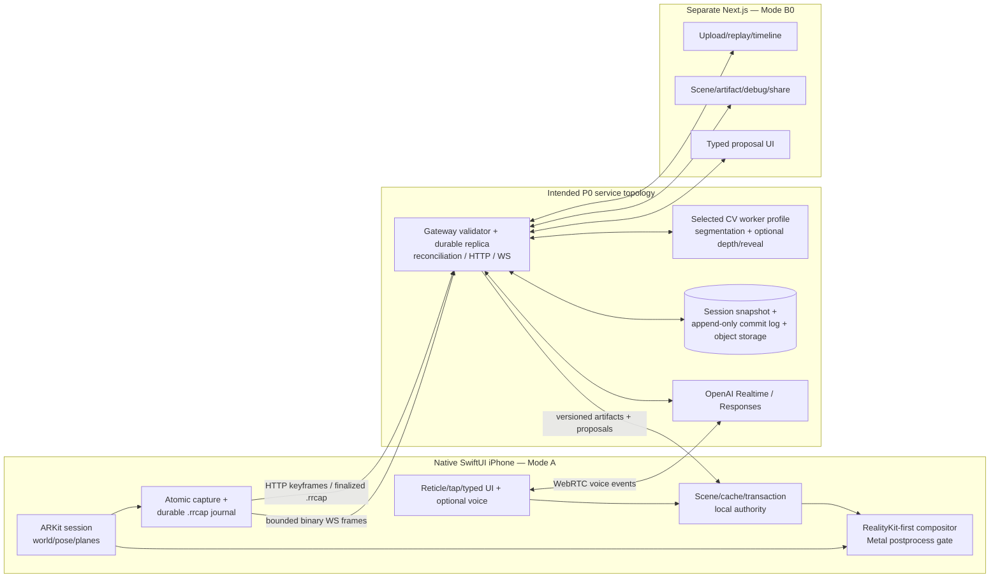
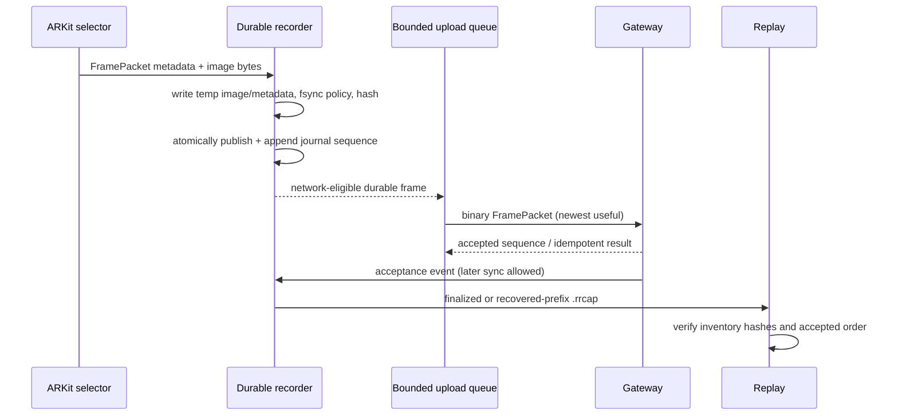
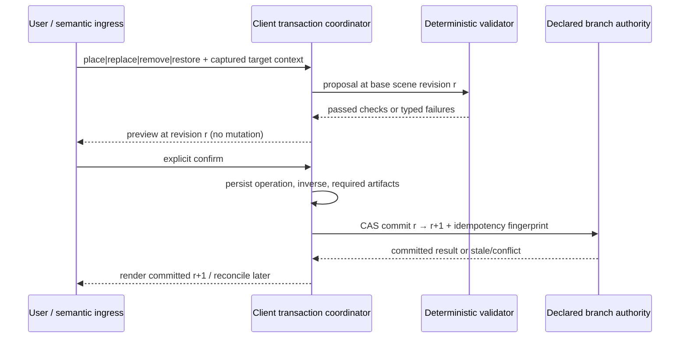

# ReRoom Master Technical Specification

Status: canonical PRE-GSD engineering authority  
Version: 1.0.0  
Date: 2026-07-13

## 1. Executive architecture decision

ReRoom is a camera-feed AR editor with deterministic capture and transaction foundations, not a rendered reconstruction of a room. A native SwiftUI iPhone client owns Mode A, ARKit owns pose/world state, and that device is the sole revision authority for its active branch. A separate Next.js client owns Mode B0 replay, debugging, fallback, session/sharing UI, and typed control. The 60 Hz mobile camera/render loop is fully local and never waits for network, GPU inference, the web app, or an LLM.

The fast path combines ARKit planes/raycasts, one target-first tracked mask, a conservative mask volume/OBB, curated assets, and observed multi-surface reveal data. Learned depth and Open3D-style dense fusion are swappable enhancements, not prerequisites for place, replace, restore, B0 replay, or local rendering. GPT interprets semantic/design intent; deterministic code owns identity, transforms, spatial-proxy checks, revisions, idempotency, persistence, commit, and restore.

The architecture is the best-supported solution for a two-developer, one-week controlled hero because it moves high-risk uncertainties behind early device/replay gates, keeps B1 out of P0, and preserves a real replay/web fallback. RealityKit compositing, semantic provider, dense provider, reveal quality, and hosting tier remain benchmark-gated.

## 2. Honest product/system boundary

Mode A edits a live camera view; it does not rebuild and render the entire room. “Constraint-checked” means checked against estimated ARKit planes, mask volumes, OBBs, observed support/room/walkway proxies, and any dense evidence that passed its gate. It does not mean certified physically safe or metrically complete.

- **Mode A:** live native iPhone place/replace/remove/restore.
- **Mode B0:** guaranteed `.rrcap` replay and separate web fallback. Learned arbitrary-video reconstruction is optional.
- **Mode B1:** isolated stretch render-skin refinement after an explicit post-P0 gate.

The controlled hero is a freestanding chair or small side table with visible floor. Unsupported categories, unobserved backgrounds, tracking loss, or missing licenses produce honest readiness/fallback states rather than synthetic certainty.

## 3. System architecture

The diagram is an intended architecture, not implemented directories or deployed resources. Next.js does not own the stateful WebSocket gateway. Each revision branch has one declared authority: the native device for active Mode A, or the gateway for a distinct frozen B0 replay fork. Only the selected mutually compatible worker profile is resident; P0 does not require simultaneous SAM, depth, mapping, fusion, and inpainting services.

### Component responsibilities

| Component | Owns | Must not own |
|---|---|---|
| Native iPhone | ARKit session, high-rate buffers, local render, durable recording, last-known-good artifacts, sole authority for its active Mode A revision branch, offline commit/restore | Cloud credentials, LLM geometry, unrelated branch/global state |
| Next.js web | B0 UI, upload/replay/timeline, inspection, sharing/session UI, typed proposals | ARKit-equivalent pose, production WebSocket/session authority, mutation of an active phone branch |
| Gateway | authentication, contracts, bounded ingress, ordering/idempotency, durable session replica/log, validation/reconciliation, sole authority only for an explicit B0 replay fork, strict tools, optional Realtime secret minting | 60 Hz render loop, competing writes to an active phone branch, arbitrary model authority |
| CV worker profile | provider-bounded masks, optional depth/fusion/reveal artifacts | stable object identity, commits, permanent scene authority |
| OpenAI models | language/design interpretation and typed proposals | transforms, collision, support, revisions, authorization, commit |

## 4. Coordinate and capture convention

`RR-COORD-1` in the glossary is normative:

- ARKit right-handed world, meters; camera forward is local `-Z`.
- `world_from_camera` maps camera coordinates into the named ARKit world epoch.
- Math uses column vectors; JSON arrays serialize matrices row-major with `float32` intent.
- Image origin is top-left; pixel centers lie at `(x+0.5,y+0.5)`.
- Transmitted bytes are physically rotated upright and metadata orientation is `up`.
- `encoded_from_sensor` maps sensor pixel coordinates to cropped/scaled/upright encoded pixels. Intrinsics are transformed into the same encoded pixel grid.
- `monotonic_timestamp_ns` is a decimal string in the device boot-time domain to avoid JavaScript integer loss. UTC is descriptive metadata only, never synchronization authority.

All cross-language numeric comparisons use RR-FLOAT-1 from the glossary: finite binary32-representable values, named absolute/relative element tolerances, translation/intrinsics limits, rigid-rotation orthonormality/determinant checks, and a homogeneous-row check. RR-FLOAT-1 is a serialization/round-trip tolerance; it does not replace the end-to-end ≤1 encoded-pixel projection gate.

A packet is rejected when image dimensions and intrinsics disagree, a duplicated binary-header value differs from canonical JSON, a matrix layout/convention is unknown, or a world-frame epoch is missing. ARKit reset/relocalization that changes the frame meaning increments `world_frame_version` and emits a `world_frame_correction` artifact; data is never silently reinterpreted.

The projection gate uses synthetic known rays and a device checkerboard/orientation fixture. Required tolerance is TARGET ≤1 encoded pixel before any learned geometry is trusted.

## 5. Capture, transport, and deterministic replay

### Record-first state machine

States are `selected → image_and_metadata_durable → journaled → network_eligible → server_acknowledged`. Selection or enqueue alone is not durability. Each `.rrcap` inventories exact-byte file hashes, one unique contiguous global journal, accepted frame/event projections, keyframes, coordinate epochs, provider locks, and retention metadata per CON-002. Every event has a self-omitting RR-JCS record digest, and its journal hash equals it. The sole replay input digest is recomputed as RR-JCS-SHA256-1 over `[[journal_sequence,entry_type,reference_id,content_sha256], ...]` in journal order. Crash recovery accepts only a hash-valid journal prefix, requires `last_durable_journal_sequence` to equal its final sequence, and verifies both projection arrays exactly for membership, order, references, per-type sequence, durable sequence, and content hash.

Replay determinism means identical ordered captured packets/events/hashes and the same deterministic transaction trace. Raw files hash exact bytes; JSON hashes use RFC 8785 JCS, UTF-8, and SHA-256 under RR-JCS-SHA256-1. The manifest hash omits only its own hash member. It does not promise bit-identical neural output. A learned replay must pin artifact/model revision, configuration digest, environment, seed where meaningful, and comparison tolerance.

### Transport and queues

- Live selected images use one binary WebSocket message per atomic FramePacket; its JSON header and image payload cannot interleave with another frame.
- That message uses RRFP-WIRE-1 from CON-001: 24-byte big-endian fixed header (`RRFP`, 1.0, zero flags, uint32 JCS-header length, uint32 payload length, uint64 capture sequence), then exact JCS UTF-8 header and exact image bytes with no trailer. Header and payload are capped at 64 KiB and 16 MiB. Duplicate sequence/length and payload SHA must match; truncation, trailing bytes, mismatch, or tamper rejects the whole frame.
- High-resolution keyframes and finalized `.rrcap` uploads use resumable/idempotent HTTP.
- Optional voice uses direct client WebRTC to OpenAI after the gateway mints a short-lived scoped client secret; its output re-enters the same nonmutating proposal boundary as typed/tap input.
- Each stage has a bounded queue. Inference queues drop stale non-keyframes in favor of the newest useful view; durable journals never reorder accepted entries.
- Gateway acceptance is idempotent by frame key/fingerprint. Reconnect resumes from the last acknowledged sequence and reconciles gaps; it does not resend unbounded history.
- Backpressure reduces cadence/quality before local recording or render correctness.

## 6. Rendering and compositor order

RealityKit is the provisional first renderer because it provides camera AR presentation, entities/assets, lighting/shadows, and occlusion material, while a Metal post-process can combine the source frame/depth and edit artifacts. Apple documentation does not prove ReRoom’s required reveal ordering or performance, so GATE-003 is mandatory on the base iPhone 17.

Normative conceptual order:

1. ARKit camera feed.
2. Background reveal layers for a committed replace/remove, clipped to the conservative target mask and supported view envelope.
3. Foreground real-world occlusion proxies that must cover objects crossing the edited region.
4. Virtual replacement/placed asset with support alignment, lighting adaptation, and contact shadow.
5. Selection/readiness/debug overlays.
6. SwiftUI controls and explicit degradation/coaching.

Artifacts carry origin and activation revision-branch IDs, producing authority, scene/world revisions, and RR-JCS content digests. The compositor uses one coherent accepted branch/revision per frame; it never mixes a new mask with an old reveal/pose or another revision-7 branch silently. A fork may reuse immutable payload bytes only through a new artifact record that preserves origin/content hash and proves compatible world epoch. Outside a reveal envelope it coaches or restores rather than stretching the atlas.

The bounded fallback ladder is: RealityKit plus Metal postprocess → reduced RealityKit replacement-only path → a timeboxed minimal custom Metal compositor only if the early spike demonstrates ordering and delivery feasibility. “Full Metal fallback” is not treated as free. A failure to deliver controlled empty removal blocks the P0 release unless a human explicitly changes the locked scope.

## 7. Fast interaction and dense understanding tracks

### Fast path (P0 authority)

The fast path uses ARKit pose/planes/raycast, target-first 2D mask tracking, multi-view conservative visual hull or sparse occupancy, OBB/footprint/support proxies, observed reveal atlas, and curated asset metadata. It exists first, is replayable, and supports place/replace/restore even when dense inference is unavailable.

### Dense enhancement (provisional)

The `DepthProvider` contract consumes ordered FramePackets and returns metric-hypothesis depth with uncertainty, scale/bias evidence, provider revision, and world-frame epoch. Candidate bake-off: DA3Metric-Large, pose-conditioned DA3 Base/Small, and the no-dense ARKit-plane baseline. Only permissively licensed weight variants may ship.

The `FusionProvider` consumes calibrated depth/pose and emits versioned surface artifacts. Open3D 0.19.0 `VoxelBlockGrid` is a reference candidate for server-side TSDF/raycast/mesh extraction; it is not on the P0 critical path. CPU/CUDA packaging, weighting, eviction, latency, and unsupported-observation behavior require replay measurement. Point/plane/canonical proxies are the fallback.

Dense evidence may upgrade capability readiness but never rewrites ARKit pose authority, canonical IDs, or committed history. Sparse ARKit feature points are ephemeral alignment evidence, not durable geometry.

## 8. Canonical scene, semantic tracking, and readiness

CON-003 defines a versioned scene of stable surfaces, objects, support relations, assets, and artifact references. IDs are generated at the authority boundary and survive provider/render changes. Provider-local labels, mask indices, mesh handles, and renderer array positions are never identity.

Processing is target-first:

1. User reticle/tap supplies a point/box and utterance-time camera/scene context.
2. The segmentation provider tracks one target through ordered frames.
3. Deterministic association uses overlap, projected proxy, temporal evidence, and explicit ambiguity thresholds.
4. GPT may propose a human-readable label/attributes, but cannot select a different object without deterministic/user grounding.
5. Target loss changes lifecycle/readiness; manual re-seed is preferred to silent identity switch.

Lifecycle is `candidate`, `tracked`, `lost`, `retired`. Capability readiness is independent: `unavailable`, `warming`, `ready`, `degraded`, `failed` for select/place/replace/remove/restore. A tracked object can be replace-ready and remove-unavailable. Readiness reasons are explicit and replayable.

SAM 2.1 Hiera Small is the provisional one-target default because it is much smaller, publicly accessible, and Apache-2.0. SAM 3.1 remains a gated upgrade candidate; its large runtime, gated weights, custom terms, and multi-object headline do not make it the default. Provider selection follows GATE-004.

## 9. Geometry and edit-artifact distinctions

Canonical scene identity references artifact variants in CON-004:

- `mask_volume`: conservative visual occupancy for cutout/occlusion, not collision truth.
- `surface_mesh`: estimated object/surface geometry usable only for capabilities whose gate it passes.
- `obb`: coarse target, footprint, support, and collision proxy.
- `occluder_chunk`: disposable foreground render proxy tied to canonical IDs and view coverage.
- `reveal_bundle`: one or more surface-specific reveal layers plus supported view envelope and quality evidence.
- `asset_manifest`: paired runtime derivatives, dimensions, origin, collision, LODs, hashes, and license evidence.
- `world_frame_correction`: explicit mapping between coordinate epochs.

Artifact payload interpretation is closed, not inferred from file type. Every surface, occluder, or visual-hull mesh declares that vertices are already in meter-valued RR-COORD-1 artifact-world coordinates. Sparse voxel occupancy declares `world_from_volume`, XYZ voxel size and dimensions, exact NPY ZYX/C memory layout, `uint8` values `0/1`, and the voxel-center rule. P0 reveal deliberately uses a narrower mapping: every layer is a convex planar local-XY polygon with an explicit `world_from_surface`; each polygon vertex carries its paired normalized top-left texture UV, CCW winding, and deterministic triangle-fan topology. A generic mesh UV atlas is a future contract-version change, not an implementation guess.

Persistent canonical geometry is the versioned set of surfaces, conservative object/support proxies, and their evidence. Dense meshes, renderer buffers, and neural outputs are derived and replaceable.

Each canonical object also has closed edit-managed state: `visible` and nullable `active_reveal`. A non-null reveal reference is typed `reveal_bundle` and requires `visible=false`. `set_object_visibility` and `set_reveal_bundle` mutate only these fields; they are not renderer-local flags.

## 10. Reveal/removal

The reveal path records pixels observed behind/around the target onto the actual floor/wall/other supporting surfaces. A bundle is multi-surface; a single floor plane cannot represent floor plus wall, baseboard, shadows, or foreground crossings.

Observed atlas pixels have priority. Bounded deterministic fill may close tiny supported gaps. LaMa or another neural fill is deferred unless checkpoint provenance/license, runtime, temporal stability, and the same reveal gate all pass; it is never general unseen 3D truth. Each layer carries provenance and coverage.

Remove becomes ready only when:

- target mask volume is stable and conservative;
- background layers cover the supported view envelope at GATE-006 thresholds;
- foreground occluder coverage is independently sufficient;
- compositor ordering is correct;
- the current camera lies inside the envelope; and
- inverse artifacts are locally durable.

After commit, a transaction pins the accepted reveal bundle revision. Later improved artifacts are proposals, not silent changes to the committed result.

## 11. Placement, assets, transactions, and restore

P0 uses a curated catalog of approximately 3–5 prevalidated assets—not a large marketplace. Each asset has a canonical meter scale, floor-center/y-up origin, paired USDZ (native) and GLB (web) derivatives from one reviewed source, collision proxy, LODs, hashes, material checks, attribution, and redistribution/use terms. Runtime conversion is not the critical path.

Placement validation is deterministic and honestly proxy-based: target/support existence, current scene revision, support-plane alignment, conservative collision, approximate room boundary/walkway, asset license/integrity, readiness, and view envelope. Local preview may appear immediately from cached data; gateway validation cannot block camera rendering.

Canonical lifecycle is `draft → validated → previewed → committed` or `rejected/cancelled`. Preview never changes `scene_revision`. Every SceneState and transaction carries a `revision_branch_id` and one authority identity. For active Mode A the native device is the sole writer and can commit `r→r+1` offline; the gateway validates and idempotently replicates its ordered commit journal. A B0 replay mutation occurs only on a separately identified gateway-authoritative fork. Web input against an active phone branch remains a proposal routed to the phone. Same idempotency key and RR-JCS-SHA256-1 request fingerprint returns the prior result; same key with different content is `idempotency_conflict`.

Restore/undo is a new compensating `restore` transaction that references an original committed transaction. The original stays committed and immutable. Local `sync_state` (`local_only`, `pending_sync`, `synced`, `conflict`, `sync_failed`) does not mutate canonical state. Before acknowledging a visible commit, the client persists the transaction, required render artifacts, inverse operations, request/result digests, authority, branch, and activated revision so the view and restore work offline. If the gateway has an unexpected divergent same-branch revision, both histories are preserved, further mutations stop, the unexpected history is quarantined under a distinct branch, and snapshot reconciliation is required; automatic merge is forbidden.

### Canonical product-operation reducer

CON-005's ordered delta list is executable authority; native, gateway, web replay, and tests must reduce it identically. Each delta `before` must match its current canonical target exactly; a restore `before` must match the complete current RR-EDIT-PROJECTION-1. Every referenced artifact must match branch/world/revision/digest, and any mismatch rejects the whole transaction without partial mutation.

| Product operation | Exact allowed forward delta order | Required meaning | Persisted inverse |
|---|---|---|---|
| `place` | `create_asset_instance` | Create one new `assetinst_…` and its asset support relation atomically; the operation entity becomes `placed_asset_id`/support subject, state is `committed`, source is the current transaction, and manifest, transform, branch, license, support, and integrity checks already passed. | One `restore_snapshot` whose `before` is the committed `r+1` edit projection and whose `after` is the exact pre-transaction `r` edit projection. |
| `replace` | `set_object_visibility`, `create_asset_instance`; or `set_reveal_bundle`, `set_object_visibility`, `create_asset_instance` when a validated underlay is needed | Reveal activation mutates `object.edit_state.active_reveal` first; `object.edit_state.visible` changes `true→false`; the replacement instance/support relation is created last. No hidden asset may appear before the original is safely covered. | One projection-scoped `restore_snapshot` from committed content to the exact pre-transaction edit projection. |
| `remove` | `set_reveal_bundle`, `set_object_visibility` | A ready GATE-006 bundle for this object/branch/world activates in `object.edit_state.active_reveal` first; `visible` then changes `true→false`. | One projection-scoped `restore_snapshot` from committed content to the exact pre-transaction edit projection. |
| `restore` | `restore_snapshot` | `compensates_transaction_id` names the latest eligible committed edit on the same branch. `before` equals the current complete edit projection. RR-RESTORE-REBASE-1 derives `after` by applying the persisted inverse only for IDs touched by that transaction onto the current projection, preserving newly tracked/unaffected object edit state and other untouched edit content. | One new captured-exact projection inverse: its `before` is the newly committed rebased projection and its `after` preserves the prior current projection, allowing later explicit compensation without mutating history. |

RR-EDIT-PROJECTION-1 is an inline, offline-complete projection containing scene/branch/world identity, every object's `edit_state`, all placed assets with full typed manifest revision/digest references, and only asset-subject support relations, with each array sorted lexicographically by its stable ID. Its RR-JCS digest covers the `projection` member only. It deliberately excludes the SceneState/session/schema/authority/revision envelopes, surfaces, tracking/labels/readiness/evidence, non-asset support relations, `edit_history`, and `updated_at_utc`. A `restore_snapshot.required_artifact_refs` array is the exact locally durable union needed to render its `after` projection; missing, extra, stale, or digest-mismatched references reject.

RR-RESTORE-REBASE-1 prevents an old inverse from deleting a newly tracked object. At restore proposal time, validate the latest eligible source transaction and its captured-exact inverse; diff that inverse's before/after projections to obtain sorted touched object/placed-asset/asset-support IDs; verify those IDs against the source ordered operations; start from the current complete projection; and apply the source inverse after-value only for touched IDs (removing a touched ID only when it is absent from that source after projection). Every untouched or newly present ID keeps its current value. The derived `restore_rebase` snapshot records source transaction and both source hashes; its source ID must equal `compensates_transaction_id`. Branch/world mismatch, unexpected touched-entity drift, or derivation mismatch rejects. Restore then applies the derived complete projection, preserves all non-edit live semantic evidence, writes a fresh SceneState at CAS `r→r+1`, appends the restore edit reference, and updates time. The new whole-SceneState digest and monotonic revision must not equal the historical pre-edit document.

`set_asset_transform` is a reserved internal migration/reconciliation delta and is not legal in a P0 product-operation forward list. A restore snapshot is eligible only when no later uncompensated branch commit exists. Reducer validation requires operation-specific checks: all commits require `scene_revision` and `artifact_integrity`; place requires `support`, `collision_proxy`, and `asset_license`; replace adds `target_exists` and `capability_ready` (plus `view_envelope` when a reveal is used); remove requires `target_exists`, `capability_ready`, and `view_envelope`; restore requires snapshot/compensation integrity. Passed validation has no failed check; failed validation has at least one failed check.

## 12. Realtime, GPT, and tool boundary

Typed/tap proposal ingress is the complete P0 path and works without OpenAI or network. If optional voice is enabled, the gateway uses a standard server-only OpenAI key to create an ephemeral Realtime client secret/session and iPhone/browser uses WebRTC for speech. Realtime function calling is a low-latency proposal channel and does not provide the canonical strict state contract by itself.

GPT-5.6 Sol through the Responses API may normalize intent, choose among curated designs, explain readiness, and emit a strict typed proposal. Strict schemas improve shape but do not establish semantic authorization. Allowed tools are narrow and non-mutating at the model boundary, such as `propose_place`, `propose_replace`, `propose_remove`, and `propose_restore`. Application code captures utterance-time target context, verifies session/user/operation, validates deterministic checks, presents preview, and requires confirmation.

Model text, tool arguments, asset metadata, replay labels, and Internet research are untrusted. They cannot introduce new tools, change target/session, bypass license/revision/readiness checks, access credentials, deploy, or directly delete/commit.

## 13. Intended service, storage, and scheduling topology

P0 begins with the fewest separations needed for conflicting dependencies:

1. Native iPhone and separate Next.js clients.
2. One gateway process with HTTP, binary WebSocket, optional Realtime bootstrap, validation, durable session replica/snapshot, append-only commit journal, and reconciliation responsibilities; it is branch authority only for an explicit B0 replay fork.
3. One selected CV worker environment; optional providers load mutually exclusively or in isolated jobs when dependencies conflict.
4. Content-addressed object storage for captures/artifacts and a small transactional store (SQLite/filesystem for local/demo is acceptable; external persistence is a deployment-time choice).

No cloud platform is locked or deployed in this preparation. A generic warm stateful host is the default architecture because live WebSocket/session affinity and GPU residency need measurement. RunPod warm Pod, load-balanced Serverless, or another provider is selected later by GATE-012; queue endpoints are suited to B0/B1 batch work, not canonical live session authority. The design specifies benchmark tiers (lowest functional, recommended demo, optional B1) and measurements—not a hidden GPU SKU.

GPU scheduler invariants: one session/provider budget, bounded input/output queues, admission control, OOM detection, provider unload, no simultaneous optional model residency assumption, and deterministic fallback to fast proxies.

## 14. Mode B0 and B1

### Guaranteed Mode B0

B0 can open a finalized or recovered-prefix `.rrcap`, verify hashes, replay accepted packets/events, inspect timeline/scene/artifacts/transactions, run typed proposals on a distinct replay branch, and show a degraded plane/point/artifact viewer without network or learned reconstruction. An ordinary MP4/MOV import uses CON-002 `capture_kind=ordinary_video_import`: it has a media timeline/event journal but no coordinate convention, ARKit capture settings, world frame, accepted ARKit frames, or keyframes. Its calibration state is `uncalibrated_no_world_authority`; metric pose/scale/planes and learned geometry are not fabricated or implied.

B0 is a robust recovery and demonstration path after capture; it is not an instantaneous offline replacement for an active live server. LingBot-Map may be evaluated as an offline ordinary-video geometry provider but is not required for B0 and cannot affect its pass status.

### Isolated Mode B1

B1 may later evaluate the permissively licensed MapAnything model variant, gsplat, and Spark through a render-skin interface. It may improve appearance but must map back to stable Mode A IDs/transforms/transactions. It never rewrites canonical scene identity, and no B1 dependency/task is scheduled while a P0 gate is red. Default MapAnything noncommercial weights are excluded; B1 itself remains deferred.

## 15. Observability and performance budgets

All current numbers below are **TARGET**, not measured. No subsystem may report them as achieved until replay/device evidence names fixture, build, device/tier, run count, and distribution.

| Metric | Classification | Initial threshold / intent | Authority |
|---|---|---|---|
| Native frame rate | TARGET | median ≥45 FPS; p95 frame time ≤33 ms over four minutes on base iPhone 17 | GATE-003 |
| Projection error | TARGET | ≤1 encoded pixel synthetic; device sanity no orientation/crop swap | GATE-002 |
| Target mask age | TARGET | p95 ≤250 ms on a declared live tier | GATE-012 |
| Segmentation quality | TARGET | median IoU ≥0.80, P10 ≥0.65, zero hero-target identity switches, seed-to-first-mask p95 ≤1.5 s | GATE-004 |
| Dense depth | TARGET | floor RMSE ≤0.025 m, every taped-distance error within ±4%, accepted-update p95 ≤450 ms, no queue growth/OOM | GATE-007 |
| Reveal coverage | TARGET | P10 ≥0.95, median ≥0.98, largest uncovered component ≤1%, visual ≥4/5 | GATE-006 |
| Typed intent | TARGET / P0 | 100% golden typed/tap edits and injection rejection | GATE-010 |
| Voice intent | TARGET / P1 | ≥4/5 scripted hero utterances; failure ends optional voice work | GATE-010 |
| Golden journey | TARGET | 5/5 complete with exact commit/replay trace and no severe artifact | OPS-GOLDEN-001 |

Trace spans use session/frame/transaction IDs and monotonic timestamps across capture selection, durable write, queue, upload, server acceptance, inference, artifact acceptance, preview, commit, render, and replay. Record p50/p95/max, queue depth/drop reason, provider/version/config digest, memory/VRAM, device memory/thermal state, FPS/frame time, reconnects, validation failures, and capability transitions. Logs avoid raw images, prompts containing sensitive room detail, credentials, and authorization headers.

## 16. Security, privacy, and retention

- Obtain explicit capture consent and show recording/upload/share state.
- Default to local-only until upload/share; minimize selected frames and apply an explicit session TTL when server-held.
- Treat raw imagery, masks, meshes, atlases, transforms, prompts, transactions, and share links as sensitive.
- Standard provider API keys remain server/user environment secrets. `.env.example` contains names only. Realtime clients receive short-lived scoped secrets.
- Authenticate/authorize session, object, transaction, and share access; use non-guessable IDs but never rely on ID entropy alone.
- Validate version, size, codec, decompression limits, path traversal, hash, scene revision, idempotency fingerprint, tool allowlist, and asset license before use.
- Deletion covers source and derived data and invalidates shares; audit logs contain stable IDs/outcomes, not room content.
- External content/model output is evidence/data only. Prompt/tool injection tests must prove it cannot expand permissions or directly mutate state.

## 17. Failure and fallback ladder

| Failure | Detection | Safe behavior | Escalation/kill rule |
|---|---|---|---|
| ARKit limited/lost | tracking state | freeze last-known-good committed overlays, disable unsafe commit, coach relocalization/restart | coordinate/tracking correctness is blocking |
| Network/gateway unavailable | heartbeat/timeout | keep render/recording/local commits/restore; mark `pending_sync` | replay later; never discard acknowledged local state |
| Semantic target unstable | confidence/ID-switch gate | request tap/box re-seed; replacement-first | failed provider gate selects manual seed/default provider |
| Dense depth/fusion fails | benchmark/OOM/queue | ARKit planes + mask volume + OBB | dense path removed from P0 |
| Reveal insufficient | coverage/view gate | `remove=unavailable`; coach; replacement still works | hero removal failure blocks release/human escalation |
| RealityKit ordering/performance fails | device gate | reduce path; bounded Metal spike | if both fail, removal release gate remains red |
| Voice/model unavailable | connection/schema/intent tests | typed/tap deterministic path | optional voice is disabled; four edits remain available |
| Asset/license invalid | manifest/license gate | quarantine asset; use prevalidated alternative | unknown/noncommercial artifact cannot ship |
| B0 learned reconstruction fails | provider gate | exact replay/degraded viewer | B0 still passes; optional provider omitted |
| Any P0 gate red | gate dashboard | no B1 dependencies/tasks | B1 start requires explicit post-P0 approval |

## 18. Integration order

1. **S0:** schemas, IDs, coordinate fixtures, device/signing and license inventory.
2. **S1:** atomic durable `.rrcap`, crash recovery, replay, bounded queue and gateway echo.
3. **S2:** scene/transaction store, typed place preview/commit/restore offline.
4. **S3:** ARKit planes, target seed/track, fast mask volume/OBB, early compositor device gate.
5. **S4:** curated assets and replacement end to end; begin demo evidence.
6. **S5:** observed multi-surface reveal and controlled removal quality gate.
7. **S6:** optional Realtime/GPT proposal ingress only after typed deterministic edit and injection tests pass.
8. **S7:** Next.js B0 upload/replay/timeline/degraded viewer/share controls.
9. **S8:** fault, security, thermal/latency, license, 5/5 golden and submission evidence.

Dense provider/fusion experiments run only within the bounded gate parallel to S3–S5 and must not delay the fast path. B1 has no P0 slice.

## 19. Contract and ADR map

CON-001 FramePacket and CON-002 `.rrcap` govern capture/replay; CON-003 governs scene identity/readiness; CON-004 governs derived edit artifacts/assets/corrections; CON-005 governs edit transactions/reconciliation. The exact `$id` registry and terms live in the glossary/contracts README. Load-bearing choices are ADR-001 through ADR-014. Requirements and gates link back to these authorities rather than duplicating schema definitions.

## 20. Provisional decisions and benchmark gates

| Decision | Status | Gate | Fallback |
|---|---|---|---|
| RealityKit-first plus Metal postprocess | Provisional | GATE-003, early physical-device slice | reduced RealityKit replacement; bounded custom Metal spike |
| SAM 2.1 Hiera Small default | Provisional | GATE-004 annotated hero replay | manual re-seed/replace-first; accessible alternative only if it wins |
| DA3 depth variant | Requires benchmark | GATE-007 | no-dense ARKit plane/proxy path |
| Open3D 0.19.0 fusion | Provisional enhancement | GATE-007 | point/plane/mask/OBB artifacts |
| Multi-surface observed reveal | Provisional quality | GATE-006 | remove unavailable per session; release remains blocked |
| Warm stateful host/platform | Provisional | GATE-012 soak/reconnect/tier test | local/demo host or alternative warm host; batch queue for B0 |
| Neural fill, LingBot, B1 stack | Deferred | explicit post-P0/license/provider gates | omit |

## 21. Changelog

- **1.0.0 (2026-07-13):** Replaced the historical multi-service/dense-first plan with a record-first fast path, strict coordinate and transaction contracts, capability readiness, bounded service topology, guaranteed provider-independent B0, quality-gated P0 removal, and isolated B1. All performance values are unmeasured targets.
